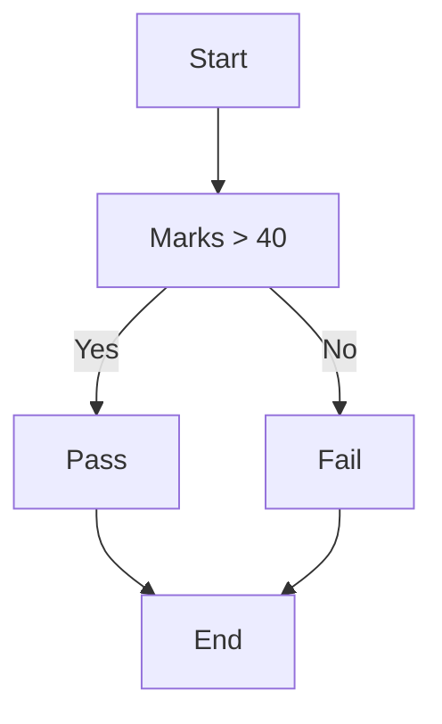

**Conditions** are involved in day-to-day working.
For example, *If I get my work done on time, I might get an appraisal* or *If I workout today as well, I will get in shape soon*.

Notice the pattern: ***If an event takes place, another event will occur***
Such statements are called **Conditionals**.

## Approach
Often, we encounter problems in programming involving conditionals.

Say you are an examiner and have to mark answer sheets as **pass or fail**.
If the marks add up to 40%, the result is **pass**. The result would be **fail**, otherwise.

This is a **flowchart** depicting the scenario.
