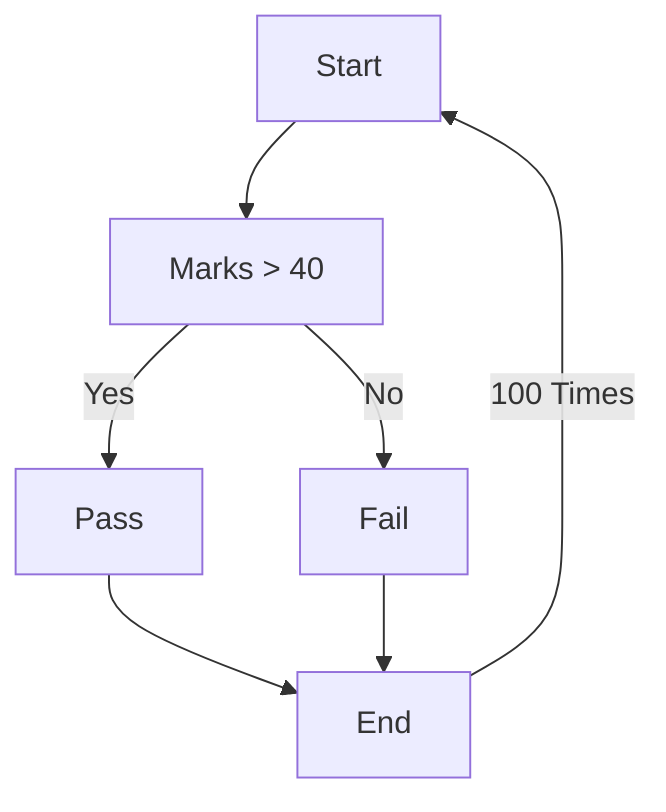

**Looping** basically means to repeat an action over and over again up till a given point.
For instance, *Read the text until you understand it* or *Keep running until you are tired*.

Notice the pattern: ***Keep doing action until a condition is satisfied***.
This is the basic structure of a **loop**.

### Approach
Take up the [[Course/FrontEnd Dev/(2) JavaScript/Module 1/Conditionals/Concept#Approach|scenario]] where you were an examiner, you have to mark 100 such answer sheets. 
In such a case, the [[Course/FrontEnd Dev/(2) JavaScript/Module 1/Conditionals/Concept|conditional]] needs to be **looped** over 100 times.

The above **flowchart** would depict the scenario.

### Structure
Loops in JS have the similar basic structure.

| Component | Function |
|--|--|
| Counter variable | To count the number of repetitions done |
| Condition | The loop will be executed up till the condition is satisfied or until the condition is satisfied. |
| Code Block | The code to be executed in each repetition |
