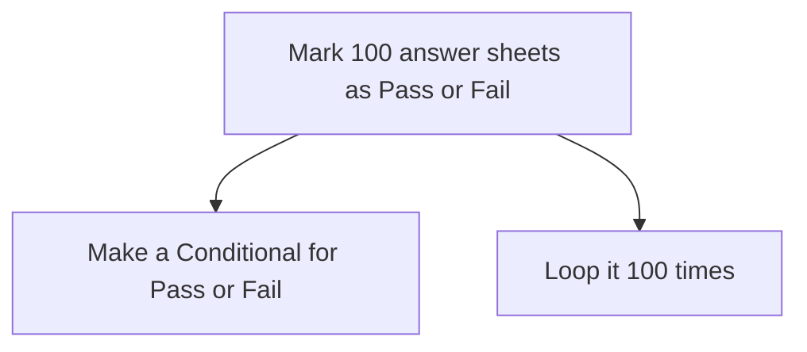

Loops can be executed in JavaScript in two ways. `for` loop is one of them.

### Syntax
This is the crude structure of `for` loops in JS. Notice, we declare the [[Course/FrontEnd Dev/(2) JavaScript/Module 1/Loops/Concept#Structure|counter variable]] variable inside the `for` loop.

```js
for (var i; condition; increment/decrement) {
	//Code Block
}
```

| Component | What it means |
|--|--|
| `for` | Initiating the `for` loop |
| `var i;` | Declaring a counter variable |
| `condition;` | The `condition` here is to be replaced with the one to satisfy |
| `increment/decrement` | The counter variable can either be incremented `i++` or decremented `i--` |


### Example
Let's take up the [[Course/FrontEnd Dev/(2) JavaScript/Module 1/Loops/Concept#Approach|example of the examiner]]. We can use [[Problem-Solving#Decomposition|problem decomposition]] here.



<br>

* ##### Making a Conditional for Pass or Fail
If the `marks` are greater than 40%, the result is **Pass** else **Fail**.
```js
if (marks > 40) {
	console.log("Pass")
} else {
	console.log("Fail")
}
```

<br>

* ##### Loop for the Conditional
A Counter variable `k` will be incremented until its value becomes `100`.
```js
for (var k; k =< 100; k++) {

}
```

<br>

* ##### Add them up
This will be looped 100 times over and print the result of all the candidates in the console.
```js
for (var k; k <= 6; k++) {
	if (marks > 40) {
		console.log("Pass")
	} else {
		console.log("Fail")
	}
}
```


>[!Note]
> This is not an actually executable code. It is just a representation of how the code would look like. It is used to depict the approach of solving this problem.
