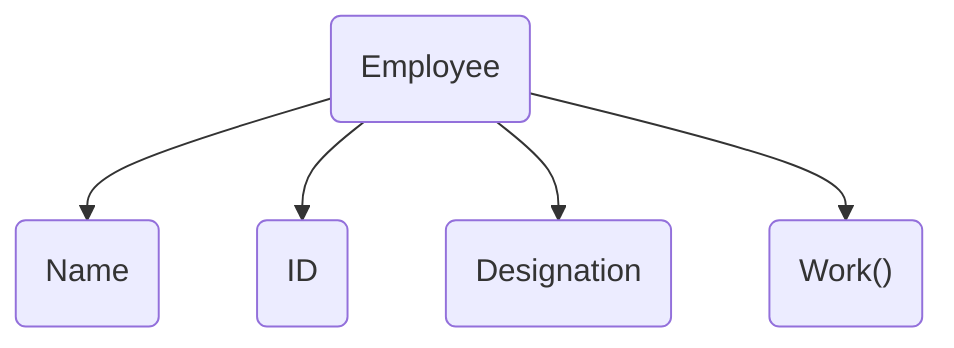

Hundreds of employees work in a company. Keeping track of their data can be difficult especially if it is unorganized. 
```js
//Employee 1
var employee1Name = "John";
var employee1Id = 1000;
var employee1Designation = "Manager";
var employee2Work = function() {
						console.log("Supervise and lead the team");
					} 

//Employee 2
var employee2Name = "Mary";
var employee2Id = 1002;
var emplyee2Designation = "Analyst";
var employee2Work = function() {
						console.log("Predict the market");
					} 
```
 
 For just 2 employees, we have 6 different variables and 2 functions which is way inefficient. 
 In such a situation, the data of each employee can be grouped under a single unit called **object**.



^fc35c6

<br>

> [!note]
> The container `Employee` is an **object**. The data `Name`, `ID` and `Designation` are called **properties**. The function `Work()` is a **method** of the object.

<br>

### Syntax
Creating an **object** of name, `objectName`with two **properties** and corresponding values and one **method**.
```js
var objectName = {
	property1: value1,
	property2: value2,
	method1: function() {
				//Code Block
			}
}
```

### Data Type
Object is one of the many data-types in JavaScript. Other data types can be converted to the Object data type using the `Object()` constructor.
```js
// Declaring a variable with a numerical value  
var num = 3;

// Making it an object
num = Object(num);

console.log(num);
console.log(typeof(num));
```

##### Some methods of `Object()`
* `create()`
Used to create an instance of the object.
```js
var food = {
	taste: "savoury",
	drl: "non-veg"
}

var chicken = Object.create(food);
console.log(chicken.taste);
```

<br>

* `keys()`
**Keys** are the properties of an object.
Lists all the *keys* or properties of an object. ^4eabae
```js
var food = {
	taste: "savoury",
	drl: "non-veg"
}

var chicken = Object.create(food);
console.log(Object.keys(chicken));
```

<br>

* `values()`
**Values** are the values of the properties or **keys** of an object.
Lists all the *values* or the values of the properties of an object.
```js
var food = {
	taste: "savoury",
	drl: "non-veg"
}

var chicken = Object.create(food);
console.log(Object.values(chicken));
```
 
### Example
Now, an object for John can be constructed using JS as follows.
```js
var employee = {
	name: "John",
	id: 1001,
	designation: "Manager",
	work: function() {
					console.log("supervises and leads the team");
				}
}
```

<br>

Using the **dot-notation**, we can access the data or **properties** of the object `john`. 
```js
console.log(john.name)
john.work();
```

<br>

> [!info]
> Imagine, you are a manufacturer and produce the same item daily. Every aspect of every item is the same except for its `manufacturingID`. Another way of creating instances of objects can be used here.
> 
> ```js
> // Creating an object prototype for the item
>  var item = {
> 	name: "Somename",
> 	pkgUnit: 0001,
> 	id: 0
> }
> 
> // Creating its instances
> var item1 = Object.create(item);
> item1.id = 1;
> 
> var item2 = Object.create(item);
> item2.id = 2;
> ```


