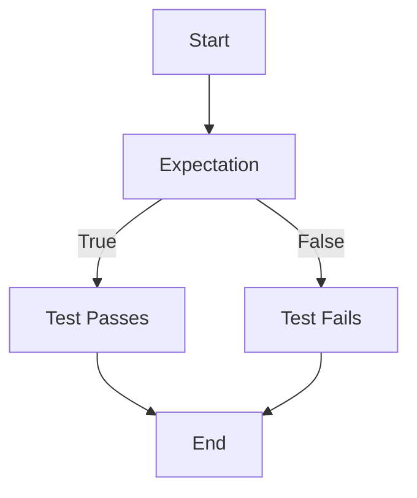

A teacher explains and educates the students. In order to check their knowledge, the teacher then examines them by taking their **tests**.

**Tests**, essentially, are a way to verify or check whether the expectations regarding some event are true or not. 

If the students fail the tests, the teacher's expectation that the students understood the concepts was wrong. It would be right, otherwise.

### Approach
In programming, it is important to verify that the code runs as expected. Thus, **tests** are used.

This is the basic structure of a test. A failed test is called **red** and a passed test is called **green**.

### Improvement
The examination of students allows them to know where they were wrong to improve in the future. Programs are just like students. 

##### Red-Green Refactor Cycle
It is just a fancy way of stating that **red** programs are corrected and updated to make them **green**.  Following is the complete cycle of actions.

* A program fails in a test
* It is updated to make it **green**
* It is further optimized for better readability
