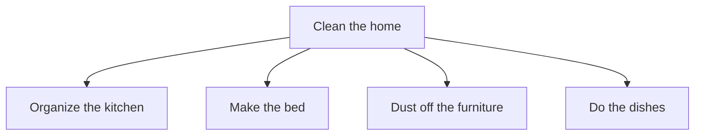

Programming is just a **tool** to solve real-world problems effectively. But translating the real-world problem into a coding one is another problem. We can use some techniques to solve such problems.

### Decomposition
Tackling a complex problem can be tough. We can, therefore, *break the problem into smaller ones and solve them first* or ***decompose*** the problem. 

Say for example you have the task of *cleaning your home*. Decompose it into smaller tasks.

