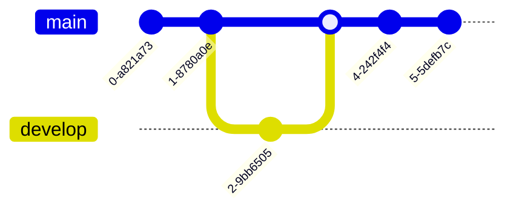

Assume yourself as a chef in a busy restaurant. While preparing a dish, you made an error in one of the steps to follow. This ruined the entire dish.
![[Pasted image 20231021105446.png|500]]
  ^7d1a55

What if, you could travel back in time to **Step 2** and prepare the dish, correctly?
![[Pasted image 20231021105738.png|500]]
  ^505de1

In programming, small changes in code cause errors that might even take days to resolve. A solution would be to revert back to the code when the change wasn't made, yet.

![[Pasted image 20231020143842.png|500]]

This is what **Version Control** does. It tracks all the changes made to a file and makes them available to the user to go back to in a specific folder called **Repository**. ^33d009

### Example
While testing the addition of some new feature in a project, the feature might not work. Modifying the code, over and over again would be inefficient. 

A solution would be to make a testing version of the file. Modify it. If the code works, then update the version of the main file to this one. Else, leave it. 

