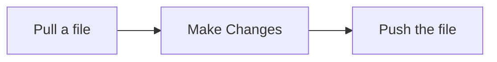

Version Control, itself, isn't sufficient. There are numerous tools and strategies that need to be implemented along with it.

### Workflow
It is, essentially, a *protocol* or a set of steps that can be modified and are followed, while using a VCS. 

This is a basic example of a workflow which is, usually, more complex than this.

 

### Continuous Integration
[[Course/FrontEnd Dev/(3) Version Control/Module 1/The What#^7d1a55|Being a chef]], it is essential to get feedback on the dishes and make changes to the recipe. 
Making changes to the recipes is one part, *preparing dishes according to it is another part*.

 

![[Pasted image 20231021120424.png|400]]

 

In other words, ***any small change made must be implemented instantaneously***. This is **Continuous Integration** or **CI** for short.

### Continuous Delivery
The next step after preparing the improved dish, is to deliver it to the customer to let them taste.

![[Pasted image 20231021140544.png|500]]

This is **Continuous Delivery**. ***Any small change implemented must be made available to use instantaneously***. It is an *extension* of **CI**. Together, they are called **CI/CD**.