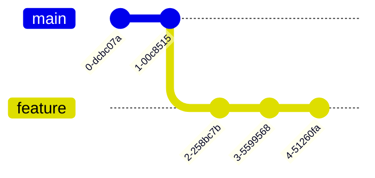
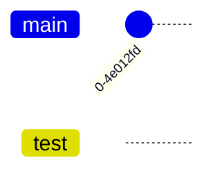
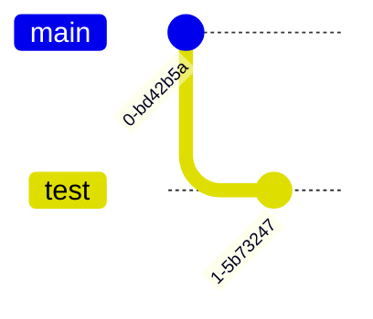

As a [[Course/FrontEnd Dev/(3) Version Control/Module 1/The What#^7d1a55|chef]], you made a mistake while cooking the dish. But corrected it by [[Course/FrontEnd Dev/(3) Version Control/Module 1/The What#^505de1|reverting back]] to before the mistake was made and starting from there.

This is called ***branching***. Creating a *new flow* or **branch** and continuing from there. 

### Application
***Branching*** is quite common amongst developers. 

Say as a developer, you need to add a new feature to a program. The code of the new feature might cause errors in the working of the program, as it is under development.

This is a special case of branching called ***feature branching*** 

It will be a good practice to create a new **branch** where this feature would be added to the program and be tested for any errors.


The `feature` branch is like a copy of the `main` branch. Making changes in the copy won't affect the actual code.
 


If no errors arise, it can be ***merged back*** into the `main` branch, *i.e.* the code of the `feature` branch can be added to the `main` branch.


### Commands
| Purpose | Command | What it means |
|--|--|--|
| List all the branches | `git branch` | *Print all the branches that currently exist in this repository*  |
| Create a branch | `git branch origin` | *Create a branch named origin* |
| Switch to the branch | `git checkout origin` | *Make all the changes from now on in the origin branch* |
| Merge branches | `git merge origin` | *Make all the changes, made in origin branch, in the master branch* |
| Delete branches | `git branch -d origin` | *Delete the branch named origin* |
<br>

>[!info]
>After merging a branch into `master`, the branch still remains with the changes. Merging basically means copying all the changes made in a branch to `master`. 

<br>

### Application
The above scenario can be re-created, programmatically.
<br>
>[!note]
>This is just a recreation of the scenario and not an actual implementation of such a project.

<br>

##### Creating a project
```shell
%% Initialize a Repository %%
git init

%% Create a file and Write some Code %%
touch index.js
cat > index.js
```

<br>

##### Creating a Branch
The need is of adding a feature to a program in JavaScript. 

So, a branch must be created called `test`.

```shell
git branch test
```

Just creating a branch is not enough, switching to it is also important to implement. This can be done using the command `checkout`. 

```shell
git checkout test
```



<br>

##### Making Changes
```shell
cat > index.js
git add .
```

<br>

##### Committing the Changes
```shell
git stage .
git committ .
```



<br>

##### Merging in the Master branch
If the functioning is correct, `test` can be *merged into* `master` branch.
```shell
git checkout main
git merge test
```
