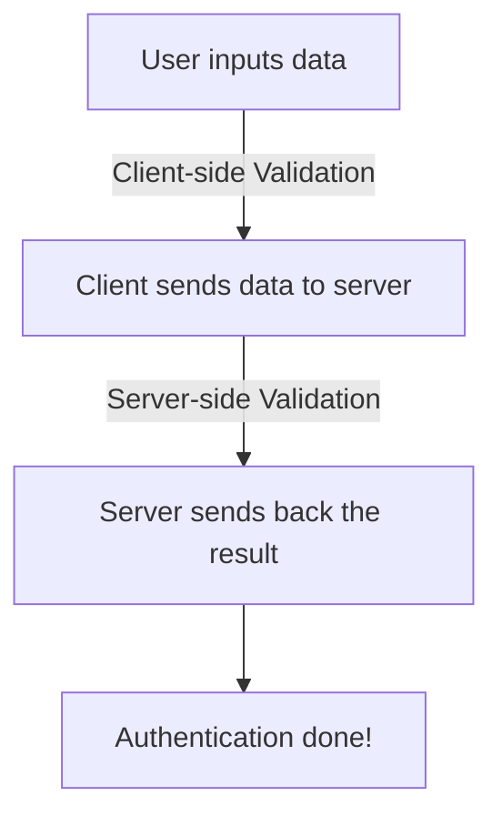

Websites use numerous ways to verify the data entered with *what **should** have entered*. Simply put, this is **form validation**. *form* because the user data is input via HTML forms.

### Approach
Say, for instance, in an Authentication System, the user enters the input for Username and Password. If the credentials are correct, authentication will be successful else not.

![[Pasted image 20231029183004.png]]

The actual process looks something like this.

