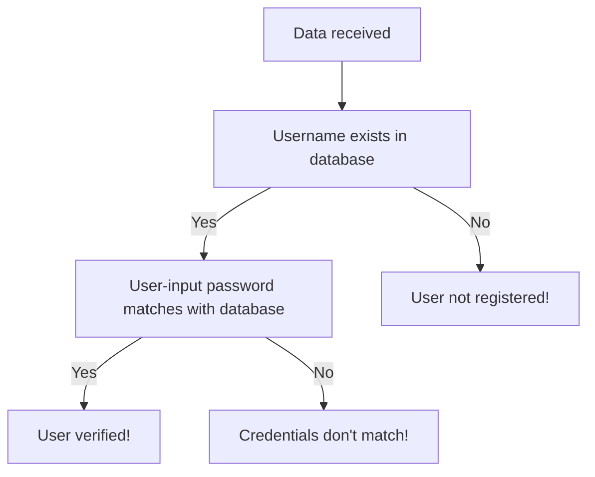

The next *sieve* for data validation is when the data reaches the server. It can be broadly done using two methods.

### Database Check
In cases of Authentication and alike, the user input must be checked with the database. 
For instance, 

### Validity
Checking with how valid or *semantic* the data is, is another type of validation. For instance, typing in the *Company name* in the *Username* section.
