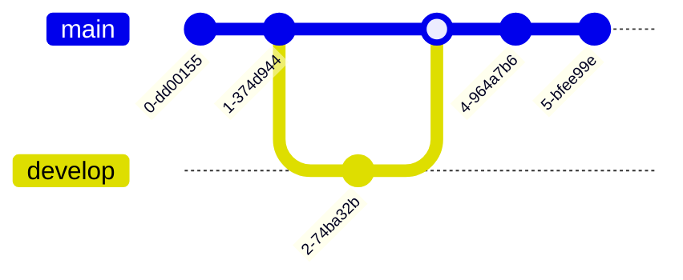
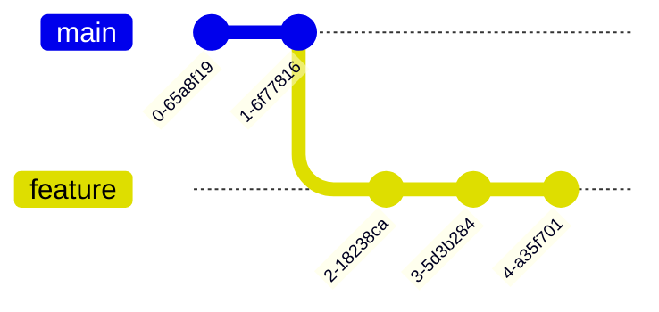
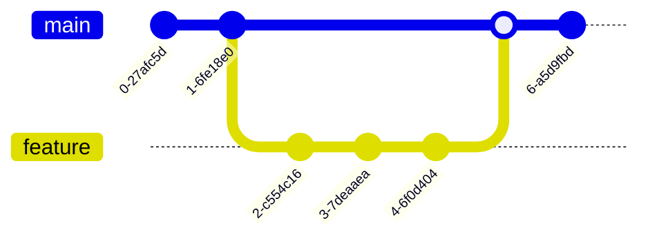

These are some of the fundamentals not **specific** to front-end development, only, rather every aspect of life.

### Framework

A well-structured plan or tool to execute an action of a specific category is a **framework**. For instance, in order to crack an egg, the steps to follow are,

- Pick up the egg
- Strike it, gently, with a hard surface
- Crack it open with ease

This is the _ **framework** to crack an egg_.

### Library

A framework is a methodical way of completing a task. A **library** is built in a way that makes it easy to work with the framework.

For instance, instead of cracking the egg with bare hands, use an egg-cracker. Here, the device acts as a **library**.

### API

Standing for **Application Programming Interface**, it is a medium to access and use databases and servers from **client-side**.

![[Pasted image 20240330175940.png]]

##### Examples

Here are some of the APIs and their functions.

| API          | Function                                 |
| ------------ | ---------------------------------------- |
| Browser      | Interpret JavaScript code in the browser |
| RESTful      | Access data from server or database      |
| Sensor-Based | Communicate with sensors (IoT)           |


# Internet Protocol
An [[Internet Protocols|IP]] standing for **Hyper Text Transfer Protocol**.

### Methods

Functions to modify, retrieve or delete data on the web.

| HTTP Method | Description |
| ----------- | ----------- |
| GET         |             |
| POST        |             |
| PUT / PATCH |             |
| DELETE      |             |

![[Pasted image 20230905160957.png]]

### Request

The request contains:

- Method
- Host Web Address
- HTTP Version
- Other info alike

```http
GET / HTTP/1.1

Host: developer.mozilla.org
Accept-Language: en
```


### Response

The response contains:

- Status Code
- Body of the content
- Server
- HTTP Version
- Other info alike

```http
HTTP/1.1 200 OK

Date: Sat, 09 Oct 2023 14:28:02 GMT
Server: Apache
Last-Modified: Tue, 01 Dec 2023 20:18:23 GMT
ETag: "51142bc1-7449-479b075b2891b"
Accept-Ranges: bytes
Content-Length: 260115
Content-Type: text/html
```

### Status Codes

The codes within an HTTP response indicating the category of the response and its **status**.

![[Pasted image 20230905160332.png]]

A framework that caters to the **Request-Response Cycle** by delivering _data packets_ back and forth the Server-Client pathway.

### Why?

- Data packets' order might get disturbed in transit.
- They may get misrouted.
- The data may get corrupted.

### How?

Just as the real-time conventional postal system.
The client sends a request to the server and gets the desired response via IP.

![[Pasted image 20230904183350.png]]

| Property | Postal System    | Internet Protocol                    |
| -------- | ---------------- | ------------------------------------ |
| Address  | H-3, Street lane | 192.162.0.5                          |
| Parcel   | A mail           | ![[Pasted image 20230905155226.png]] |
| Mode     | Mailman          | HTTP, TCP, UDP,...                   |

### Some Examples

| IP   | Full Form                           | Application                                                                   |
| ---- | ----------------------------------- | ----------------------------------------------------------------------------- |
| HTTP | Hyper Text Transfer Protocol        | Transfer web pages across the web                                             |
| TCP  | Transmission Control Protocol       | Transfer data across the web in precise order and to the right client         |
| UDP  | User Datagram Protocol              | Transfer data on the web corruption-free                                      |
| DHCP | Dynamic Host Configuration Protocol | Gives each client its IP address and redirects responses to the correct ones. |
| DNS  | Domain Name System Protocol         | Regulates the corresponding website of an IP address.                         |
| IMAP | Internet Message Access Protocol    | Retrieve messages and mails on the server                                     |
| FTP  | File Transfer Protocol              | Send, receive, retrieve and delete files on a server                          |
| SMTP | Simple Mail Transfer Protocol       | IMAP, but just for mails                                                      |
| SSH  | Secure Shell Protocol               | Access the server from client system, remotely                                |

Computers connect and communicate with other computers forming a network. This creates a messy graph with the systems at its nodes.

![[Pasted image 20230902163443.png]]

### Network Switch

An interface which serves as a two-way connection between the switch itself and the computer or the client.

![[Pasted image 20230902163507.png]]

Multiple network switches connect each and all to form **Internet** or **Inter**connected-**Net**work.

Also, the services we access via internet are provided via the **Server-Client Model** wherein the Client (user's system) requests the Server (hosting the service) by the medium of Internet.

An application that acts as an interface to the web.

### Functionality

- The User specifies the address of the website also called its **URL** or **Uniform Resource Locator**.

- The Browser sends a request to the [[Web Server]] which then processes and returns the webpage in document form.

![[Pasted image 20230902214741.png]]

- The Browser then [[Website|renders]] the document form into a visual format.

![[Pasted image 20230902214721.png]]

A service provided by owners of large data centers wherein specific memory and computational power is allocated to the client to **host** or bring a website online.

### Types

- #### Shared Hosting

  The bandwidth and memory of a physical server is shared with other users and thus, the user with higher power and memory demand would use the majority of it.

- #### Virtual Private Hosting

  The memory and power supply is pre-determined and remains constant regardless of the demand.

- #### Dedicated Hosting

  A full-fledged physical server is allocated to the user which, too, has upper bounds on memory and power usage but a lot more higher than VPS.

- #### Cloud Hosting
  Both physical server and a cloud server is solely dedicated to a single user with extreme power and memory.

A piece of hardware that provides or **serves** on the **web**. Hence the term Web Server. Some functions are enlisted

- Email Management
- Security
- Authorization
- Request-Response Cycle

![[Pasted image 20230902212139.png]]

### Data Center

Such hardware is located all around the globe to access the data and services from the nearest hotspot called a Data Center.

A collection of documents on the web is a **Website**. The documents themselves are called **Webpages**.

![[Pasted image 20230905164233.png]]

### Webpage Rendering

Webpages being documents, are written in languages such as HTML, CSS and JavaScript and not visually created by drag-drop.

![[Pasted image 20230902213357.png]]

These documents are further interpreted and designed by the browser. This function of the browser is **Webpage Rendering**.

![[Pasted image 20230902213421.png]]

CSS stands for **Cascading Style Sheet** and serves the function of styling an HTML document or simply, a webpage.

## Syntax

Each element in an HTML document can be styled separately and collectively. Below is called a **CSS Rule**.

```CSS
p {
	color: green;
	font-size: 2em;
}
```

| Component | Function                                                   |
| --------- | ---------------------------------------------------------- |
| `p`       | Stylize all elements with this tag called the **Selector** |
| `{}`      | Contain the style declaration block                        |
| `color`   | The property that needs to be modified                     |
| `green`   | The value of the property to be modified                   |

#### Selector

In a CSS rule, the tag name before the opening curly bracket is called a **selector**. It _selects_ the elements of a tag to be modified.

##### CSS Precedence and Specificity

A property of CSS which allows the user to modify specific elements by using different selectors.

| Property | ID Selector                                                                                              | Class Selector                                                                                                                 | Descendant Selector                                                                                                     |
| -------- | -------------------------------------------------------------------------------------------------------- | ------------------------------------------------------------------------------------------------------------------------------ | ----------------------------------------------------------------------------------------------------------------------- |
| Usage    | Modifies all elements with same `id` attribute                                                           | Modifies all elements with the same `class` attribute                                                                          | Modifies all elements with a specified tag within another tag                                                           |
| Syntax   | Use a `#` before the selector                                                                            | Use a `.` before the selector                                                                                                  | Use `#id_of_parent element > tag_to_modify`                                                                             |
| Example  | Sets the color of all elements with `id` as `para_id` to green <br> ![[Pasted image 20230926144947.png]] | Set the color of all elements with `para_class` as the attribute of `class` to green <br> ![[Pasted image 20230926145000.png]] | Sets the color of all `<p>` elements within the `para_class` element to green <br> ![[Pasted image 20230926145033.png]] |

Elements in an HTML document need to be _understood_ by the browser to stylize and display them further with CSS. For instance,

```html
<html>
  <body>
    <h1>Hello World!</h1>
  </body>
</html>
```

```CSS
h1 {
	color: rgba(0, 0, 0, 1);
}
```

How does the browser know as to where shall each letter of `<h1>` be located?

## Box Model

Browsers use what’s called a **box model** to solve the above problem. Each HTML element is assigned a bounding box around it.

![[Pasted image 20230909220226.png]]

| Boundary | What it means                                                |
| -------- | ------------------------------------------------------------ |
| Content  | This is the actual width and height of the content           |
| Padding  | The space between the content size and its bounding box      |
| Border   | The width of the border of the bounding box                  |
| Margin   | The space between the complete element and another one alike |

## Document Flow

The bounding boxes to the elements have been allocated but where shall they be positioned on a webpage?
**Document Flow** specifies the orientation of elements on a webpage.

#### Inline Format

Elements can be specified to have an arrangement such that every next element appears in the same line as the previous or in other words **occupy the space of the content size only**.

![[Pasted image 20230909222305.png]]

This can be done by-

- -choosing elements that are pre-defined as inline elements such as `<span>` and `<form>`.
- -declaring a CSS rule that specifies the layout

```CSS
h1 {
	display: inline;
}
```

#### Block Format

Elements which always occupy a new line or in other words **have the height of an element and the width of the parent element**.

![[Pasted image 20230909222437.png]]

This can be done by-

- -choosing elements that are pre-defined as block elements such as `<div>` and `<input>`.
- -declaring a CSS rule that specifies the layout

```CSS
h1 {
	display: block;
}
```

## Alignment

The above models are for positioning the elements but aligning a piece of text is different than setting it to a block-level element.

#### Text

Text can be aligned in CSS by modifying the `text-align` property in broadly four ways.

| Alignment | Visual                                                                                                                                                                                 |
| --------- | -------------------------------------------------------------------------------------------------------------------------------------------------------------------------------------- |
| `left`    | <p style="text-align: left">Lorem ipsum dolor sit amet, consectetur adipiscing elit, sed do eiusmod tempor incididunt ut labore et dolore magna aliqua. Ut enim ad minim veniam</p>    |
| `right`   | <p style="text-align: right">Lorem ipsum dolor sit amet, consectetur adipiscing elit, sed do eiusmod tempor incididunt ut labore et dolore magna aliqua. Ut enim ad minim veniam</p>   |
| `center`  | <p style="text-align: center">Lorem ipsum dolor sit amet, consectetur adipiscing elit, sed do eiusmod tempor incididunt ut labore et dolore magna aliqua. Ut enim ad minim veniam</p>  |
| `justify` | <p style="text-align: justify">Lorem ipsum dolor sit amet, consectetur adipiscing elit, sed do eiusmod tempor incididunt ut labore et dolore magna aliqua. Ut enim ad minim veniam</p> |

Also, to wrap text around an element the `float` property is edited via CSS.

<div class="parent">
	<div style="height: 100px; width: 150px; background: rgb(128, 128, 128); float: right;">
	</div>
	<div>Lorem ipsum dolor sit amet, consectetur adipiscing elit, sed do eiusmod tempor incididunt ut labore et dolore magna aliqua. Ut enim ad minim veniam
	</div>
</div>

#### Element

Aligning elements just requires the following line of code

```CSS
child_span {
	transform: translate(-x%, -y%);
}
```

The style of text wrapped by elements around can be modified using some basic declarations.

### Font Size and Family

The `font-size` property accepts units such as `px`, `em` along others and the `font-family` demands for the font-style followed by the family to which it belongs.

```CSS
p {
	font-size: 20px;
	font-family: "Roboto", sans-serif;
}
```

### Text Decoration

Text can be _decorated_ or stylized by underlining or striking the text.

```CSS
p {
	text-decoration: underline red dash 3px;
}
```

| Value       | Usage                                    |
| ----------- | ---------------------------------------- |
| `underline` | Type of decoration                       |
| `red`       | Color of the decoration (underline here) |
| `dash`      | Stroke of the decoration (----- here)    |
| `3px`       | Width of the decoration                  |

# Color

Color of font and other elements can be customized in CSS using multifarious color models.

### RGBA

Standing for **Red-Green-Blue-Alpha**, RGBA is a very popular color model. Each one of RGBA is a parameter which tells how much of that color is mixed to get a composite color.

```CSS
p {
	color: rgba(255, 255, 255, 1);
}
```

| Parameter | Usage                           | Range   |
| --------- | ------------------------------- | ------- |
| RGB       | Saturation of RGB in the color  | [0-255] |
| Alpha     | Transparency of the mixed color | [0-1]   |

### HSL

Standing for **Hue-Saturation-Lightness**, HSL is yet another color model which CSS supports.

```CSS
p {
	color: hsl(120, 100%, 50%);
}
```

| Parameter  | What it means                     | Range     |
| ---------- | --------------------------------- | --------- |
| Hue        | The color                         | [0°-360°] |
| Saturation | How much of the color is in there | [0-100%]  |
| Lightness  | How light the color is            | [0-100%]  |

![[Pasted image 20230909161044.png|400]]

**HTML** stands for **Hypertext Markup Language**.

Hypertext → Link to other texts
Markup → Content of the document (Tags and Elements)

### Syntax

Set of rules to abide while writing code in a certain programming language. **Semantics** refers to how coherent the code is.

#### Element

The building blocks of an HTML document or structure are regarded as **elements**. Just as a paragraph of a blog post or a component of a mobile phone.

```html
<p>A paragraph</p>
```

#### Tags

In HTML, **tags** denote an **element** in a code. Tags often contain what’s called **attribute** which provides more information about the **element** and how it should be structured in the document.

```html
<element> is the opening tag of the element </element> is the closing tag of the
element

<element attribute="description">
  denotes the provision of an attribute and associated value</element
>
```

> Note → The value of an attribute need not be enclosed in double or single quotes.

###### Common Tags

| Tags      | Function                                        |
| --------- | ----------------------------------------------- |
| `<hn>`    | Heading with the nth-largest font               |
| `<head>`  | Encapsulates the meta-data of the document      |
| `<p>`     | Paragraph                                       |
| `<body>`  | The main content of the document                |
| `<html>`  | Denotes the start and end of the file           |
| `<title>` | Title of the website to be displayed on the tab |
| `<form>`  | A form-like layout for user-input               |

### Sample Code

```html
<!DOCTYPE html>
<html>
  <head>
    <title>Sample Webpage</title>
  </head>
  <body>
    <h1>Hello World!</h1>
    <p>This is my first website!</p>
  </body>
</html>
```

HTML also supports and avails built-in structures for data management.

## Lists

An element in HTML for displaying point-based data.
HTML supports two broad types of lists.

- ##### Ordered List
  List with bullet points as numbers or index-based bullets.
  <ol>
  	<li>Apple</li>
  	<li>Pineapple</li>
  	<li>Custard Apple</li>
  </ol>

```html
<ol></ol>
acts as a container of the ordered list
```

- ##### Unordered List
  List with basic bullet points.
  <ul>
  	<li>Apple</li>
  	<li>Pineapple</li>
  	<li>Custard Apple</li>
  </ul>

```html
<ul></ul>
acts as the container of an unordered list
```

## Table

Unlike regular tables, tables in HTML aren’t represented in a purely tabular format but somewhat resembles it.

<table>
	<tr>
		<td>A1</td>
		<td>A2</td>
	</tr>
	<tr>
		<td>B1</td>
		<td>B2</td>
	</tr>
</table>

```html
<table>
  <tr>
    <td>A1</td>
    <td>A2</td>
  </tr>
  <tr>
    <td>B1</td>
    <td>B2</td>
  </tr>
</table>
```

```html
<table>
  contains the rows and columns
  <th>
    is for the table header
    <tr>
      is for the table row
      <td>is for the table data</td>
    </tr>
  </th>
</table>
```

The approach to filling out the table is to work your way row-wise.

- ###### Row A

  - `<tr>`
  - Cell A1 or `<td>A1</td>` is added
  - Cell A2 or `<td>A2</td>` is added
  - `</tr>`

- ###### Row B
  - `<tr>`
  - Cell B1 or `<td>B1</td>` is added
  - Cell B2 or `<td>B2</td>` is added
  - `</tr>`

## Forms

Pre-built and structured modes of obtaining user input via HTML.

<form action=/authorization method=POST>
	<label for=username>Username:</label>
	<input type=text id=username>
	<br>
	<label for=password>Password:  </label>
	<input type=password>
</form>

```html
<form action=/authorization method=POST>
	<label for=username>Username:</label>
	<input type=text id=username>
	<br>
	<label for=password>Password:  </label>
	<input type=password>
</form>
```

| Component | Function                              |
| --------- | ------------------------------------- |
| `<form>`  | Encapsulates the contents of the form |
| `<input>` | Prompts for input from user           |
| `<label>` | A description of what to do           |

#### Input Types

| Type       | Function                                                                                                                                                                                              |
| ---------- | ----------------------------------------------------------------------------------------------------------------------------------------------------------------------------------------------------- |
| `text`     | Input text from user <br> <input type=text>                                                                                                                                                           |
| `password` | Inputs hidden text from user <br> <input type=password>                                                                                                                                               |
| `checkbox` | Input the choices of user from given options <br> <input type=checkbox value=Option1> <label for=Option1>Option 1</label> <br> <input type=checkbox value=Option2><label for=Option2>Option 2</label> |
| `radio`    | Input a single choice from user <br> <input type=radio name=Option><label for=option1>Option 1</label> <br> <input type=radio name=Option><label for=Option2>Option 2</label>                         |
| `file`     | Input a file from the user <br> <input type=file>                                                                                                                                                     |
| `email`    | Input email of correct format from user <br> <input type=email pattern=“.+@gmail\.com”>                                                                                                               |

#### Some other Input Elements

These elements are not attributes of the `<input>` tag but rather are tags themselves used for taking user input

| Element    | Function                                                                                                                                                  |
| ---------- | --------------------------------------------------------------------------------------------------------------------------------------------------------- |
| `textarea` | Input lengthy text from user <br> <textarea></textarea>                                                                                                   |
| `select`   | Input the choice of user from a drop-down menu <br> <select name=food><option value=burger>Burger</option><br><option value=Pizza>Pizza</option></select> |

#### Attributes

- #### `<form>`

  - `action` → The address to forward the input
  - `method` → The HTTP method to use

- #### `<input>`

  - `name` → Name of the input element
  - `id` → Identity to denote the element
  - `type` → The mode of input

- #### `<label>`
  - `for` → The element for which the label is
  - `id` → Identity to denote the label

**Document Object Model** or **DOM** is a specific structure of an HTML document that allows for modification of any or all elements of the document via **JavaScript**.

![[Pasted image 20230908181049.png|600]]
What **DOM** does is, it creates a tree of the elements in an HTML document. This is also known as **parsing**.

## Anchor Tags

Elements in HTML used to connect or **hyperlink** webpages or sections of webpages to one-another.

```html
<a href="linking-site">Alt text</a>
```

Here,

- `<a> </a>` is the anchor tag which creates the hyperlink.
- `Alt text` is the text to be displayed in the form of link.

| Color of Link | State                                    |
| ------------- | ---------------------------------------- |
| Blue          | Link not visited                         |
| Purple        | Visited Link                             |
| Red           | Active link: Clicked and being processed |

- `href="linking-site"` is the attribute of the anchor tag which gives the _reference_ or file of target site by the name `linking-site`.

HTML provides built-in elements that support images and videos.

## Images

The `` tag is used as a placeholder of the image and is an **empty tag**.

```html

```

| Component | Usage                                            |
| --------- | ------------------------------------------------ |
| ` `  | Declaration of an image element                  |
| `src`     | Attribute of `` referring to the image file |

Also known as the **Backend**, the **application server** generates content on user-demand which is influenced by certain properties.

Say you want to look for an email from your personal account.

- You open up the Mail webpage on your browser and login to your account. Up till this point everything is the same for everyone. This is called **Static content**.

- Then appears your inbox and you get the mail you wanted. The inbox that appears is personalized by the **application server** and is called **Dynamic content**.

| Static                              | Dynamic                                        |
| ----------------------------------- | ---------------------------------------------- |
| Does not depend on other attributes | Modified in accordance with certain properties |
| Processed by Web server             | Processed by an **Application server**         |

## How does it work?

- The **application server** on getting the user input via the **web server** interacts with the database.
- Searches for the data you want.
- Sends it back to you via the **web server**.

![[Pasted image 20230920214753.png]]

#### Efficiency

Application servers are quick-to-respond thanks to the web servers. Web servers use **caching**.

**Caching** → The content requested by the user gets temporarily stored in the web browser to easily re-deliver it on request.

![[Pasted image 20230920215716.png]]

We have already discussed about **libraries and frameworks** in Module 1.

![[Basic Concepts#Framework|Libraries and frameworks]]

![[Basic Concepts#Library|Libraries and frameworks]]

## Dependencies

Using reusable and pre-built functions in code is an efficient practice.
If our code doesn't include the **dependencies** used, it will not respond to the API and get an error.
Thus, our code gets _dependent_ on the **frameworks or libraries** used. Thus, they are called **dependencies**.

## Package Manager

Numerous frameworks and libraries are built on top of others and thus, they are **dependent** on other frameworks and libraries. Thus, those are also **dependencies** of the original code and must be included in the code.

![[Pasted image 20230910174035.png]]

To simplify it, **package-managers** download all the dependencies associated with a single dependency and the correct version of them as well.

The same websites when viewed on a mobile phone and a laptop differ in the orientation of components and the layout of the webpage. The following are responsible for the same.

## Fluid Images

Images via CSS can be assigned maximum dimensions so they can adjust their size in accordance with the device and its display.

Say an image of a flower is to be displayed on a webpage. We want the original size of the image if enough space is available else it must adapt itself to the device it's viewed on.

```CSS
img {
	max_width: 100%;
}
```

This makes the image adjustable or **fluid**.

## Flexible Grids

Just like fluid images, content grids, too, can be **fluid** or **flexible**. They instead of the conventional `width` and `height` CSS declarations, are associated with a percentage of the space on the webpage.

![[Pasted image 20230912220813.png]]

| Parts   | Structure                                                 | Reference       |
| ------- | --------------------------------------------------------- | --------------- |
| Gutter  | The space between consecutive content grids               | The blue line   |
| Margins | The space between the browser window and the content grid | The black lines |
| Columns | The grids of content                                      | The grey area   |

## Media Queries

These are CSS rules to specify the orientation and layout of a webpage beforehand using CSS. Each condition which triggers the use of the specified rule is called a **Breakpoint**.

#### Desktop

```CSS
@media only screen and (min-width: 700px) {
	.col-1 {
		width: 33.33%;
	}
	.col-2 {
		width: 33.33%;
	}
	.col-2 {
		width: 33.33%;
	}
}
```

The **media query** above specifies that the width of each column must be ⅓ (_one-third_) of the total space available on the webpage.

Also, `@media only screen and (min-width: 700px)` this basically means that any screen with a minimum width of 700px must have this layout. This is the **breakpoint** for the layout.

| Keyword              | Meaning                                                                                                     |
| -------------------- | ----------------------------------------------------------------------------------------------------------- |
| `@media`             | To indicate a media query block                                                                             |
| `only screen`        | To indicate the target. We want the orientation to be just in case of _screens_ and not _print_ or _speech_ |
| `(min-width: 700px)` | The condition which acts as a trigger point for the code                                                    |

#### Mobile

```CSS
@media only screen and (max-width: 700px) {
	[class *='col-'] {
		width: 100%;
	}
}
```

This code `@media only screen and (max-width: 700px)` is the **breakpoint**.

`[class *= "col-"]` declares the same CSS rule for every class-name that begins with _col-_ . It can also be rephrased as

```CSS
@media only screen and (max-width: 700px) {
	.col-1 {
		width: 100%;
	}
	.col-2 {
		width: 100%;
	}
	.col-3 {
		width: 100%;
	}
}

```

Bootstrap associates UI elements with pre-defined `class` names for `<div>` containers.

### How to use it?

Class names usually have a format of `{Base-Class}-{Contextual-Class}`

- Base-Class → The basic Bootstrap component to be added
- Contextual-Class → The modification to be applied to the component

```html
<html>
  <head>
    <link
      rel="stylesheet"
      href="https://cdn.jsdelivr.net/npm/bootstrap@4.4.1/dist/css/bootstrap.min.css"
    />
  </head>
  <body>
    <div class="container">
      <div class="row">
        <div class="alert alert-primary">Message</div>
      </div>
    </div>
  </body>
</html>
```

Here, the `container` has been used to create a grid and `row`, to place the alert message in the first row of the grid.

### Some Common Bootstrap Components

| Bootstrap Component | Bootstrap Classes                                        | Description                                                            |
| ------------------- | -------------------------------------------------------- | ---------------------------------------------------------------------- |
| Grid System         | `container`, `container-fluid`, `row`, `col-*`           | Used for creating responsive layouts based on a 12-column grid system. |
| Typography          | `text-*`, `font-weight-*`                                | Provides text styling options for headings, paragraphs, and alignment. |
| Buttons             | `btn`, `btn-primary`, `btn-secondary`, ...               | Creates interactive buttons with various styles.                       |
| Forms               | `form-group`, `form-control`, `input-group`, ...         | Styles form elements like inputs, checkboxes, and select boxes.        |
| Navigation          | `navbar`, `nav`, `nav-item`, `nav-link`, `dropdown`, ... | Helps create responsive navigation menus and bars.                     |
| Alerts              | `alert`, `alert-*`                                       | Displays alert messages and notifications.                             |
| Badges              | `badge`, `badge-*`                                       | Creates badges or labels for highlighting content.                     |
| Cards               | `card`, `card-header`, `card-body`, ...                  | Structured containers for content presentation.                        |
| Modals              | `modal`, `modal-dialog`, `modal-content`, ...            | Displays modal dialogs for additional content or forms.                |
| Carousel            | `carousel`                                               | Creates image sliders or galleries.                                    |
| Utilities           | Margin and padding classes, text alignment, ...          | Provides utility classes for spacing and alignment.                    |
| Responsive Classes  | `d-*-none`, `d-*-block`, `d-*-inline`, `d-*-flex`, ...   | Controls element visibility and behavior on different screen sizes.    |

### Grid System

A way of _containerizing_ or structuring elements within a document provided by Bootstrap. There are 3 main constituents of a **grid system**.

![[Pasted image 20230914165032.png]]

- ##### Container
  It is the _box_ which encompasses all the elements within.
  <br><br>
- ##### Row

  It is, as the name conveys, a _row_ or a horizontal sub-box with a percent width of the **container** with the length of the **container**.
  <br>

  | Prefix                 | Description                    | Instance         |
  | ---------------------- | ------------------------------ | ---------------- |
  | `-cols-{breakpoint}-#` | Size of each column in the row | `.row-cols-sm-3` |

  <br>

- ##### Column

  It is just a **row** but vertical.

  | Prefix                     | Description                           | Instance              |
  | -------------------------- | ------------------------------------- | --------------------- |
  | `-sm, -md, -lg, -xl, -xxl` | Breakpoints for `min-width` of device | `.col-*`              |
  | `-1, -2, -3, -4, -6, -12`  | Width of the column                   | `.col-{breakpoint}-*` |

  <br>

### Card

A flashcard-like structure useful for product catalogue, features and cases alike.

![[Pasted image 20231125164603.png]]

```html
<!DOCTYPE html>

<html lang="en">
  <head>
    <link
      rel="stylesheet"
      href="https://cdn.jsdelivr.net/npm/bootstrap@4.4.1/dist/css/bootstrap.min.css"
    />
  </head>
  <body>
       
    <div class="container">
             
      <div class="row">
                   
        <div class="col">
                     
          <div class="card"></div>
                     
        </div>
                   
        <div class="col">
                     
          <div class="card"></div>
                     
        </div>
               
      </div>

             
      <div class="row">
                   
        <div class="col">
                     
          <div class="card"></div>
                     
        </div>
               
      </div>
         
    </div>

       
    <script src="../Bootstrap/bootstrap-4.3.1-dist/js/bootstrap.min.js"></script>
  </body>
</html>
```

> [!note]
> The height of the card is variable, i.e. it depends on the _amount_ of content that is in the card.

Bootstrap is a library of pre-written JavaScript and CSS codes for efficient website-making.

## Functionality

Bootstrap provides with pre-designed UI elements that can be used just by modifying the value of `class` of a `<div>` container.

- ##### Bootstrap CSS
  It can be used simply by adding the `<link>` element to `<head>`

```html
<link
  rel="stylesheet"
  href="https://cdn.jsdelivr.net/npm/bootstrap@4.4.1/dist/css/bootstrap.min.css"
  integrity="sha384-Vkoo8x4CGsO3+Hhxv8T/Q5PaXtkKtu6ug5TOeNV6gBiFeWPGFN9MuhOf23Q9Ifjh"
  crossorigin="anonymous"
/>
```

- ##### Bootstrap JS
  It can be used simply by adding the `<script>` element to `<body>`.

```html
<link
  rel="stylesheet"
  href="https://cdn.jsdelivr.net/npm/bootstrap@4.4.1/dist/js/bootstrap.min.js"
  integrity="sha384-Vkoo8x4CGsO3+Hhxv8T/Q5PaXtkKtu6ug5TOeNV6gBiFeWPGFN9MuhOf23Q9Ifjh"
  crossorigin="anonymous"
/>
```

React is a JavaScript library developed by Meta to create UI components.

### Approach

React breaks down documents into components by making a **component hierarchy** each of which is reusable. Also, React solves the problem of frequent browser updates due to changes in the [[DOM]] by a process called **reconciliation**.

#### Reconciliation

React creates a virtual representation of the browser DOM in memory and compares it with the browser DOM to check for changes.

- A change in the document would first lead to a change in the virtual DOM of React

- The updated version of the Dom will be compared with the previous version to identify the change.

- The change will then be made to the browser DOM

![[Pasted image 20230922231704.png|500]]

#### Component Hierarchy

Often, in web applications, elements _house_ other elements. For instance, the shopping list below

![[Pasted image 20230922232626.png|500]]

**Single Page Application** or an **SPA** is a webpage that uses **Dynamic content** and updates when needed rather than being replaced by other webpages.

A traditional website is basically _a web of pages with static elements linked to each other_.

![[Pasted image 20230920220817.png|400]]

It would be inefficient for the web browser to render and reload different pages for every request. Thus **SPAs** are used.

## How they work

There are two types of working of SPAs

#### Bundling

The web server on the initial request for a webpage unloads and sends back all the required HTML, CSS and JavaScript documents.

![[Pasted image 20230920221716.png|500]]

#### Lazy Loading

On every subsequent request, the web server delivers data packets in the **JSON** format which are rendered in the same webpage and updated.

![[Pasted image 20230920221118.png|500]]

Programming is just a **tool** to solve real-world problems effectively. But translating the real-world problem into a coding one is another problem. We can use some techniques to solve such problems.

### Decomposition

Tackling a complex problem can be tough. We can, therefore, _break the problem into smaller ones and solve them first_ or **_decompose_** the problem.

Say for example you have the task of _cleaning your home_. Decompose it into smaller tasks.


They are symbols (not [[Data Types#Symbol|these]] ones) that tell the computer, what to do with the mentioned objects.

#### Arithmetic Operators

Operators used with numbers.
The answers to all the examples below will be 8.

| Operator | Meaning                                     | Example  |
| -------- | ------------------------------------------- | -------- |
| +        | Addition                                    | 7 + 1    |
| -        | Subtraction                                 | 14 - 6   |
| \*       | Multiplication                              | 2 \* 4   |
| /        | Division                                    | 32 / 4   |
| %        | Modulus (returns the remainder on division) | 18 % 10  |
| \*\*     | Exponential                                 | 2 \*\* 3 |

#### Comparison Operators

To compare objects and get a Boolean value. All the examples are true below.

| Operator | Meaning                                            | Example   |
| -------- | -------------------------------------------------- | --------- |
| >        | Greater than                                       | 5 > 2     |
| <        | Less than                                          | 3 < 7     |
| ==       | Checks if the LHS value is equal to RHS value      | 9 == 9    |
| ===      | Checks for the equality of value **and** data type | 16 === 16 |
| !=       | Checks for unequal value                           | 8 != 4    |
| !==      | Checks for unequal value **or** data type          | 1 !== "1" |

> [!Note]
> In the example of the **equality operator** `==` , the LHS is a **number** while the RHS is a **string**.
> Since, the value of LHS and RHS is equal, the statement is true but not in the case of **strict equality operator** `===`.

<br>

#### Logical Operators

To logically analyze a given statement and get a Boolean value. All the examples are true below.

| Operator  | Meaning                                          | Example          |
| --------- | ------------------------------------------------ | ---------------- |
| && (and)  | Checks if both the statements are True           | 5 < 8 && 4 > 2   |
| \|\| (or) | Checks if either of the statements is True       | 5 < 8 \|\| 4 > 2 |
| ! (not)   | Returns for the logical inverse of the statement | !(2 > 3)         |

Placeholders to store data. The term **variable** itself refers to something which can change.

## Syntax

```js
/*To declare a variable and assign it a value*/
var name = "John";
```

| Component | What it means                                |
| --------- | -------------------------------------------- |
| `var`     | It is a **keyword** that declares a variable |
| `name`    | Name of the variable                         |
| `=`       | Assignment operator                          |
| `"John"`  | Value of the variable                        |
| `;`       | End of line of code                          |

## Usage

Variables are generally used when the data to store is unknown or is bound to change.

- ##### Input
  In the case of inputs, we do not know the value beforehand and thus, variables are used.
  <br>
- ##### Repetition
  Often, a value is to be used several times in a code and variables make the code cleaner.

## Example

```js
/*Declare a variable*/
var marks = 90;

/*Print "Your Grade: 90" in the console*/
console.log("Your Grade: ", marks);

/*Updating the value of the variable*/
marks = 94;

/*Print "Your Grade: 94" in the console*/
console.log("Your Grade: ", marks);
```

In the above example, the variable `marks`, initially, is assigned a value of `90`. Later, its value is updated to `94`.

> [!Note] >`var` keyword isn't used while updating the value of
> an already declared variable.

**Number** data type only deals with numbers in a certain range. The rest is dealt by **BigInt**. It is a **big number** data type, indeed.

### Syntax

It can be assigned in two methods.

- By adding or _appending_ an `n` at the end of the number.
- By _calling the function_ **BigInt()**.

```js
/*Adding an 'n'*/
var bigNumber1 = 929902948475894003873n;
console.log(typeof bigNumber);

/*Calling the bigint function*/
var bigNumber2 = BigInt(929993874889029837873);
console.log(typeof bigNumber2);
```

Anything is either **true** or **false**. This represents a **Boolean** data type.

### Syntax

Nothing but the words `true` and `false`, themselves.

```js
/*Assigning the boolean vallue, false, to the variable, attractive*/
var attractive = false;

console.log(typeof attractive);
```

### Logical Operations

Using [[Operators#Logical Operators|logical operators]] on Boolean values, we can manipulate them.

```js
/*I have a dog but I don't have a cat*/
var hasDog = true;
var hasCat = false;

/*I have a pet means I atleast have one of them => OR logical operator*/
console.log("I have a pet:", hasDog || hasCat);

/*I must have both of the pets => AND logical operator*/
console.log("I have both a dog and a cat:", hasDog && hasCat);

/*Opposite of the statement, "I have a dog: true" => NOT logical operator*/
console.log("I don't have a dog:", !hasDog);
```

It is a data type or an object that means an absence of a value, intentionally. **Null** means **nothing**.

### Syntax

Just type `null`.

```js
var success = null;
console.log(typeof success);
```

Simply put, **number** data type contains integers and decimals of a certain range.

```js
/*Data type*/
console.log(typeof 100);

/*When enclosed in quotation marks, numbers are treated as strings*/
console.log(typeof "100");
```

### Syntax

Numbers do not need any extra add-ons.

```js
console.log(198);

console.log(3.14);

console.log(-1 / 2);

console.log(8 % 3);
```

### Concatenation

Numbers do **concatenate** with numbers only if even one of the is a **string**.

```js
var a = "10";
var b = 20;

console.log(a + b);
```

Numbers **concatenate** with strings, too.

```js
var name = "John";
var age = 32;

console.log(name + age);
```

A sequence of alphabetical characters is called a **string**. In simpler terms, text is of **string** data type. ^28e4c8

```js
/*Here we assign a string ("John") to a variable*/
var name = "John";

/*This statement prints the data type of the value of the variable.*/
console.log(typeof name);
```

### Syntax

**Strings** must be enclosed within **single-quotes** `''` or **double-quotes** `""`.

```js
/*Below is a string*/
console.log("I am a Human");

/*This is the same as above*/
console.log("I am a Human");
```

```js
/*Below is an exception*/
console.log('It's sunny today');
```

> [!Note]
> The error above occurred because the symbol for apostrophe and single-quotes is the same.
> Thus, the compiler treats the apostrophe as the end of the statement, `'It'` in this case.
> A better practice is to use **double-quotes** for **strings**.
>
> ```js
> /*Below is an exception*/
> console.log("It's sunny today");
> ```

<br>

### Concatenation

It basically means to join or adhere. In the context of **strings**, it means to join two or more strings into one using the [[Operators#Arithmetic Operators|addition operator]]. ^635605

```js
/*Declaring two variables and assigning them a string*/
var string1 = "Hello";
var string2 = "World";

/*This is what "concatenating two strings" mean*/
var greeting = string1 + string2;

console.log(greeting);
```

> [!info] Empty Strings
> Strings with no value, generally used as placeholders.
>
> ```js
> var name = "";
> console.log(name);
> ```

Generally used in **cryptography**, symbols are unique objects that are used in identifying other objects.
For instance, your fingerprint or your DNA is a **symbol** to you and this **symbol is never same**.

### Syntax

It can be used by calling the **Symbol()** function.

```js
var id = Symbol("MachoMan");

console.log(id);
console.log(typeof id);
```

### Working

Symbols are randomly generated. They are not dependent on the content.
As an example, many companies have employees with the same name. To differentiate them, we assign them an **Employee ID** that is different for every employee.

```js
/*Generating Employee IDs (symbols) of the same name "Harry"*/
var id1 = Symbol("Harry");
var id2 = Symbol("Harry");

/*Despite of the symbols with the same content, the symbols are not same, they are unique*/
console.log(id1 == id2);
```

Another data type similar to [[Null]] which, as well, indicates the absence of a value **but unintentional**.
For instance, the value of a variable when it is not assigned a value at the time of declaration is **undefined**.

```js
var name;
console.log(name);
```

**Conditions** are involved in day-to-day working.
For example, _If I get my work done on time, I might get an appraisal_ or _If I workout today as well, I will get in shape soon_.

Notice the pattern: **_If an event takes place, another event will occur_**
Such statements are called **Conditionals**.

## Approach

Often, we encounter problems in programming involving conditionals.

Say you are an examiner and have to mark answer sheets as **pass or fail**.
If the marks add up to 40%, the result is **pass**. The result would be **fail**, otherwise.


This is a **flowchart** depicting the scenario.

In JavaScript, we create **conditionals** using the `if` and `else` statements.

### Syntax

Here, `condition` is replaced with the condition to be met. If the statement is true, `Event 1` is executed. Otherwise, `Event 2` will be executed.

```js
if (condition) {
	Event 1
} else {
	Event 2
}
```

### Example

Taking up the previous example of the examiner, we can write a JS code for it.

```js
/*Arbitrary marks for testing the program*/
var marks = 80;

/*If marks are greater than 40, print "Pass" in the console.*/
if (marks > 40) {
  console.log("Pass");
} else {

/*Otherwise, print "Fail"*/
  console.log("Fail");
}
```

##### Multiple Conditions

Often, multiple conditions are to be met. For instance, only an adult of the Indian nationality can participate in the General Elections.

In such cases, we can use any of the below.

- `||` or `&&` logical operators
- `and` or `or` keywords

```js
var age = 26;
var nationality = "Canadian";

if (age > 18 && nationality == "Indian") {
  console.log("Eligible to vote");
} else {
  console.log("Not eligible to vote");
}
```

##### Multiple Cases

Say you are a data analyst and have to sort out the _Children_, _Adult_ and _Senior Citizen_ based on their age.
Here, we use the `else if` statements to support multiple cases.

```js
var age = 56;

if (age < 18) {
  console.log("Child");
} else if (age > 18 && age < 60) {
  console.log("Adult");
} else {
  console.log("Senior Citizen");
}
```

> [!Note]
> The `else if` statement can be used multiple times in a conditional but the `if` and `else` statements must be used only once, each.

As an alternative to the [[If...else|if-else]] statement, **switch** statement can be used.

### Syntax

Just as in **if-else** statements the **conditionals** act as a trigger point to an event, **cases** act as the trigger points to those events in **switch** statements.

Here, `expression` is replaced with the parameter that might have many values.

If the value of the `expression` is `value1`, `event1` will take place. If the value is `value2`, `event2` will take place and so on.
If no case matches the value of the expression, the default case will be executed.

```js
switch (expression) {
  case value1:
    event1;
    break;

  case value2:
    event2;
    break;

  default:
    event0;
}
```

The code above when programmed in `if-else` statements would be the understated.

```js
if (expression === value1) {
  event1;
} else if (expression === value2) {
  event2;
} else {
  event0;
}
```

### Example

You are a Software Engineer in an automotive company. You have been assigned the project to display on the car's dashboard screen, when to move, stop or halt, given the state of traffic light.

```js
/*For testing the program*/
var light = "green";

/*The variable "light" can have many possible cases, so it is the expression*/
switch (light) {
  /*When `light = "green"`, "You can go" will be printed*/
  case "green":
    console.log("You can go");
    break;

  case "red":
    console.log("Stop!");
    break;

  case "yellow":
    console.log("Halt");
    break;

  default:
    break;
}
```

A [[Programming|high-level programming language]] generally used in making web applications and IoT devices.

### Properties

- ##### Direct Interaction
  Allows to interact with the server-side from the client-side, dynamically and remotely.
  <br>
- ##### Backwards Compatibility
  Makes old version of a software also called **legacy code** usable in the future as well.
  <br>
- ##### Convenient
  It's easy-to-use and has human-readable syntax
  <br>
- ##### Vast Community
  Being the most popular programming language on the planet, it has a huge community and thus, solutions to numerous problems, various [[Dependency and Package|packages]] and much more.

## Syntax

Below is a code snippet of JavaScript.

```javascript
/*To print 'Hello World' in the console */
console.log("Hello World");
```

| Term            | What it means                                                   |
| --------------- | --------------------------------------------------------------- |
| `console`       | Accessing the console                                           |
| `.log()`        | Function to print in the console                                |
| `"Hello World"` | **Parameter** of `console.log()` or the statement to be printed |
| `;`             | To indicate the end of line of code                             |
| `/**/`          | Multiline comment in JavaScript                                 |

Next: [[Variables]]

Instructing a machine to perform specific tasks or to **program** it to do something is **programming**.

### Programming Languages

Machines are just a bunch of electrical circuits and therefore, to communicate with them, **programming languages** are used.

| Property    | Low-Level Languages                                               | High-Level Languages                                                |
| ----------- | ----------------------------------------------------------------- | ------------------------------------------------------------------- |
| Readability | Closer to machine language and are easily understood by machines. | More human-readable and are first converted to low-level languages. |
| Example     | ![[Pasted image 20230926134331.png]]                              | ![[Pasted image 20230926134317.png]]                                |

![[Pasted image 20230926132756.png|250]]

**Looping** basically means to repeat an action over and over again up till a given point.
For instance, _Read the text until you understand it_ or _Keep running until you are tired_.

Notice the pattern: **_Keep doing action until a condition is satisfied_**.
This is the basic structure of a **loop**.

### Approach

Take up the [[Course/FrontEnd Dev/(2) JavaScript/Module 1/Conditionals/Concept#Approach|scenario]] where you were an examiner, you have to mark 100 such answer sheets.
In such a case, the [[Course/FrontEnd Dev/(2) JavaScript/Module 1/Conditionals/Concept|conditional]] needs to be **looped** over 100 times.


The above **flowchart** would depict the scenario.

### Structure

Loops in JS have the similar basic structure.

| Component        | Function                                                                                          |
| ---------------- | ------------------------------------------------------------------------------------------------- |
| Counter variable | To count the number of repetitions done                                                           |
| Condition        | The loop will be executed up till the condition is satisfied or until the condition is satisfied. |
| Code Block       | The code to be executed in each repetition                                                        |

Loops can be executed in JavaScript in two ways. `for` loop is one of them.

### Syntax

This is the crude structure of `for` loops in JS. Notice, we declare the [[Course/FrontEnd Dev/(2) JavaScript/Module 1/Loops/Concept#Structure|counter variable]] variable inside the `for` loop.

```js
for (var i; condition; increment / decrement) {
  //Code Block
}
```

| Component             | What it means                                                             |
| --------------------- | ------------------------------------------------------------------------- |
| `for`                 | Initiating the `for` loop                                                 |
| `var i;`              | Declaring a counter variable                                              |
| `condition;`          | The `condition` here is to be replaced with the one to satisfy            |
| `increment/decrement` | The counter variable can either be incremented `i++` or decremented `i--` |

### Example

Let's take up the [[Course/FrontEnd Dev/(2) JavaScript/Module 1/Loops/Concept#Approach|example of the examiner]]. We can use [[Problem-Solving#Decomposition|problem decomposition]] here.


<br>

- ##### Making a Conditional for Pass or Fail
  If the `marks` are greater than 40%, the result is **Pass** else **Fail**.

```js
if (marks > 40) {
  console.log("Pass");
} else {
  console.log("Fail");
}
```

<br>

- ##### Loop for the Conditional
  A Counter variable `k` will be incremented until its value becomes `100`.

```js
for (var k; k =< 100; k++) {

}
```

<br>

- ##### Add them up
  This will be looped 100 times over and print the result of all the candidates in the console.

```js
for (var k; k <= 6; k++) {
  if (marks > 40) {
    console.log("Pass");
  } else {
    console.log("Fail");
  }
}
```

> [!Note]
> This is not an actually executable code. It is just a representation of how the code would look like. It is used to depict the approach of solving this problem.

A loop in another loop is called a **nested loop**.

### Syntax

It is essentially made up of the `for` loops and `while` loops. Therefore, there is no different syntax for nested loops. In the each iteration of the outer loop, the inner loop completes all of its iterations.

```js
for (expression1) {
		//Code block
		for (expression2) {
			//Code Block
		}
}
```

### Example

Say you have to print the days of two consecutive weeks.

```js
for (var i = 1; i <= 2; i++) {
  console.log("Week", i);

  for (var k = 1; k <= 7; k++) {
    console.log("Day", k);
  }
}
```

- On running the code, when `i = 1`, `Week 1` will be printed
- Then the inner loop will be completed.
- The second iteration of the outer loop starts at `i = 2`
- The complete inner loop is executed.

The second type of loop in JS is the `while` loop.

### Syntax

Its syntax is somewhat similar to the `if` statement but its components resemble the `for` loop. The `condition` will be replaced by the actual condition. Notice how the [[Course/FrontEnd Dev/(2) JavaScript/Module 1/Loops/Concept#Structure|counter variable]] is declared outside the loop.

```js
var i = 0;

while (condition) {
  //Code block
}
```

### Example

We can construct a `while` loop for the same [[Course/FrontEnd Dev/(2) JavaScript/Module 1/Loops/Concept#Approach|examiner problem]].
The above loop will be executed until `k = 100`.

```js
var k = 0;

while (k <= 100) {
  if (marks > 40) {
    console.log("Pass");
  } else {
    console.log("Fail");
  }
}
```

Often, while writing and executing code, we face **errors** and **bugs** which prevent the code from running the way we wanted it to.

### Bugs

Mistakes or rather the code, that gets executed in another way which we didn't want.
For instance,

```js
// Declaring two variables with numbers
var a = 10;
var b = "20";

// Adding the two numbers together
console.log(a + b);
```

Instead of `30`, the result is `"1020"` which is not the desired one. This is a **bug**.

### Error

These are bugs that prevent the code from further execution. For instance,

```js
console.log(c + d);
console.log("Hello World!");
```

Here, the variables `c` and `d` have not been declared, earlier. Thus, it _throws the_ **Reference error** and the `Hello World!` statement doesn't get printed as the execution stops.

There are various predefined errors.

| Error           | Trigger Point                                   | Example                           |
| --------------- | ----------------------------------------------- | --------------------------------- |
| Reference Error | Using undeclared variables                      | `console.log(x + y);`             |
| Syntax Error    | When the syntax is not correct                  | `var name = "John;`               |
| Type Error      | When incorrect methods are used with data types | `var age = 10;` <br> `age.pop();` |

## The Solution

To tackle **errors** and **bugs**, we must first know where they are and then, prevent them from terminating the execution of the code. The `try-catch` statements serve this purpose.

#### Syntax

In the `try` statement, the code block which might produce an error, is placed. If an error is caught, the the code block inside the `catch` statement gets executed. Here, `err` is the parameter of the `catch` statement which is the error caught.

```js
try {
  //Code Block
} catch (err) {
  //Code Block
}
```

#### Example

The code block inside `try` statement uses an undeclared variable `d` instead of `b`. This must raise the `ReferenceError()` which, in turn, would trigger the code block inside `catch` statement.

```js
try {
  var a = 10;
  var b = 20;
  console.log(a + d);
} catch (err) {
  console.log(err);
  console.log("An error is caught in the above code");
}
```

<br>

Note that there is no error in the code block inside the `try` statement and thus, the `catch` block wouldn't be executed.

```js
try {
  console.log("Hello World!");
} catch (err) {
  console.log("There was an error");
}
```

<br>

> [!info]
> Often, in high-level programs, there is a need of raising errors, willingly. This can be done using the `throw` statement.
>
> ```js
> try {
>   throw new SyntaxError();
> } catch (err) {
>   console.log("This error was raised at will");
> }
> ```

Now that you have marked the answer sheets as the [[Course/FrontEnd Dev/(2) JavaScript/Module 1/Loops/Concept|examiner]], it's time to declare the result.
You have to print the marks against the name of each candidate.
`Name => Marks` ^48d621

It's code would be

```js
var name = "Some Name";
var result = 70;

console.log(name, "=>", result);
```

To write this over and over again for different names, numerous variables would have to be declared. Thus, we use **functions**.
Re-usable pieces of code which perform a given _function_ are called **functions**.

### Syntax

```js
//Defining a function
function functionName(parameter1, parameter2) {
  //Code Block
}

//Calling the function
functionName(argument1, argument2);
```

| Component                  | What it means                                                                                               |
| -------------------------- | ----------------------------------------------------------------------------------------------------------- |
| `function`                 | It indicates that the following code is a function                                                          |
| `functionName()`           | Name of the function                                                                                        |
| `parameter1`, `parameter2` | **Parameter** is the variable that acts as a placeholder. There can be multiple **parameters**              |
| `Code Block`               | This is the body of the function. It tells the computer what to do                                          |
| `argument1`, `argument2`   | **Argument** is the input given to the function while calling it. It is also the value of the **parameter** |

### Application

The function `result` for printing the result in the given format would be the following.

```js
function result(name, marks) {
  console.log(name, "=>", marks);
}

result("John", 80);
result("Mary", 65);
result("Isiaha", 90);
```

> [!note]
> The same parameter name must be used throughout the function for the same parameter.

Hundreds of employees work in a company. Keeping track of their data can be difficult especially if it is unorganized.

```js
//Employee 1
var employee1Name = "John";
var employee1Id = 1000;
var employee1Designation = "Manager";
var employee2Work = function () {
  console.log("Supervise and lead the team");
};

//Employee 2
var employee2Name = "Mary";
var employee2Id = 1002;
var emplyee2Designation = "Analyst";
var employee2Work = function () {
  console.log("Predict the market");
};
```

For just 2 employees, we have 6 different variables and 2 functions which is way inefficient.
In such a situation, the data of each employee can be grouped under a single unit called **object**.


^fc35c6

<br>

> [!note]
> The container `Employee` is an **object**. The data `Name`, `ID` and `Designation` are called **properties**. The function `Work()` is a **method** of the object.

<br>

### Syntax

Creating an **object** of name, `objectName`with two **properties** and corresponding values and one **method**.

```js
var objectName = {
  property1: value1,
  property2: value2,
  method1: function () {
    //Code Block
  },
};
```

### Data Type

Object is one of the many data-types in JavaScript. Other data types can be converted to the Object data type using the `Object()` constructor.

```js
// Declaring a variable with a numerical value
var num = 3;

// Making it an object
num = Object(num);

console.log(num);
console.log(typeof num);
```

##### Some methods of `Object()`

- `create()`
  Used to create an instance of the object.

```js
var food = {
  taste: "savoury",
  drl: "non-veg",
};

var chicken = Object.create(food);
console.log(chicken.taste);
```

<br>

- `keys()`
  **Keys** are the properties of an object.
  Lists all the _keys_ or properties of an object. ^4eabae

```js
var food = {
  taste: "savoury",
  drl: "non-veg",
};

var chicken = Object.create(food);
console.log(Object.keys(chicken));
```

<br>

- `values()
  **Values** are the values of the properties or **keys** of an object.
  Lists all the _values_ or the values of the properties of an object.

```js
var food = {
  taste: "savoury",
  drl: "non-veg",
};

var chicken = Object.create(food);
console.log(Object.values(chicken));
```

### Example

Now, an object for John can be constructed using JS as follows.

```js
var employee = {
  name: "John",
  id: 1001,
  designation: "Manager",
  work: function () {
    console.log("supervises and leads the team");
  },
};
```

<br>

Using the **dot-notation**, we can access the data or **properties** of the object `john`.

```js
console.log(john.name);
john.work();
```

<br>

> [!info]
> Imagine, you are a manufacturer and produce the same item daily. Every aspect of every item is the same except for its `manufacturingID`. Another way of creating instances of objects can be used here.
>
> ```js
> // Creating an object prototype for the item
> var item = {
>   name: "Somename",
>   pkgUnit: 0001,
>   id: 0,
> };
>
> // Creating its instances
> var item1 = Object.create(item);
> item1.id = 1;
>
> var item2 = Object.create(item);
> item2.id = 2;
> ```

For increasingly complex programs, loops must also be up to the par.

- #### [[For-of Loop]]
- #### [[For-in Loop]]

Similar to the [[For-of Loop|for-of loop]], it is used to iterate over JavaScript components. The difference is that `for-of` loop is better suited for iterable objects like _arrays_ and the `for-in` loop is suitable for objects.

### Why?

Using a `for-of` loop and a `for-in` loop on a `car` object and an [[Arrays|array]], gives the following result.

- #### On Object

```js
const car = {
  speed: "slow",
  weight: 1000,
};

for (let property in car) {
  console.log(property);
}

for (let property of car) {
  console.log(property);
}
```

| `for-of`                                            | `for-in`                                                 |
| --------------------------------------------------- | -------------------------------------------------------- |
| Returns the [[Objects#^4eabae\|keys]] of the object | raises `TypeError()` saying `car object is not iterable` |

<br>

- #### On Arrays

```js
const parts = ["engine", "chassis", "battery"];

for (part of parts) {
  console.log(part);
}

for (part in parts) {
  console.log(part);
}
```

| `for-of`                         | `for-in`                              |
| -------------------------------- | ------------------------------------- |
| Yields the elements of the array | Returns the indexes of those elements |

Thus, the `for-of` loop is better for iterable components.

Say, an object has been created with some transactions in it.

```js
const transactions = {
  John: -100,
  Mary: +30,
  Isiaha: +170,
  Ali: -80,
};
```

In order to list all the transactions, the following program would have to be used.

```js
console.log(transactions.John);
console.log(transactions.Mary);
console.log(transactions.Isiaha);
console.log(transactions.Ali);
```

### Syntax

```js
for (item of iterable) {
  // Code Block
}
```

| Component  | What it means                                               |
| ---------- | ----------------------------------------------------------- |
| `for`      | Indicates a `for` loop                                      |
| `item`     | Variable that iterates over                                 |
| `iterable` | An _iterable_ object or an object that can be iterated over |

### Example

Here, we need to iterate over the values of the `transaction` object. We thus use the `values()` method of the `Object` constructor.

```js
const transactions = {
  John: -100,
  Mary: +30,
  Isiaha: +170,
  Ali: -80,
};

for (person of Object.values(transactions)) {
  console.log(person);
}
```

A few of the less used operators in JavaScript are **spread** operator and **rest** operator.

### Spread Operator

Printing out the names of hundreds of students stored in an array or an object is quite tedious. The fast way is the **spread** operator `...`

```js
const students = ["John", "Mary", "Isiaha", "Ali", "Michael"];

console.log(...students);
```

### Rest Operator

It is used in creating sub-arrays out of lengthier arrays.

```js
// Creating an array
const students = ["John", "Mary", "Isiaha", "Ali", "Michael"];

// The first three variables are assigned to the first three elements and the rest of the elements are pushed in the participants array
const [john, mary, isiaha, ...participants] = students;

console.log(john, mary, isiaha);
console.log(participants);
console.log(students);
```

<br>

> [!info] De-structuring
> In the above code, the `students` array is de-structured or in other words, it is broken down into several components.
>
> ```js
> const toppers = ["Isiaha", "Michael", "Mary", "John", "Ali"];
> const [first, second, third, …consolation] = toppers;
>
> console.log(first);
> console.log(consolation);
> ```
>
> Each of the variables `first`, `second` and `third` have the values as the first three elements of the array and the rest are stored in the `consolation` array.

^4911b4

One way of creating variable strings is

```js
var name = "John";
console.log("Hey!", name);
```

But using it for multiple variables isn't much maintainable.

### Syntax

Here, the variable that is to be included in the string, is wrapped inside `{}` _curly-brackets_ preceded by a `$` and the string is to be wrapped in `` _backticks_.

```js
var name = "John";

console.log(`Hey! ${name}`);
```

A few more methods to manipulate arrays and retrieve the desired data

### `forEach()`

What it says is, _for each element in the array, perform a function_.

Say, you have a list of the students who have passed. The task is to add `Pass` against each of their names.

One way is using a `for` loop.

```js
const students = ["John", "Isiaha", "Mary"];
const newArray = [];

for (student of students) {
  newArray.push(`${student} : Pass`);
}

console.log(newArray);
```

The other way is `forEach()` method.

```js
const students = ["John", "Isiaha", "Mary"];

// For each student in the array, replace the string at the index with "Name: Pass"
students.forEach(function (name) {
  students[students.indexOf(name)] = `${name} : Pass`;
});

console.log(students);
```

### `map()`

It is similar to `forEach()` but the slight difference is that it transforms the array into a new one where `forEach()` performs some action on the same array.

`map()` methods accepts the array, executes the function for each element and stores the result in a new array.

```js
const students = ["John", "Isiaha", "Mary"];

const newStudentArray = students.map(function (name) {
  return name + ": Pass";
});

console.log(newStudentArray);
```

### `filter()`

As the name suggests, it _filters_ out the unwanted and returns what we input.

```js
const students = ["John", "Mary", "Isiaha"];

const studentsWithNameJohn = students.filter(function (name) {
  return name === "John";
});

console.log(studentsWithNameJohn);
```

Containers are used as storage units. Arrays, too, are such containers.

### Syntax

This is the basic structure of an array. Each of the elements has an **index** or the position in the array. `element1` has the index `0`, `element2` has `1` and `element3` has `2`.

```js
var array = [element1, element2, element3];
```

| Component                      | What it means                                |
| ------------------------------ | -------------------------------------------- |
| `array`                        | Name of the array                            |
| `[]`                           | Container                                    |
| `element1, element2, element3` | **Elements** or the data stored in the array |

### Operations

Just storing data and not being able to retrieve it or edit it would make the container useless. Understated are some of the operation on arrays.
<br>

- ##### Retrieving
  Accessing or getting the data back from the array is retrieval. Any element can be accessed if its index is known or vice-versa.

```js
var fruits = ["papaya", "melon", "litchi"];

// Getting the element using index
console.log(fruits[1]);

// Getting the index using the element
console.log(fruits.indexOf("melon"));
```

<br>

- ##### Length
  Arrays can contain virtually infinite elements. Knowing the number of elements can be simplified.

```js
var fruits = ["papaya", "melon", "litchi"];

console.log(fruits.length);
```

<br>

- ##### Appending
  Adding elements to an array is called **appending**.

```js
var fruits = ["papaya", "melon", "litchi"];

fruits.push("mango");
console.log(fruits);
```

### Example

An array containing some books would be

```js
var books = ["The Alchemist", "The Hobit", "Think and Grow Rich"];
```

```js
// Getting a book
var hobit = books[books.indexOf("The Hobit")];
console.log(hobit);
```

```js
// Adding another book
books.push("Rich Dad Poor Dad");
console.log(books);
```

```js
// Getting the length of the array
var len = books.length;
console.log(len);
```

Not the locations ones, they essentially hold data but in a _key-value pair_.

There are 3 boxes each with a label and uniquely colored set of balls.  
![[Pasted image 20231015181503.png|500]]
A simple way to remember the box containing a specific color of balls would be to associate them.

- Box 1 → Yellow
- Box 2 → Green
- Box 3 → Pink

This is called a **map** and each of these is called a **key-value pair**.

### Syntax

Here a **map** is created using the `Map()` constructor.

```js
const colorBalls = new Map();
```

| Component    | What it means                                  |
| ------------ | ---------------------------------------------- |
| `colorBalls` | Name of the map                                |
| `new`        | To create a new instance of the object `Map()` |
| `Map()`      | Constructor function of the `Map()` object     |

### Methods

Some of the methods used on **maps** are as follows.

- #### `set()`

  To add a key-value pair
  <br>

- #### `get()`
  To get the value of a key

### Example

Taking up the instance of box containing balls.

```js
const colorBalls = new Map();

// Adding key-value pairs using set() method
colorBalls.set("Box 1", "Yellow");
colorBalls.set("Box 2", "Green");
colorBalls.set("Box 3", "Pink");

// Retrieving the value of a key
const box2 = colorBalls.get("Box 2");

console.log(colorBalls);
console.log(box2);
```

They basically are arrays with the only difference being that **sets** cannot contain duplicate elements.

### Syntax

```js
var array = [1, 2, 3, 4];

const sampleSet = new Set(array);
```

| Component   | What it means                                                       |
| ----------- | ------------------------------------------------------------------- |
| `sampleSet` | Name of the set                                                     |
| `new`       | To create a new instance of the object `Set()`                      |
| `Set()`     | Constructor function of the `Set()` object                          |
| `array`     | A sample array that the `Set()` constructor takes in as an argument |

Initially, there isn't much use of **sets**. Thus, extra methods aren't mentioned here.

### Example

Repeating items in a grocery list would neither be nice to the pocket nor to the storage.

```js
let groceryList = ["milk", "oatmeal", "bread", "eggs", "cereal", "milk"];

groceryList = new Set(groceryList);
console.log(groceryList);
```

Here, the repeated item `milk` has been removed as **sets** can not contain duplicates.

DOM or [[DOM|Document Object Model]] can be accessed using JavaScript in the browser.

#### `document` Object

Each webpage is stored in a DOM, and precisely, inside a JavaScript object named `document` which can be accessed through the console as follows.

```js
document;
```

### Creating Elements

Elements can be created using JavaScript, as well.

```js
document.createElement("h1");
```

This creates an `<h1>` element in the webpage.

### Accessing Elements

The elements inside the `document` object can be accessed by using the `querySelector()` method which takes in the element as an argument.

```js
// This will return the first <h2> element
document.querySelector("h2");
```

These elements can be accessed by `class` and `id` as well.

- ##### `class`
  This can be done using the `getElementbyClassName()` method.

```js
document.getElementbyClassName("primary");
```

- #### `id`
  This can be done using the `getElementbyId()` method.

```js
document.getElementbyId("heading");
```

### Editing the Elements

Just accessing and not being able to edit these elements would be meaningless. This can be achieved using the `innerText()` or `innerHtml()` methods.

```js
const heading = document.querySelector("h1");
heading.innerText = "Hello World!";
```

This changes the text of the heading to `Hello World!`.

JavaScript is used to add interactivity to websites and this is where it begins. Handling events basically means to _look out for any interaction made by the user_.

### Click or Tap

Say, you are building a webpage which accepts user input and prints it in the console on the click of a button. How will the button know what to do?

One way of assigning a function to a button is using the `addEventListener()` method.
It takes in two arguments.

- Type of event, click in this case
- The function to assign the component.

#### Example

A button can be assigned a function of printing `Hello World!` in the console.

```js
function print() {
  console.log("Hello World!");
}

const btn = document.querySelector("button");
btn.addEventListener("click", print);
```

The second method is by adding the `onClick` attribute to the element in the HTML document itself.

```js
// index.js
function print() {
  console.log("Hello World!");
}
```

```html
%% index.html %% <button onClick="print()">Print<button></button></button>
```

One of the ways of writing code professionally and minimizing the effort is using **modules** which basically are pieces of JavaScript code that can be re-used.

Say, for instance, you have been creating a Banking System in JavaScript.

```js
class Bank {
  // A lot of code
}

class Account {
  // Some Code
}

class Savings extends Account {
  // Some code
}

class Current extends Account {
  // Some Code
}
```

In such a case, managing multiple classes in a single file is confusing. These classes can be written and accessed over independent files.

```js
// bank.js

class Bank {
  // Some Code
}
```

```js
// account.js

class Account {
  // Some code
}

class Savings {
  // Some code
}

class Current {
  // Some code
}
```

Each of the files is called a **module**. All of them can be accessed using `import`.

```js
// main.js

import Bank from "./bank.js";
import Account from "./account.js";
```

| Component       | What it means                                  |
| --------------- | ---------------------------------------------- |
| `import`        | Importing means receiving                      |
| `Bank, Account` | The classes or methods to import               |
| `./bank.js`     | The file which contains the classes or methods |

Just as in Apparel and Clothing, it's not the clothes, what matters is the sense of color and combination. In programming, _what makes the code cleaner and more professional is the style of writing it_.

These styles are called **paradigms**. The difference is not in the syntax but in the order and style. Two of them are

- #### [[Course/FrontEnd Dev/(2) JavaScript/Module 3/Paradigms/FP/Concept|Functional Programming]]
<br>
- #### [[Course/FrontEnd Dev/(2) JavaScript/Module 3/Paradigms/OOP/Concept|Object-Oriented Programming]]

**FP** for short, functional programming majorly involves **functions** to write programs. The variables are separated from the functions, herein.

### Example

A program, in the FP paradigm, for calculating the total price of a transaction.

```js
// Function separated from the data
function totalPrice(cost, taxRate) {
  return cost + (cost * taxRate) / 100;
}

// Data in the form of variables
var sampleCost = 100;
var sampleTaxrate = 3;

// Invoking the function with the data
var amount = totalPrice(sampleCost, sampleTaxrate);
console.log(amount);
```

**Recursion** means _repeating an action_, just like loops. But, recursion can also be achieved using functions.

### Approach

Say you have to make a counter of $n$ days in the console.

- ##### Using Loops
  A `for` loop would do the work.

```js
// Sample variable to test the loop
var n = 5;

// The loop
for (var i = n; i >= 1; i--) {
  console.log("Day", i);
}
```

<br>

- ##### Using Functions
  Herein, we call the function inside itself.

```js
// The function
function getDays(n) {
  console.log("Day", n);
  if (n === 1) {
    return;
  } else {
    getDays(n - 1);
  }
}

// Sample call to test the program
getDays(5);
```

On running the program,

- First, `Day 5` is printed.
- If the value of `n` is `1`, exit the function and terminate the program else call `getDays(n - 1)`.
- The function `getDays()` then gets called for `n - 1 = 5 - 1 = 4`.
- The above steps are repeated until `n === 1`.

> [!note]
> The bottom limit for `n` was chosen to be `1` as the function would be called for `n - 1` which would be `0` in the case, printing `Day 0` which didn't make much sense.

A function for calculating the speed of a car would be

```js
function getSpeed(distance, time) {
  console.log(distance / time);
}
```

What about acceleration?

```js
function getAcceleration(speed, time) {
  console.log(speed / time);
}
```

But, the speed is calculated by another function `getSpeed()`. The result of the `getSpeed()` function can be used as an input in the `getAcceleration()` function using **`return` statements**.

```js
// Defining the functions
function getSpeed(distance, time) {
  return distance / time;
}

function getAcceleration(speed, time) {
  return speed / time;
}

// Declaring the variables
var sampleDistance = 100;
var sampleTime = 2;

// Assigning the returned values to variables
var calaculatedSpeed = getSpeed(sampleDistance, sampleTime);
var acceleration = getAcceleration(calaculatedSpeed, sampleTime);

// Printing the values in the console
console.log(calaculatedSpeed, acceleration);
```

Here, the `return` statement gives back the output whenever the function is called.

Say, in [[Course/FrontEnd Dev/(2) JavaScript/Module 3/Paradigms/FP/Scope/Concept#^e7cb89|this]] case, two students of the same name _Harry Snyder_ belong to each of the classes. For the teachers, it would be easy to address them since there is only one _Harry Snyder_ in each class. But for the _Principal_, this would create confusion since both of them belong to the same school.

### Example

Variables declared in a block of code are _scoped to that block_. Here, two variables of the same name co-exist only because one of them is scoped to the `for` **block**.

```js
// Declaring a variable at global scope
let name = "Harry Snyder";

function getName(classRoom) {
  let name = "Harry Snyder";
  console.log(name + classRoom);
}

getName("A");
console.log(name);
```

> [!note]
> This only works with [[Let|let]] and [[Const|const]] declaration keywords.

In a school, there are many classrooms which all have a different set of students and a teacher.
The teacher can deal with the students of his/her own class but not of other classes.
But, the principal must deal with all of the students to keep a check on how well they perform. ^956532

![[Pasted image 20231007231505.png|500]] ^e7cb89

## Why?

Scope might seem unnecessary but is actually very useful.

- Commonly, extra variables have to be declared inside functions which are not significant in the program otherwise, `speed` and `acceleration` in this case. Scope allows for such variables to be inaccessible outside the code.

```js
function getAcceleration(distance, time) {
  var speed = distance / time;
  var acceleration = speed / time;
  return acceleration;
}

console.log(speed);
```

<br>

- Using [[Declaration Keywords|declaration keywords]] other than `var`, makes those variables absolute which can be used to store sensitive information.

```js
// Declaring a variable using const
const name = "John";

// Its value cannot be updated
name = "Mary";
```

The _Principal_ [[Course/FrontEnd Dev/(2) JavaScript/Module 3/Paradigms/FP/Scope/Concept#^e7cb89|here]] must keep a check on students of the all the classes. She, thus, belongs to the **global scope**.

Variables declared at the **global scope** can be accessed anywhere within the program.

```js
// Declaring a variable at the global scope
var name = "John";

// Defining a function using the variable declared above
function printName() {
  console.log(name);
}
```

In the [[Course/FrontEnd Dev/(2) JavaScript/Module 3/Paradigms/FP/Scope/Concept#^956532|scenario]] of a school, the students of _Class A_ can be accessed only by _Teacher A_ and same for _Class B_. Thus, the students of _Class A_ belong to the **local scope** for _Teacher A_.

Variables in the **local scope** are _localized_ or can be accessed only in the part of the program where it is declared.

```js
fucntion declareName() {
	var name = "John";
}

console.log(name);
```

Here, the compiler _throws_ the `Unexpected Identifier` error because `name` is in the **local scope** and can only be accessed within the function.
<br>

> [!note]
> The name has been printed outside the function

Just like `let`, it also used to scope a variable to a block. It is the most strict keyword in JavaScript.
It is generally used when **a variable's value must or should not change** making it a **const**-ant.

- It cannot be redeclared

```js
// Initial declaration
const name = "John";

// Declaring the same variable again
const name = "Mary";
```

- It cannot be updated

```js
// Initial Declaration
const name = "John";

// Updating its value
name = "Mary";
```

- It cannot be used before its declaration

```js
// Using the variable
console.log(name);

// Declaring the variable
const name = "John";
```

The **keywords** used to declare variables. For instance, `var`.

- #### [[Var|var]]
- #### [[Let|let]]
- #### [[Const|const]]

It is generally used when _scoped to a block_.

### Properties

- It cannot be redeclared

```js
// Initial declaration
let name = "John";

// Declaring the same variable again
let name = "Mary";
```

- It can be updated

```js
// Initial Declaration
let name = "John";

// Updating its value
name = "Mary";
```

- It cannot be used before its declaration

```js
// Using the variable
console.log(name);

// Declaring the variable
let name = "John";
```

The `var` keyword is the most lenient one.

### Properties

- It can be redeclared

```js
// Initial declaration
var name = "John";

// Declaring the same variable again
var name = "Mary";
```

- It can be updated

```js
// Initial Declaration
var name = "John";

// Updating its value
name = "Mary";
```

- It can be used even before its declaration

```js
// Using the variable
console.log(name);

// Declaring the variable
var name = "John";
```

We had created [[Objects|objects]] for the employees for efficient management. But creating hundreds of such objects would still be repetitive.

Also, notice that the properties and methods are the same for every employee, just the values differ. We, can, thus, create a framework of an **Employee** called **class** with the following properties and methods.

<iframe style="border: 1px solid rgba(0, 0, 0, 0.1);" width="800" height="450" src="https://www.figma.com/embed?embed_host=share&url=https%3A%2F%2Fwww.figma.com%2Ffile%2FBG0ctO2Yn2nLYzh69FixEY%2FClasses%3Ftype%3Dwhiteboard%26node-id%3D0%253A1%26t%3DS4cu1wDk9whc38t1-1" allowfullscreen></iframe>
^906559

Each employee would thereby be called as an **instance** of the **class** Employee and _instantiating the class_ would mean the creation of an employee.

### Syntax

Below is a **class** named `className` with two methods `constructor` and `method1`.

```js
class className {
  constructor(argument1, argument2) {
    this.property1 = argument1;
    this.property2 = argument2;
  }
  method1() {
    // Code Block
  }
}
```

| Component        | What it means                                                               |
| ---------------- | --------------------------------------------------------------------------- |
| `class`          | It is the keyword to make a class                                           |
| `className`      | Name of the class                                                           |
| `constructor`    | A special method which is automatically called at the time of instantiation |
| `this.property1` | Referring to `property1` of the instance                                    |
| `argument1`      | The value assigned to `property1`                                           |

<br>

The method named `constructor` is a special type of method called **constructor**. It is called as soon as a class is _instantiated_ or _an instance of the class is created_. It isn't required to call.

```js
// Instantiating the class
const instance = new className();

// Calling a method of the class instance
instance.method1();
```

### Example

- ##### Employee
  A class named **Employee** can be created, similarly. An instance of the class `Employee` is an **object**, itself. Here `john` is an object.

```js
// A basic framework for Employee
class Employee {
  // A function called at the time of instantiation
  constructor(name, id, designation, job) {
    // All the properties (data) of an employee
    this.name = name;
    this.id = id;
    this.designation = designation;
    this.job = job;
  }

  // A method which prints the job of the employee
  work() {
    console.log(this.job);
  }
}

// Instantiating the Employee class
const john = new Employee(
  "John",
  1001,
  "Manager",
  "Supervise and lead the team"
);

console.log(john);
```

<br>

- ##### Animal
  Animal can be treated as a class which can have many different instances such as dogs and cats. ^57f14e

```js
// Animal Class
class Animal {
  constructor(type, sound, color) {
    this.type = type;
    this.color = color;
    this.sound = sound;
  }
  makeSound() {
    console.log(this.sound);
  }
}

// Instantiating or creating an instance of the class
const dog = new Animal("Dog", "woof", "Black");
const cat = new Animal("Cat", "meow", "Snowwhite");

dog.makeSound();
cat.makeSound();
```

^b634f5

The term itself, Object-Oriented programming or **OOP** for short, means _programming with a profound use of [[Objects|objects]]_.

Herein, data with similar properties is grouped under an object, unlike **FP**.

### Example

Writing [[Course/FrontEnd Dev/(2) JavaScript/Module 3/Paradigms/FP/Concept#Example|this]] program in OOP paradigm,

```js
// The object with all the data of the transaction
var transaction = {
  // Properties
  cost: 100,
  taxRate: 3,
  // Method
  totalPrice: function () {
    return transaction.cost + (transaction.cost * transaction.taxRate) / 100;
  },
};

// Calling the method totalPrice()
console.log(transaction.totalPrice());
```

The procedure of simplifying and generalizing things is called **abstraction**.

In the example of [[Inheritance#Example|animals]], the `Animal` class is not used or _instantiated_ directly instead it forms the super-class of `Fish` and `Bird` classes. Here, `Animal` is an **abstract class**. The methods of such classes are, therefore, **abstract methods**.

### Example

`Shape` forms the base-class of `Triangle` because triangle is a form of shape. Here, `area` is an abstract method as the dimensions of the shape are not accepted in the `Shape` class but it still has some unknown area.

```js
// Abstract class
class Shape {
  constructor(sides) {
    this.sides = sides;
  }
  // Abstract method
  area() {
    console.log("Dimensions not known!");
  }
}

// Concrete class
class Triangle extends Shape {
  constructor(height, base, sides = 3) {
    super(sides);
    this.h = height;
    this.b = base;
  }
  area() {
    return this.h * this.b * 0.5;
  }
}

const triangle = new Triangle(5, 5);
console.log(triangle.area());
```

A sick person consumes medicines, which essentially are chemicals wrapped in a thin sheet or _encapsulated_, to get better. One need not know the exact working of the chemicals inside the capsule. It simplifies the process.

This is what **encapsulation** means. 'Hiding' or 'wrapping' code that is not useful for the user.
In such a lengthy piece of code, the user can access the methods just by typing the last 2-4 lines.

### Example

![[Inheritance#^90af74]]

The act of taking possession from previous generations is called **inheritance**. For instance, a child inherits his/her ancestral property.

In the example of [[Classes#^b634f5|animals]], knowing that animals can have numerous sub-categories such as mammals, birds, fishes, amphibians, etc. **Sub-classes** for the can be created, as well.

<iframe style="border: 1px solid rgba(0, 0, 0, 0.1);" width="800" height="450" src="https://www.figma.com/embed?embed_host=share&url=https%3A%2F%2Fwww.figma.com%2Ffile%2FnGPOgoh1QTJOISX6lfGx0N%2FUntitled%3Ftype%3Dwhiteboard%26node-id%3D0%253A1%26t%3D5CzRgvcOJtOfsbJm-1" allowfullscreen></iframe>

The two **sub-classes**, Birds and Fishes, have a common parent class, also called the **super-class**, Animal.

### Syntax

The `extend` keyword is used to indicate inheritance. The `super` keyword instructs which argument is to be inherited.

```js
class subClass extends superClass {
  constructor(arg1, arg2) {
    super(arg2);
    this.param2 = arg2;
  }

  method1() {
    /*Code Block*/
  }

  method2() {
    /*Code Block*/
  }
}
```

### Example

^ed0efa

```js
// Animal Class
class Animal {
  constructor(type, sound, color) {
    this.type = type;
    this.color = color;
    this.sound = sound;
  }
  makeSound() {
    console.log(this.sound);
  }
}

// Fish Class
class Fish extends Animal {
  constructor(color, habitat) {
    super(color);
    this.habitat = habitat;
  }
  move() {
    console.log("Swimming in the waters!");
  }
}

// Bird Class
class Bird extends Animal {
  constructor(color, habitat, sound) {
    super(color, sound);
    this.habitat = habitat;
  }
  move() {
    console.log("Cutting through the air!");
  }
}

var sparrow = new Bird("brown", "forest", "chirp");
var dolphin = new Fish("black-white", "oceans");

sparrow.makeSound();
dolphin.move();
```

^90af74

> [!note]
> We didn't write the `makeSound()` method for the `Bird` class but it was successfully called, for the `Bird` class inherits the methods of `Animal` class, as well.

_poly_ means "many" and _morph_ means "form". **Polymorphism** means taking multiple forms. In OOP, often the same method or object can output different results.

### Example

Herein, the `+` operator is used in both the situations, similarly. But, the output is different.
The first one yields the string `"Pineapple"` and the second one, the number `7`.

```js
// Using '+' with strings
console.log("Pine" + "apple");

// Using '+' with numbers
console.log(3 + 4);
```

OOP is built, while keeping in mind, on four programming pillars.

- #### [[Inheritance]]

- #### [[Polymorphism]]
- #### [[Abstraction]]
- #### [[Encapsulation]]

There are many testing frameworks available for JavaScript. **Jest** is one of them. Writing tests for code using Jest is efficient as it supports **Code Coverage** which is the percentage of code covered in tests.

### Setup

First, the Jest package is to be installed using **npm**.

```CLI
npm install jest
```

A test file is created separately for testing.

```js
// main.test.js

// The default framework to run the tests would be Jest and thus, it is required in this file
const { default: TestRunner } = require("jest-runner");

// The function add() is to be tested and has to be imported from main.js file
const { add } = require("./main.js");
```

A main file where a function to be tested is stored.

```js
// main.js
function add(a, b) {
  return a + b;
}

module.exports = { add };
```

The `module.exports = {add}` means that _the following objects or functions can be accessed by other files_.

The test is created using the `test()` method.

```js
// main.test.js

const { default: TestRunner } = require("jest-runner");
const { add } = require("./main.js");

// test() takes two arguments
// 1. A comment
// 2. A function or rather the test itself

test("Adds two numbers", () => {
  // Expect the value that this function returns to be 3. If not, the test fails.
  expect(add(1, 2)).toBe(3);
});
```

A teacher explains and educates the students. In order to check their knowledge, the teacher then examines them by taking their **tests**.

**Tests**, essentially, are a way to verify or check whether the expectations regarding some event are true or not.

If the students fail the tests, the teacher's expectation that the students understood the concepts was wrong. It would be right, otherwise.

### Approach

In programming, it is important to verify that the code runs as expected. Thus, **tests** are used.


This is the basic structure of a test. A failed test is called **red** and a passed test is called **green**.

### Improvement

The examination of students allows them to know where they were wrong to improve in the future. Programs are just like students.

##### Red-Green Refactor Cycle

It is just a fancy way of stating that **red** programs are corrected and updated to make them **green**. Following is the complete cycle of actions.

- A program fails in a test
- It is updated to make it **green**
- It is further optimized for better readability

The purpose of testing can vary. It might be the correct functioning of all the elements together or the output to be as expected.

### e2e

Also known as **End-to-End** testing, e2e basically means testing the application as a user. Using the application just as a user would, allows developers to get the user experience.

### Integration

Testing if all the components of an application work together in harmony, is the purpose of Integration testing.

### Unit Testing

One of the many problem-solving techniques is [[Problem-Solving#Decomposition|decomposition]]. It can be applied to testing as well.
The program is broken down into smaller code blocks or **units**. Each of those units are then tested.

[[Tools and Strategies#Workflow|Workflow]] in Version Control System involves environments for testing and development.

### Staging

It basically acts as the first sieve which enables the developers to improve the software.

- Testing new features
- Catching obvious errors

### Production

The next environment which is live for the users to interact with.

Assume yourself as a chef in a busy restaurant. While preparing a dish, you made an error in one of the steps to follow. This ruined the entire dish.
![[Pasted image 20231021105446.png|500]]
<br> ^7d1a55

What if, you could travel back in time to **Step 2** and prepare the dish, correctly?
![[Pasted image 20231021105738.png|500]]
<br> ^505de1

In programming, small changes in code cause errors that might even take days to resolve. A solution would be to revert back to the code when the change wasn't made, yet.

![[Pasted image 20231020143842.png|500]]

This is what **Version Control** does. It tracks all the changes made to a file and makes them available to the user to go back to in a specific folder called **Repository**. ^33d009

### Example

While testing the addition of some new feature in a project, the feature might not work. Modifying the code, over and over again would be inefficient.

A solution would be to make a testing version of the file. Modify it. If the code works, then update the version of the main file to this one. Else, leave it.



There are many reasons as to why use Version Control.

### Revision History

It provides the history of all changes made in a file and the ability to _undo_ the changes.

### Identity

Not only does it record the changes, but also **who** **made them**.

### Collaboration

Provides the ability to access the changes and files from remote devices and thus, **collaborate** efficiently.

Version Control, itself, isn't sufficient. There are numerous tools and strategies that need to be implemented along with it.

### Workflow

It is, essentially, a _protocol_ or a set of steps that can be modified and are followed, while using a VCS.

This is a basic example of a workflow which is, usually, more complex than this.


<br>

### Continuous Integration

[[Course/FrontEnd Dev/(3) Version Control/Module 1/The What#^7d1a55|Being a chef]], it is essential to get feedback on the dishes and make changes to the recipe.
Making changes to the recipes is one part, _preparing dishes according to it is another part_.

<br>

![[Pasted image 20231021120424.png|400]]

<br>

In other words, **_any small change made must be implemented instantaneously_**. This is **Continuous Integration** or **CI** for short.

### Continuous Delivery

The next step after preparing the improved dish, is to deliver it to the customer to let them taste.

![[Pasted image 20231021140544.png|500]]

This is **Continuous Delivery**. **_Any small change implemented must be made available to use instantaneously_**. It is an _extension_ of **CI**. Together, they are called **CI/CD**.

There are broadly two types of Version Control Systems (VCS).

### Centralized

Centralized Version Control System, or **CVCS** for short, is a **Client-Server framework**.

All the files and their **versions** are stored on the server. The client, then, can access and update the files as and when required.

- The client first **_pulls_** or retrieves a file from the server.
- Any update, to be made, is made.
- The client then **_pushes_** or stores the newer version of the file on the server.

![[Pasted image 20231020150429.png|300]]

### Distributed

**DVCS** for short, it is essentially the same as **CVCS** but the difference is that it is a **Client-Client framework**. Here, the client acts as a server. So, all the data needs to be pulled once and pushing isn't required.

![[Pasted image 20231020191302.png|300]]

**Command Line Interface** or **CLI** is a **GUI** (_goo-ey_) or **Graphical User Interface** used to interact with the computer. It can be used to _command_ the computer through an _interface_ to perform numerous tasks.

### Setup

The **Git Bash** program is a CLI which can be installed from the [Git website](https://git-scm.com/downloads). It is, generally, used to make Git commands.

### Some actions

Some of the tasks that can be done via the **bash**.

##### Creating a Directory

A directory, essentially a folder, named `userdata` can be created using the `mkdir` command in the **bash**.

```shell
%% Make a directory named userdata %%
mkdir userdata
```

##### Changing Directory

Changing the current working directory to the previously created `userdata` using the `cd` command.

```shell
%% Change current directory to userdata %%
cd userdata
```

##### Create a File

A JavaScript file named `index` can be created using the `touch` command.

```shell
touch index.js
```

### Flags

Often, simply using the commands doesn't suit our needs. **Flags** are the options and choices that are specified with the command to get the desired result.

For instance, while ordering a sandwich in Subway, you might customize the sandwich by providing your choices as

| Ingredient    | Preference  |
| ------------- | ----------- |
| Mustard Sauce | Yes         |
| Lettuce       | No          |
| Bread         | Whole Wheat |

These are flags which in **bash** could be written as

```shell
order -mustardSauce y -lettuce n -bread whole-wheat
```

> [!warning]
> This is only an example and not an actual instance of the usage of flags in the bash or terminal.

As mentioned [[CLI#^556277|earlier]], directory is just a folder. Using CLI, numerous other actions on such folders can be performed.

### List Contents

What the directory contains can be printed out in the **bash** using the `ls` command.

```shell
ls
```

##### Flags

- `-la` → Print out all the hidden files and folders, as well.
- `-l` → Print the contents in a list format.

### Current Working Directory

Or **cwd** for short, is the folder the user is in, currently. It can be printed using the `pwd` command.

```shell
pwd
```

### Move Directory

Placing the `directory_to_move` directory into the `target_directory` can be done using the `mv` command.

```shell
mv directory_to_move target_directory
```

Several actions can be performed on files via the CLI.

### Printing Content

The contents of a file , `LICENSE.electron.txt` here, can be printed in the CLI using the command `cat`.

```bash
cat LICENSE.electron.txt
```

### Word Count

The total number of words in a file can, too, be printed in the CLI using `wc` along with the flag `-w`.

```shell
wc LICENSE.electron.txt -w
```

Standing for **Global Regular Expression Print**, **GREP** is used to filter out the results as wanted.

Using the command `ls`, prints out a whole list of items.

```shell
ls -l
```

To get what is needed, the results can be filtered using the command `grep` using [[Pipes|pipes]].

```shell
ls -l | grep resources
```

### Flags

| Flags | Usage                                                                       |
| ----- | --------------------------------------------------------------------------- |
| `-i`  | Include partial results which may have the keyword wherever in the filename |
| `-w`  | Results which have the name specified                                       |

Pipe establishes connection between points. It takes the input from one and transports it to the other end as output.

Pipes, in CLI, act the same way. They take the output from a command as the input to another command.
![[Pasted image 20231021183853.png|400]]

### Example

To get the word count of a file, a way would be

```shell
cat textfile.txt
wc textfile.txt -w
```

Using a **pipe**, it can be done as follows.

```shell
cat textfile.txt | wc -w
```

- First, `textfile.txt` is printed out
- The printed text, then, is taken as the input for the next command
- Word count of the text is then printed

**Redirecting** means deviating something from its original path.
![[Pasted image 20231021191407.png|300]]
In CLI, it means the same but in context of the location of files. All the inputs and outputs of the commands in CLI go to the `stdout` standing for **Standard Output** and `stdin` standing for **Standard Input** which are files to store the data.

The location or file where the data goes can be customized or in other words, \*it can be **redirected\***.

### Input

To accept input from the user, the `cat` command can be used. `Ctrl+D` can be used to stop accepting input.

```shell
cat
```

**Redirecting** the input to a custom file can be done using `>` operator which can be then read out using the `<` operator.

```shell
%% Accepting input %%
cat > input.txt

%% Printing output %%
cat < input.txt
```

### Output

To store the output of a command, the `>` operator can be used here, as well.

```shell
wc textfile.txt -w > output.txt
```

### Error

The `2>` can be used here to store any error caused by a command.

```shell
%% helloworld.txt does not exist %%
wc helloworld.txt -w 2> error.txt
```

As a [[Course/FrontEnd Dev/(3) Version Control/Module 1/The What#^7d1a55|chef]], you made a mistake while cooking the dish. But corrected it by [[Course/FrontEnd Dev/(3) Version Control/Module 1/The What#^505de1|reverting back]] to before the mistake was made and starting from there.

This is called **_branching_**. Creating a _new flow_ or **branch** and continuing from there.

### Application

**_Branching_** is quite common amongst developers.

Say as a developer, you need to add a new feature to a program. The code of the new feature might cause errors in the working of the program, as it is under development.

This is a special case of branching called **_feature branching_**

It will be a good practice to create a new **branch** where this feature would be added to the program and be tested for any errors.


The `feature` branch is like a copy of the `main` branch. Making changes in the copy won't affect the actual code.



If no errors arise, it can be **_merged back_** into the `main` branch, _i.e._ the code of the `feature` branch can be added to the `main` branch.



### Commands

| Purpose               | Command                | What it means                                                       |
| --------------------- | ---------------------- | ------------------------------------------------------------------- |
| List all the branches | `git branch`           | _Print all the branches that currently exist in this repository_    |
| Create a branch       | `git branch origin`    | _Create a branch named origin_                                      |
| Switch to the branch  | `git checkout origin`  | _Make all the changes from now on in the origin branch_             |
| Merge branches        | `git merge origin`     | _Make all the changes, made in origin branch, in the master branch_ |
| Delete branches       | `git branch -d origin` | _Delete the branch named origin_                                    |

<br>

> [!info]
> After merging a branch into `master`, the branch still remains with the changes. Merging basically means copying all the changes made in a branch to `master`.

<br>

### Application

The above scenario can be re-created, programmatically.
<br>

> [!note]
> This is just a recreation of the scenario and not an actual implementation of such a project.

<br>

##### Creating a project

```shell
%% Initialize a Repository %%
git init

%% Create a file and Write some Code %%
touch index.js
cat > index.js
```

<br>

##### Creating a Branch

The need is of adding a feature to a program in JavaScript.

So, a branch must be created called `test`.

```shell
git branch test
```

Just creating a branch is not enough, switching to it is also important to implement. This can be done using the command `checkout`.

```shell
git checkout test
```


<br>

##### Making Changes

```shell
cat > index.js
git add .
```

<br>

##### Committing the Changes

```shell
git stage .
git committ .
```


<br>

##### Merging in the Master branch

If the functioning is correct, `test` can be _merged into_ `master` branch.

```shell
git checkout main
git merge test
```


Simply put, lending a helping hand is **contribution**.

On GitHub, there are numerous projects that are maintained by developers around the world called **Open Source Software**. These can be accessed, used or modified by anyone.
For instance, [Linux](https://www.linux.org) and [Python](https://www.python.org)

![[Pasted image 20231026145305.png|400]]

### Making a Contribution

Say a repository named `softdev` is an **Open Source** project created by `OpenTech`, _i.e._ it is a [[Git and GitHub#Creating a Repository|public]] repository. In order to _make a contribution_ or change the _repo_, a series of steps must be implemented.
<br>

- ##### Forking the Repository

  Any _repo_ cannot be accessed directly. It, first, must be [[Forking|forked]] into the personal account.

  ```shell
  gh repo fork opentech/softdev
  ```

- ##### Cloning the Repository

  **_Cloning_** means installing a copy of the _repo_ on the local device.

  ```shell
  git clone https://www.github.com/SomeOrg/OpenTech
  ```

- ##### Creating a Feature Branch

  To add a new feature and test it, a new branch is created. Such a branch is called a **feature branch**.

  ```shell
  git branch feature
  git checkout feature
  ```

- ##### Making the changes

  ```shell
  %% Some code %%
  ```

- ##### Pushing the changes

  ```shell
  git push origin feature
  ```

- ##### Making a Pull Request

  Simply, making the changes in a copy of the Open Source project won't work. The changes must be merged with the main project.

  To do this, a request must be sent to the owner of the project to review and merge the changes. This is called a **Pull Request**.

  ```shell
  gh pr create
  ```

Any repository, [[Git and GitHub#Creating a Repository|public]] or [[Git and GitHub#Creating a Repository|private]], can be _copied_ onto the personal GitHub account, including its contents. This is called **_forking_**.

### Command

There is no Git command for **_forking_**. Instead, it can be done using the `gh` command which accesses the [[Git and GitHub#Setup|GitHub CLI]].

```shell
gh repo fork URL_of_repo
```

### Application

Say Microsoft's _repo_ `vscode` is to be forked into your account. The _repo_ name can be copied from the `GitHub CLI` tab besides the `HTTPS` tab.

```shell
gh repo fork microsoft/vscode
```

**Git** is a [[Course/FrontEnd Dev/(3) Version Control/Module 1/The What|Distributed Version Control System]] which can be installed locally from the [official Git website](https://git-scm.com/downloads).

**GitHub** is a UI, _User Interface_, for Git which has its own [[CLI]] called **GitHub CLI** which can be installed from its [official website](https://cli.github.com/).

<br>

<iframe src="https://www.github.com" style="height: 350px; width: 780px;"></iframe>

<br>

### Setup

Both of Git and GitHub require setup to work with them.

- ##### GitHub

  It can be done by creating an account on [GitHub](https://www.github.com).
  <br>

- ##### GitHub CLI
  For `gh`, the user must be authenticated via GitHub by executing the following command in GitHub CLI, itself, and proceeding with the inputs.

```shell
gh auth login
```

<br>

- ##### Git
  - First, create an SSH key-pair using `ssh-keygen`
  - Two files will be created, after entering the right input
  - Copy the contents of `<filename>.pub`
  - Go to `GitHub > Menu > Settings > SSH and GPG keys > New SSH key`
  - Give it a name of choice
  - Paste the key and Add it
  - In the Git Bash, run the command `git config --global credential.helper store`
  - Done!

### Creating a Repository

A [[Course/FrontEnd Dev/(3) Version Control/Module 1/The What#^33d009|repository]] or **_repo_** for short contains some files and mainly [[The Why#Revision History|revision history]].

- Head over to the `New` button on the left panel.
- Add the name of your repository
- Choose for
  - `Public` → Anyone can see it
  - `Private` → Only you can see
- Create the repository

The changes committed to a repository or file can be seen via the `git log` command. But **_what changes made_**, **_who made them_** and at **_what time_** is accessed by the command `git blame`.

### Command

```shell
git blame filename
```

#### Output Format

The `blame` command produces output in a specific format.

```shell
<Hash Id>
<Author>
<Timestamp>
<Content>
```

Working with a Version Control System like Git revolves around what and how to access repositories.

### Remote

What cannot be accessed directly is **remote**. Similarly, a **_repo_** which cannot be accessed directly from the computer or machine is called a **remote repository**.
Every repository on GitHub is a remote _repo_.

##### Creating a Remote Repo

Every _repo_ **created** on GitHub is a remote one.

### Local

Every folder or _directory_ and file on a computer is **local** to it. Thus, any repository on the computer itself, is called a **local repository**.

##### Creating a Local Repo

Using the Git command, `init`, a **local _repo_** can be _initialized_ or created.

```shell
%% Changing to the directory where the repository is to be created %%
cd repofolder

%% Initializing a Git repo %%
git init
```

One of the most common and basic [[Tools and Strategies#Workflow|workflows]] in Git to maintain the [[The Why#Revision History|revision history]] of a repository involves four states of a file.

The status of a repo can be verified using the `status` command.

```shell
git status
```

### Untracked

Any new file created in an initialized [[Accessibility#Local|local repo]] is **untracked**. In other words, Git doesn't have the ability to _track_ the changes made in it.

To give this right to Git, the command `add` is used.

```shell
git add .
```

> [!info] >`.` is used to track all the files for every Git command.

> [!info]
> Any changes made to Untracked files can be reverted using the command `git reset --hard HEAD`

<br>

### Modified

Whenever a file is renamed, deleted or updated, it is considered **modified** in Git terminology.

```shell
cd my-repo
touch readme.md
```

### Staged

After any changes in the file that need to be saved, the file is _brought onto the stage_.
Just like some subject brought onto the stage to get a photo clicked.

```shell
git stage readme.md
```

To remove the file from being **staged**, the `restore` command with the `--stage` flag.

```shell
git restore --stage readme.md
```

### Committed

If the changes need to be saved, the changes in the files are **committed** or in other words, their photograph is finally clicked.

```shell
%% Adding some text in the file via input %%
cat > readme.md

git commit readme.md
```

This _photograph_ or **commit** of the changes made goes to the `.git` folder where the **revision history** is stored.

## Example

As a developer, you are assigned the task to write a JS program in a repository and **commit** it.

1.  ##### Create a Repository

```shell
%% Changing directory (if needed) %%
cd myprojects

git init
```

2. ##### Create a file and Write the Program

```shell
touch index.js
cat > index.js
```

3. ##### Add, Stage and Commit

```shell
%% Add %%
git add index.js

%% Stage %%
git stage index.js

%% Commit %%
git commit -m "Created a JS program called index" index.js
```

> [!warning]
> Note that `add` command is to be used only once for a file and for every subsequent change made, use the `stage` followed by `commit` command.

> [!note]
> Here, the `-m` [[CLI#Flags|flag]] is used to add a message to the commit made to indicate what change has been made.

After creating a [[Accessibility#Remote|remote repository]], assume you have to make changes to it.

![[Pasted image 20231025141512.png|500]]
To do this,

- A _pipeline_ or connection must be created which would join the computer and GitHub server.
- Then, the remote _repo_ must be brought onto the **local** computer, via the _pipeline_.
- From the computer, the changes made can be pushed into the _pipeline_.
- These changes would be travel across the _pipeline_ to GitHub where they would be made.

This _pipeline_ is called a **remote**.

The next step to change a remote _repo_ is to **_clone_** or download the remote repository onto the computer to make changes to it.

This can be done using the Git command `clone`.

```shell
git clone url_of_the_repo
```

### Example

Cloning the repo `OpenTech`,

```shell
%% Changing Directory to opentech-repo %%
cd opentech-repo

git clone https://www.github.com/SomeOrg/OpenTech
```

**_Remotes_** can be added using Git command in the Bash.

##### List the Remotes

To look for any _pipelines_ or remotes currently linked, the Git command `remote` is used.

```shell
git remote -v
```

##### Add a Remote

A **remote** is created between one directory of the computer to a repository on GitHub


```shell
git remote add name_of_the_pipeline url_of_the_repo
```

Here,

- `name_of_the_pipeline` → Name of the remote or _an alias to the remote_ .
- `url_of_the_repo` → URL of the repository which is
  `https://www.github.com/<username>/<repository>`.

##### Remove a Remote

After the work is done, the remote **_can_**, not necessarily, be removed using the `remote remove` command.

```shell
git remote remove name_of_the_connection
```

### Example

Add a remote or _pipeline_ for a repository named `OpenTech`.

```shell
git remote add origin https://www.github.com/SomeOrg/OpenTech
git remote -v
```

Any changes made to the **_cloned_** repo must be, first, committed.

```shell
git stage file1 file2
git commit -m "Commit Message here"
```

Following that, these changes need to be pushed via the _pipeline_ to the repository on GitHub.

This can be done using the Git command `push`.

```shell
git push pipeline from_where
```

Here,

- `pipeline` → Name of the remote
- `from_where` → The branch in which the changes are committed

### Example

Pushing the changes to `OpenTech`

```shell
git push origin master
```

It means _push the changes from the master branch to the repo via origin_.

User data can be accepted in many forms and formats.

### Text

For plain text such as _username_, _description_ or fields alike.

```html
<input type="text" />
```

### Password

It includes a toggle button to show or hide the password. It is hidden by default.

```html
<input type="password" />
```

### File

To choose a file from the system memory.

```html
<input type="file" />
```

### Time

Data is input in the time format.

```html
<input type="time" />
```

### Reset

A button to reset all the input fields to empty in a form.

```html
<input type="reset" />
```

> [!note]
> Despite being an `<input>` tag, it is rendered as a button.

<br>

### URL

For entering a URL with the correct format.

```html
<input type="url" />
```

### Color

To select a color from a color picker.

```html
<input type="color" />
```

### Range

Renders a slider to select a value between an upper and lower limit.

```html
<input type="range" min="-100" max="100" />
```

> [!tip]
> To display the current value of the slider, an `<output>` semantic element is used. Along with the `oninput` attribute which specifies _the function to execute when an input is given_.
>
> ```html
> <input
>   type="range"
>   min="-100"
>   max="100"
>   value="5"
>   oninput="this.nextElementSibling.value = this.value"
> />
> <output>5<output></output></output>
> ```
>
> This code basically says _If an input is given to the slider, change the value of the next element, i.e. the output element to the current value of the slider._

<br>

### Radio

It can be used when to select only one value of some given options of the same property or `name`.

```html
<input type="radio" name="input-type" value="Text" />
<input type="radio" name="input-type" value="Password" />
<input type="radio" name="input-type" value="Number" />
```

> [!tip]
> Radio buttons for the same property can be grouped using the `<fieldset>` HTML element.
>
> ```html
> <fieldset id="input-type">
>   <input type="radio" value="Text" />
>   <input type="radio" value="Password" />
>   <input type="radio" value="Number" />
> </fieldset>
> ```
>
> It serves the same functionality as the `name` attribute.

<br>

### Checkbox

Same functionality as radio, the difference being that it allows for multiple values to be chosen for the same property or `name`.

```html
<input type="checkbox" name="input-type" value="Text" />
<input type="checkbox" name="input-type" value="Password" />
<input type="checkbox" name="input-type" value="Number" />
```

After filling out all the details in the fields of an Authentication System, the details travel to the server to get processed.

### How?

The details travel to the server as a part of an HTTP request which acts as a link between the client and the server.

There are two HTTP methods which deliver such data.

- ##### GET
  It is more insecure and unreliable than POST and is thus, not recommended. The data travels through as a part of the URL.
  For instance, the submission of an Authentication form would create the URL, `http://www.example.com/username=admin&password=welcome`

<br>

- ##### POST
  It is a recommended option. The data is in the HTTP request's payload.

```html
POST/ HTTP/1.1 Host: example.com Content-type: application/form Content-length:
32 username=admin&password=welcome
```

### Application

It can be implemented in HTML forms using its `action` and `method` attributes.

| Attribute | What it does           |
| --------- | ---------------------- |
| `action`  | Where to send the data |
| `method`  | How to send the data   |

- ##### `action`
  Its value is a URL. It takes the base address as the current address which for instance, is `http://www.example.com/profile`.

| Semantics         | What it means                           |
| ----------------- | --------------------------------------- |
| `action="/login"` | `http://www.example.com/login`          |
| `action="login"`  | `https://www.example.com/profile/login` |

- ##### `method`
  It can have, broadly, two values. `GET` and `POST`.

For efficient verification of results, the data validation process is divided in two parts. The first one being **Client-Side Validation**. Some of the techniques used for the same are understated.

### Input-type Comparison

The attribute `type` of the `<input>` tag is compared with the type of actual input. If it is correct, the process proceeds, else an alert message is prompted.

### Significance

Another one is to check if data is entered in all the **_required_** fields or not. If not, an alert is shown.

> [!info]
> A required field is the one that needs to be filled else the form won't be submitted.
> This can be done using the `required` attribute.
>
> ```html
> <input type="text" required />
> ```

### Specifying Range

Using `minlength` and `maxlength` to set limits to word count in text-type or number-type input field is another option.

Websites use numerous ways to verify the data entered with _what **should** have entered_. Simply put, this is **form validation**. _form_ because the user data is input via HTML forms.

### Approach

Say, for instance, in an Authentication System, the user enters the input for Username and Password. If the credentials are correct, authentication will be successful else not.

![[Pasted image 20231029183004.png]]

The actual process looks something like this.


The next _sieve_ for data validation is when the data reaches the server. It can be broadly done using two methods.

### Database Check

In cases of Authentication and alike, the user input must be checked with the database.
For instance,


### Validity

Checking with how valid or _semantic_ the data is, is another type of validation. For instance, typing in the _Company name_ in the _Username_ section.

Just like videos, audio can be added in a webpage using HTML.

### Tag

This can be done using the `<audio>` tag with the following attributes.

| Attribute  | Usage                                                  | Example            |
| ---------- | ------------------------------------------------------ | ------------------ |
| `controls` | Add controls like pause and fast-forward to the player | `<audio controls>` |

It is also used along with the `<source>` tag which serves the same purpose of mentioning the location of the file.

| Attribute | Usage                                                   | Example                                                                                        |
| --------- | ------------------------------------------------------- | ---------------------------------------------------------------------------------------------- |
| `src`     | Defines the actual source or location of the audio file | `<source src="videos/personal/dance.mp3">`                                                     |
| `type`    | Specifies the format of audio used                      | `<source type="audio/mpeg">` <br> `<source type="audio/wav">` <br> `<source type="audio/ogg">` |

### Example

This will add an audio player with controls playing the audio `music` in `mp3` format.

```html
<video controls>
  <source src="dance.mp3" type="audio/mpeg" />
</video>
```

> [!note] >`mp3` stands for `MPEG Audio Layer 3`. Thus, `mpeg` is used for `mp3`.
> Also, `MPEG` stands for _Media Players Experts Group_.

Rendering 2D and 3D graphics in HTML is made possible by canvas which works in the same way as a real one.

### Tag

An HTML canvas can be added using the tag `<canvas></canvas>`. It has the attributes `height` and `width` to set its dimensions.

Graphics are rendered in a Canvas using CSS and JavaScript to add interactivity and logic to the animations or even games.

Not an Apple product rather an HTML element that allows to run a website inside another webpage.

![[Pasted image 20231030142326.png|300]]

It is used to run ads and mention social media posts in webpages and much more. But is considered insecure as the website to embed might be malicious.

### Tags

To add an iFrame, the `<iframe>` tag is used which has the following attributes.

| Attribute         | Usage                                                              | Example                                                 |
| ----------------- | ------------------------------------------------------------------ | ------------------------------------------------------- |
| `src`             | The URL of the website to embed                                    | `<iframe src="https://www.google.com/search"></iframe>` |
| `height`, `width` | Set the dimensions of the iFrame                                   | `<iframe height="240" width="320"></iframe>`            |
| `allow`           | To make the iFrame safe, certain restrictions can be imposed on it | `<iframe allow="geolocation 'none'; camera 'none'">`    |

### Security

iFrames can be made more secure by using the attributes `allow` and `sandbox` to restrict certain permissions.

- #### `allow`
  It is used to enable or disable permissions to the website embedded.

```html
<!-- To allow permissions -->
<iframe allow="camera; microphone; geolocation;"></iframe>

<!-- To disable permissions to the iframe -->
<iframe allow="camera 'none'; microphone 'none';"></iframe>
```

- #### `sandbox`
  To impose even more restrictions such as the permission for not using JavaScript files or downloading files.

```html
<!-- To apply all restrictions -->
<iframe sandbox=""></iframe>

<!-- To allow certain permissions to the iframe -->
<iframe sandbox="allow-downloads allow-popups"></iframe>
```

HTML supports images, too.

### Tag

Images are added using the `` tag. It has the following attributes.

| Attribute         | Usage                                                                                            | Example                            |
| ----------------- | ------------------------------------------------------------------------------------------------ | ---------------------------------- |
| `height`, `width` | Dimensions of the image                                                                          | ``   |
| `src`             | The source of the image file                                                                     | ``          |
| `alt`             | If the image doesn't preview, a descriptive text will be shown. This text is called **alt text** | `` |

### Example

This will add a flower image to the webpage.

```html
<figure id="flower">
  
  <figcaption>A flower blooming in the daylight</figcaption>
</figure>
```

> [!tip]
> Using [[Semantics|semantics]] is a good practice while creating webpages with a well-defined layout and better readability.

HTML allows for adding videos in a webpage.

### Tag

This can be done using the `<video>` tag. It has the following attributes.

| Attribute         | Usage                                                  | Example                                |
| ----------------- | ------------------------------------------------------ | -------------------------------------- |
| `width`, `height` | Define the dimensions of the video player              | `<video height="300px" width="500px">` |
| `controls`        | Add controls like pause and fast-forward to the player | `<video controls>`                     |

It is paired with the open tag, `<source>`, which specifies from where the video file is added or its _source_.

| Attribute | Usage                                                   | Example                                                                                        |
| --------- | ------------------------------------------------------- | ---------------------------------------------------------------------------------------------- |
| `src`     | Defines the actual source or location of the video file | `<source src="videos/personal/dance.mp4">`                                                     |
| `type`    | Specifies the format of video used                      | `<source type="video/mp4">` <br> `<source type="video/webm">` <br> `<source type="video/ogg">` |

### Example

This will add a video player with controls of dimensions 300x500 playing the video `dance` in `ogg` format.

```html
<video height="300px" width="500px" controls>
  <source src="dance.ogg" type="video/ogg" />
</video>
```

_meta_ means _about or self-reference_. **Metadata**, thus, translates to **_data about data_**.
It basically is a summary of data.

### SEO

Say, on searching "_Front End Development_" on Google, certain results concerning Frontend Dev. appear. But how does the browser know what "_Front End Development_" means and come up with likewise results?

![[Pasted image 20231029143424.png|300]]
Search-Engine Optimization, or SEO for short, is a technique used by browsers to filter searches according to the **\*Metadata** of a webpage\*.

In the example above, the webpages that appear in the search results have the metadata of _Front-End Development_.

### Meta Tags

To make the webpage appear in a certain search result, its metadata must be added.
The open HTML tag, `<meta>` is used in this case. It has two main attributes.

| Attribute | Usage                                           |
| --------- | ----------------------------------------------- |
| `name`    | The parameter whose metadata is to be specified |
| `content` | Value of the parameter                          |

- #### `name`
  The attribute `name`, commonly, has the following values.

| Value         | What it means                                      |
| ------------- | -------------------------------------------------- |
| `author`      | It tells who the author of the webpage is          |
| `language`    | The language the webpage is in                     |
| `description` | A summary or brief of the content of the webpage   |
| `robots`      | Tells the Search Engine how to analyze the webpage |
| `rating`      | For which age group is the webpage suited          |

- #### `content`
  It is the actual data or _value_ of the `name` parameter.

| `name`        | `content`                                                                                                                                                                         |
| ------------- | --------------------------------------------------------------------------------------------------------------------------------------------------------------------------------- |
| `author`      | John Doe                                                                                                                                                                          |
| `language`    | English                                                                                                                                                                           |
| `description` | This webpage describes what Metadata is                                                                                                                                           |
| `robots`      | `index` → _read the page_ <br> `noindex` → _don't read the page_ <br> `follow` → _visit all the links in the page, as well_ <br> `nofollow` → _don't visit the links in the page_ |
| `rating`      | Suitable for all                                                                                                                                                                  |

### Example

A webpage to show up in the search result _Front-End Development_ would be

```html
<!DOCTYPE html>
<html>
  <head>
    <meta name="author" content="John Doe" />
    <meta
      name="description"
      content="Describing the concepts of Front-End Development"
    />
  </head>

  <body>
    <header>
      
      <h1>Heading</h1>
    </header>

    <main>
      <section>
        <h3>What is it?</h3>
        <p>Lorem Ipsum Dolor Sit Amet...</p>
      </section>
    </main>

    <footer>
      <h3>Contact Us</h3>
      <menu>
        <li>Youtube</li>
        <li>Facebook</li>
        <li>Instagram</li>
      </menu>
    </footer>
  </body>
</html>
```

Established by Meta, it basically creates a preview of a webpage, when shared, in terms of its metadata.

For instance, the ads posted on social media platforms like _Facebook_ and _YouTube_ have

- An Image for preview
- The URL of the webpage
- A brief description
  ![[Pasted image 20231029160845.png|400]]

This is made possible due to the Open Graph Protocol.

### Usage

It, also, involves meta tags but with the the prefix `og` to depict `Open-Graph`. The five basic meta tags that **must** be in a webpage are understated.

| `property`       | `content`                                                         |
| ---------------- | ----------------------------------------------------------------- |
| `og:title`       | The title of the webpage                                          |
| `og:description` | A brief of what the webpage contains                              |
| `og:image`       | A hyperlink to the image to be shown in preview                   |
| `og:url`         | URL of the webpage                                                |
| `og:type`        | The type of webpage <br> ![[Pasted image 20231029162639.png\|70]] |

> [!note]
> These are the values of the `property` attribute of the `<meta>` tag. The `content` attribute should contain the actual values.

### Example

An example for the [[Metadata#Example|website]] would be

```html
<!DOCTYPE html>
<html>
  <head>
    <meta property="og:title" content="Front-End Development Basics" />
    <meta
      property="og:description"
      content="Describing the concepts of Front-End Development"
    />
    <meta property="og:url" content="https://www.frontenddev.com/basics" />
    <meta property="og:image" content="./images/logo.png" />
    <meta property="og:type" content="website" />
  </head>

  <body>
    <header>
      
      <h1>Heading</h1>
    </header>

    <main>
      <section>
        <h3>What is it?</h3>
        <p>Lorem Ipsum Dolor Sit Amet...</p>
      </section>
    </main>

    <footer>
      <h3>Contact Us</h3>
      <menu>
        <li>Youtube</li>
        <li>Facebook</li>
        <li>Instagram</li>
      </menu>
    </footer>
  </body>
</html>
```

In a webpage, the function of a button cannot be known if it isn't labelled.
![[Pasted image 20231028135309.png|200]]
In such an Authentication form, how would the user know which button is to _Sign In_ and which to _Sign Up_?

By simply using a label for each button.
![[Pasted image 20231028140328.png|200]]
Here, the label acts as a **_sematic_**. The term **_semantic_** means _meaningfulness_ or _how meaningful something is_.

### Semantic Tags

HTML provides numerous tags for serving specific purposes. Some of them are understated.

- ##### Sectioning Tags
  Such tags are used to divide the webpage into smaller _sections_.

| Tag                                 | Usage                                                                                             | Application                               |
| ----------------------------------- | ------------------------------------------------------------------------------------------------- | ----------------------------------------- |
| `<header>`, `<main>` and `<footer>` | Divide the webpage into a header, main section and footer, respectively                           | ![[Pasted image 20231028223041.png\|200]] |
| `<nav>`                             | Short for _Navigation Bar_, it is a section within the header for all the links to other webpages | ![[Pasted image 20231028223635.png\|200]] |
| `<section>`                         | Creates sections in a webpage                                                                     | ![[Pasted image 20231028224203.png\|200]] |

- ##### Content Tags
  Semantics which involve content or simply, text, are as follows.

| Tags           | Usage                          | Application                               |
| -------------- | ------------------------------ | ----------------------------------------- |
| `<blockquote>` | To add a quotation             | ![[Pasted image 20231029131416.png\|200]] |
| `<figcaption>` | Creates a caption for an image | ![[Pasted image 20231029133308.png\|200]] |

- ##### Media Tags

| Tag         | Usage                                                                                    |
| ----------- | ---------------------------------------------------------------------------------------- |
| `<audio>`   | Embeds audio in web pages.                                                               |
| `<canvas>`  | Renders 2D and 3D graphics on web pages.                                                 |
| `<embed>`   | Contains external content provided by an external application (e.g., media player).      |
| `<iframe>`  | Embeds a nested web page.                                                                |
| ``     | Embeds an image on a web page.                                                           |
| `<object>`  | Similar to `<embed>`, but content is provided by a web browser plug-in.                  |
| `<picture>` | Contains one `` element and one or more `<source>` elements for alternative images. |
| `<video>`   | Embeds a video on a web page.                                                            |
| `<source>`  | Specifies media resources for `<picture>`, `<audio>`, and `<video>` elements.            |

- ##### Inline Tags

| Tag        | Usage                                                                   |
| ---------- | ----------------------------------------------------------------------- |
| `<a>`      | Anchor link to another HTML document.                                   |
| `<abbr>`   | Specifies that the containing text is an abbreviation or acronym.       |
| `<b>`      | Bolds the containing text (use `<strong>` for importance).              |
| `<br>`     | Line break, moves subsequent text to a new line.                        |
| `<cite>`   | Defines the title of creative work (usually rendered in italics).       |
| `<code>`   | Indicates that the containing text is a block of computer code.         |
| `<data>`   | Indicates machine-readable data.                                        |
| `<em>`     | Emphasizes the containing text.                                         |
| `<i>`      | Displays containing text in italics (for idiomatic or technical terms). |
| `<mark>`   | Marks or highlights the containing text.                                |
| `<q>`      | Contains a short quotation.                                             |
| `<s>`      | Displays containing text with a strikethrough or line through it.       |
| `<samp>`   | Represents a sample of code or output.                                  |
| `<small>`  | Represents small text (e.g., copyright and legal notices).              |
| `<span>`   | Generic element for grouping content for CSS styling.                   |
| `<strong>` | Displays containing text in bold (for importance).                      |
| `<sub>`    | Contains subscript text (lowered baseline).                             |
| `<sup>`    | Contains superscript text (raised baseline).                            |
| `<time>`   | Used to display both dates and times.                                   |
| `<u>`      | Displays containing text with a solid underline.                        |
| `<var>`    | Represents a variable in a mathematical expression.                     |

**Motion Graphics** simply mean * **graphics**, which can be anything like a square or a cube, **that are in motion** *i.e.\* **_moving objects_**.

### Approach

Animation is basically showing the changes done to a component, slowly, as a process and not an **instantaneous change**. It, using CSS, can be done in broadly two ways.

##### [[Transform and Transition]]

The first way is to define the change, initially, and execute it over a span of time.

##### [[Keyframe Animation]]

The second method is to define the what changes are to occur step-wise.
This would make it seem natural and **_in motion_**.

![[Pasted image 20231106182305.png]]
<br>

To define the changes made at each step, the **At-rule** `@keyframes` is used.

> [!info]
> An **at-rule** is a specific statement which tells the browser, when to behave according to the properties inside it.

Herein, the animation is first defined step-wise. It can, then, be used for multiple components by assigning them the animation.

### Syntax

```css
@keyframes animation-name {
  0% {
    /* CSS rule here */
  }
  50% {
    /* CSS rule here */
  }
  100% {
    /* CSS rule here */
  }
}

.component {
  animation: animation-name duration;
}
```

| Code                         | What it means                                                |
| ---------------------------- | ------------------------------------------------------------ |
| `@keyframes`                 | The **at-rule** to indicate the animation                    |
| `animation-name`             | Name of the animation                                        |
| `0% {}`, `50% {}`, `100% {}` | **_Keyframes_** or _steps_ of the animation                  |
| `animation`                  | Property assigned to the component that needs to be animated |
| `duration`                   | The duration of the animation                                |

> [!note]
> Keyframes are percentage values. The above code will define what the components must look like when,
>
> - `0%` → when animation starts
> - `50%` → when animation is halfway-through
> - `100%` → when animation ends
>
> Also, the keyframes can have any percentage value.

### Example

This will create an animation of a square **_morphing_** or _changing its shape_ into that of a circle.

```css
@keyframes sq-to-crc {
  0% {
    border-radius: 0;
  }

  100% {
    border-radius: 50%;
  }
}

.square {
  animation: sq-to-crc 2s;
}
```

First, the change to be made is defined. Then the duration and other properties are specified.

##### Properties

This method involves two properties.

- ##### Transform

  It is a CSS property that is used to _alter_ or _change_ an HTML element's appearance.

  Some common functions to change the appearance using `transform`,

  | Function   | What it does                                 | Example                     |
  | ---------- | -------------------------------------------- | --------------------------- |
  | `scale()`  | Increase or decrease the size of a component | `transform: scale(2);`      |
  | `skew()`   | Tilt a component                             | `transform: skew(20deg);`   |
  | `rotate()` | Rotates a component                          | `transform: rotate(90deg);` |

  ###### Example

  For instance,

  ```css
  .box {
    transform: scale(1.5);
  }
  ```

  This would make the box $1.5$ times bigger than its original size.

<br>

- ##### Transition

  It is also a CSS property and it describes _the **how** of an animation_.
  The basic value it accepts is of the **duration** of the animation.

  ###### Example

  For instance,

  ```css
  .box {
    transform: scale(1.5);
    transition: 0.5s;
  }
  ```

  This would create an animation of the box getting $1.5$ times bigger than its original size.

Positioning elements in a webpage is what makes it organized. It is one of the trickier tasks in creating a webpage, too.

CSS provides numerous ways to create custom layouts. Two of the most used display styles are

- ### [[Course/FrontEnd Dev/(4) HTML and CSS/Module 2/CSS Layout/Flexbox/Concept|FlexBox]]

<br>

- ### [[Course/FrontEnd Dev/(4) HTML and CSS/Module 2/CSS Layout/Grid/Concept|Grid]]

There are numerous units for the dimensions of the components in CSS which can broadly be categorized in two.

- ### Absolute Units
  As the name suggests, it's value does not depend on anything. It is **fixed**.

| Unit | What it means                         |
| ---- | ------------------------------------- |
| `px` | $1/96$ of an inch or about $0.026 cm$ |
| `cm` | $1 cm$                                |

<br>

- ### Relative Units
  These units change according to other factors or are **relative**.

| Unit  | What it means                                                                                        |
| ----- | ---------------------------------------------------------------------------------------------------- |
| `vw`  | $1\%$ of the viewport width                                                                          |
| `vh`  | $1\%$ of the viewport height                                                                         |
| `em`  | When set to a parent element, all the children components will have the same value                   |
| `rem` | When set to a child element, it will have the specified value no matter what the parent font-size is |

<br>

> [!tip]
> It's always a better practice to use Relative Units.

> [!note]
> Only the frequently used units are mentioned here. Rest of the units can be found [here](https://developer.mozilla.org/en-US/docs/Learn/CSS/Building_blocks/Values_and_units)

Such properties define how the components are **positioned relative to the flexbox** or simply, inside the flexbox.

### Justify-Content

It is used to _align_ or _position_ items along the main-axis. It can have the following possible values.

| Value           | What it means                                                 | Visual Depiction                          |
| --------------- | ------------------------------------------------------------- | ----------------------------------------- |
| `flex-start`    | All the components aligned to left                            | ![[Pasted image 20231031155125.png\|200]] |
| `flex-end`      | All the components aligned to right or bottom                 | ![[Pasted image 20231031154852.png\|200]] |
| `center`        | Aligned to the center                                         | ![[Pasted image 20231031154916.png\|200]] |
| `space-between` | Space between the elements but not between them and the edges | ![[Pasted image 20231031154955.png\|200]] |
| `space-evenly`  | Equal space between the elements and the edges                | ![[Pasted image 20231031155034.png\|200]] |

<br>

### Align-Items

It positions the child components on the cross-axis.

| Value        | What it means                                                            | Visual Depiction                          |
| ------------ | ------------------------------------------------------------------------ | ----------------------------------------- |
| `flex-start` | Places the components along the starting edge, top or left               | ![[Pasted image 20231031160029.png\|200]] |
| `flex-end`   | Places the components along the starting edge, bottom or right           | ![[Pasted image 20231031160101.png\|200]] |
| `center`     | Children aligned to the center                                           | ![[Pasted image 20231031160145.png\|200]] |
| `baseline`   | Placed next to each other with their **baseline** or bottom edge aligned | ![[Pasted image 20231031204211.png\|200]] |
| `stretch`    | Makes the children occupy the space across the cross axis evenly         | ![[Pasted image 20231031212325.png\|200]] |

<br>

### Align-Self

It is used on the child component to position it uniquely along the cross-axis. There is no need for the main-axis, thus, `align-self` doesn't exist for the main-axis.

<br>

| Value        | What it means                                                                                            | Visual Depiction                          |
| ------------ | -------------------------------------------------------------------------------------------------------- | ----------------------------------------- |
| `flex-start` | Places the child component along the starting edge, top in the case of row or left in the case of column | ![[Pasted image 20231103132037.png\|200]] |
| `flex-end`   | Places the child component along the ending edge, bottom or right                                        | ![[Pasted image 20231103132515.png\|200]] |
| `center`     | Aligned along the center                                                                                 | ![[Pasted image 20231103132546.png\|200]] |
| `baseline`   | Placed next to other components with their **baseline** or bottom edge aligned                           | ![[Pasted image 20231103132613.png\|200]] |
| `stretch`    | Makes the child component occupy the space across the cross axis evenly                                  | ![[Pasted image 20231103132613.png\|200]] |

Such properties define how the components occupy the space inside the flexbox.

### Flex-Wrap

Determines if the contents of the flexbox occupy another line when needed or get squished. It can have the following values.

| Value    | What it does                                                  | Visual Depiction                          |
| -------- | ------------------------------------------------------------- | ----------------------------------------- |
| `wrap`   | Uses another line if the contents cannot fit in a single line | ![[Pasted image 20231103133305.png\|200]] |
| `nowrap` | Squishes the components but doesn't occupy another line       | ![[Pasted image 20231103133421.png\|200]] |

### Flex-Grow

Determines how much of the available space the child components will acquire. It's value is a ratio which can be any number. When set to a specific child component, it occupies more space than the others.

##### Example

- `.container {flex-grow: 0;}`
  The children do not occupy the excess space.
  ![[Pasted image 20231103134122.png|250]]

- `.container {flex-grow: 1;}`
  The children stretch themselves to occupy equal space.
  ![[Pasted image 20231103134316.png|250]]

- `.child {flex-grow: 0.5;}`
  The child component grows $0.5$ times less than the other one.
  ![[Pasted image 20231103134608.png|250]]

### Flex-Shrink

Same functionality as `flex-grow`. The difference is that it specifies the rate at which the components shrink on decreasing the viewport size.

##### Example

- `.container {flex-shrink: 0;}`
  If the content width is more than that of the flexbox, the contents will start **_overflowing_**.

![[Pasted image 20231103140717.png|250]]

- `.container {flex-shrink: 1;}`
  Each box would **shrink** or get squished, equally, to fit into the flexbox.
  ![[Pasted image 20231103140914.png|250]]

- `.child1 {flex-shrink: 3;}`
  The first child component will shrink $3$ times more than others.
  ![[Pasted image 20231103141815.png|250]]

### Flex-Basis

It is **like** the width of the child components but not exactly the width. It can have the following values.

| Value               | What it does                                                                                                       | Visual Depiction                          |
| ------------------- | ------------------------------------------------------------------------------------------------------------------ | ----------------------------------------- |
| `content`           | Checks for the width of the contents of the child component and sets the value such that they fit inside, properly | ![[Pasted image 20231103142624.png\|200]] |
| `auto`              | If the width is not specified, uses `content`; else, the width specified in the `width` property                   | ![[Pasted image 20231103142624.png\|200]] |
| Any numerical value | Sets the width of the component                                                                                    | ![[Pasted image 20231103143516.png\|200]] |

<br>

> [!info]
>
> #### `width` _vs_ `flex-basis`
>
> When `flex-basis: 0;`, the component will have the minimum size such that the contents inside the child component fit completely.
> ![[Pasted image 20231103143759.png|250]]
> Whereas, in the case of width, the child component completely collapses.
> ![[Pasted image 20231103143859.png|250]]

<br>

### Flex-Flow

Specifies the direction of the flexbox. There can be two directions.

- ##### Row
  Left-right direction
  ![[Pasted image 20231031143606.png\|250]]
- ##### Column
  Top-bottom direction
  ![[Pasted image 20231031143758.png\|250]]

**Flexbox** stands for **Flexible Box Model**. It is not actual HTML element. Rather a **_responsive_** CSS component.

What makes it responsive is not the component itself but the properties it has.

> [!info] >**Responsive** means _something which reacts or **responds** to an action_.
>
> In CSS, how **responsive** a component is depends on how it can adjust itself according to the screen-size and other components.

<br>

### The What

Flexbox, simply put, is a container. It has two axes for adjusting _items_ or **_children_** inside.

- Main Axis → In line with the direction of the flexbox ^a0cb3f
- Cross Axis → Perpendicular to the Main Axis

### The Why

Again, it is a property which makes containers like `div` and `span` unique and special.

The properties, underlisted, are mainly of two types.

- #### [[Alignment]]

<br>

- #### [[Arrangement]]

This method, too, involves the usage of columns and rows.

### Creating the Areas

To create the areas, first the columns and rows must be defined.

For instance, for such a layout, the container must be divided into equal rows and columns, first.

![[Pasted image 20231104192437.png]]

Next comes defining which space would an area occupy using a special format.

##### Properties

This is done using the `grid-template-areas` property.

```css
grid-template-areas:
  "purple purple yellow green"
  "blue red red green";
```

The value basically says,

###### In the first row,

- The first two grid cells are to be grouped together and named **purple**.
- The third grid cell is to be named **yellow**.
- The fourth named **green**.

###### In the second row,

- The first grid cell must be named **blue**.
- The next two named **red**.
- The last one to be named **green**.

![[Pasted image 20231104193544.png|350]]

Then, the grid cells with sharing the same name are grouped together. This forms the desired layout.

![[Pasted image 20231104194336.png|350]]

### Assigning the Areas

Now, the boxes are to be placed in their respective areas.

##### Properties

This is done using the `grid-area` property **which is used on the child component**.

```css
.child {
  background-color: purple;
  grid-area: purple;
}
```

> [!note]
> The name of the area could have been anything. For the sake of simplicity, it has been named `purple`.

The `grid-area` assigns the box to the area named `purple`. This, when done for all the child components, makes the following layout.

![[Pasted image 20231104194928.png|350]]

Grid, as the name conveys, is a two-dimensional CSS component.
![[Pasted image 20231103161733.png|300]]

### The What

Grid, along with flexbox, is the most used CSS component because of its versatility.
Following are its _constituents_ or _what its made of_.

| Part       | What is it                                 | Visual Depiction                          |
| ---------- | ------------------------------------------ | ----------------------------------------- |
| Row        | Space between the horizontal lines         | ![[Pasted image 20231103162433.png\|200]] |
| Column     | Space between the vertical lines           | ![[Pasted image 20231103162633.png\|200]] |
| Grid Cells | Boxes formed by the intersection           | ![[Pasted image 20231103162808.png\|200]] |
| Gutter     | Space between consecutive rows and columns | ![[Pasted image 20231103163336.png\|200]] |

### The Why and When

Grids are to be used for arranging components inside a container. For instance,

- Displaying the dishes in a menu card
- Creating a collage of photograph

### The How

There are broadly two approaches to work with grids.

- ##### [[Rows and Columns|Positioning using Rows and Columns]]

  Basically, the child components are placed inside the grid according to the **column number** and the **row number**.
  <br>
  ![[Pasted image 20231103203120.png|350]]
  <br>

- ##### [[Areas|Positioning using Areas]]
  Herein, the grid is divided into several areas. These areas are assigned to the components that need to be positioned in the specific arrangement. For instance,
  <br>
  ![[Pasted image 20231104170027.png|350]]

It involves a series of steps to follow.

### Defining Rows and Columns

In order to place children components according to the column and row numbers, **the columns and rows must first be defined**.

##### Properties

To define them, the CSS properties `grid-template-columns` and `grid-template-rows` are used.

```css
grid-template-columns: col col col col;
grid-template-rows: row row row;
```

| Code                    | What it means                                  |
| ----------------------- | ---------------------------------------------- |
| `grid-template-columns` | Used to define columns in a grid               |
| `col col col col`       | The number of columns to create of width `col` |
| `grid-template-rows`    | Used to define the rows of a grid              |
| `row row row`           | Creates 3 rows of width `row`                  |

##### Example

This would create 3 columns of width, $200px$, $100px$ and $200px$, and 2 rows of width, $300px$ and $150px$.

```css
grid-template-columns: 200px 100px 200px;
grid-template-rows: 300px 150px;
```

<br>

> [!info] `fr`
> It is another relative unit in CSS. It stands for `fraction`. So, `1fr` means _1 fraction_.
>
> ```css
> grid-template-columns: 1fr 1fr 1fr;
> ```
>
> The above code says, _Create 3 columns with width 1 fraction or 1 part of the total width of the container._
> ![[Pasted image 20231104182733.png|250]]
>
> ```css
> grid-template-rows: 3fr 1fr;
> ```
>
> The above code would create 2 rows. The first row's width would be 3 parts and the second one's would be 1 part.
>
> ![[Pasted image 20231104182700.png|250]]

<br>

> [!tip]
> Say you have to create a grid with 10 columns. Rather than writing the code as
>
> ```css
> grid-template-columns: 1fr 1fr 1fr 1fr 1fr 1fr 1fr 1fr 1fr 1fr;
> ```
>
> The `repeat()` function should be used to make the code cleaner. The above code can be written as,
>
> ```css
> grid-template-columns: repeat(10, 1fr);
> ```
>
> It says, _Write `1fr` 10 times_.

<br>

### Placing components

Next comes positioning the children with reference to the column and row numbers.

##### Properties

This is done using the properties `grid-column` and `grid-row`.

```css
grid-column: start-column / end-column;
grid-row: start-row / end-row;
```

| Code                        | What it means                                                               |
| --------------------------- | --------------------------------------------------------------------------- |
| `grid-column`               | Used to define the position of a child with respect to column number        |
| `start-column / end-column` | Place the child component from column number `start-column` to `end-column` |
| `grid-row`                  | Place the component according to the row number                             |
| `start-row / end-row`       | Place the child from row number `row-start` to `row-end`                    |

##### Example

To place a child component like this,

![[Pasted image 20231104185206.png|350]]

```css
/* place the box from column line number 1 and cover the next 2 columns */
grid-column: 1 / span 2;

/* place the box from row line number 1 and cover the next 1 row */
grid-row: 1 / span 1;
```

<br>

> [!info] > `span n` basically means _cover n columns/rows_.
>
> ```css
> grid-column: 2 / span 3;
> ```
>
> This means _start from column 2 and cover the next three columns_. This is the same as,
>
> ```css
> grid-column: 2 / 5;
> ```

As the name suggests, selectors that combine elements are called **combination selectors**.
<br>

- ### Child Selector

  Selects the immediate child component of the specified type.
  <br>

  ##### Example

  This will select just the text `Hey!` because it is the **_immediate child_** of the `<div>` element.

  ```css
  /* styles.css */
  div h1 {
    /* CSS rule here */
  }
  ```

  ```html
  <!-- index.html -->
  <div>
    <h1>Hey!</h1>
    <span>
      <h1>How are you doing?</h1>
    </span>
  </div>
  ```

  <br>

- ### Descendant Selector

  It selects the direct child of the element with the specified class or element type.
  <br>

  ###### Example

  This selects only `<h1>Hey!</h1>` and not `<h1>How are you doing?</h1>` because the first one is its direct child.

  ```css
  /* styles.css */
  div h1 {
    /* CSS rule here */
  }
  ```

  ```html
  <!-- index.html -->
  <div>
    <h1>Hey!</h1>
    <span>
      <h1>How are you doing?</h1>
    </span>
  </div>
  ```

  <br>

- ### General Sibling Selector
  Selects all the **_siblings_** of the specified element type.
  <br>
  ##### Example
  This selects all the `<p>` elements besides `<h1>` as they are **_siblings_** or **children to the same parent element**.
  ```css
  /* styles.css */
  h1 ~ p {
    /* CSS rule here */
  }
  ```
  ```html
  <!-- index.html -->
  <div>
    <h1>Hey!</h1>
    <span>
      <h1>How are you doing?</h1>
      <p>Hoping you are good,</p>
      <p>Let's go on a trip!</p>
    </span>
  </div>
  ```

````
<br>

* ### Adjacent Sibling Selector
Selects the immediate next sibling and not all of the siblings.

  ##### Example
  This selects `Hoping you are good,` besides `<h1>` and not all the siblings.

  ```css
  /* styles.css */
  h1 + p {
	  /* CSS rule here */
  }
````

````html
<!-- index.html -->
<div>
  <h1>Hey!</h1>
  <span>
    <h1>How are you doing?</h1>
    <p>Hoping you are good,</p>
    <p>Let's go on a trip!</p>
  </span>
</div>

Objects used to select items are called **selectors**. In CSS, it is the same
way. In order to tell the computer, which CSS rule should be applied to which
HTML element, CSS selectors are used. There are numerous of them.
<br />

* ### Element Selector Selects all the elements of a certain type. ##### Example
Selects all the `
<p>` elements in an HTML file. ```css p { /*CSS rule here*/ }</p>
````

<br>

- ### ID Selector

  Selects the element with the specified ID. It selects only 1 component because ID is unique to every element.

  ##### Example

  Selects the element with `id="paragraph"`.

  ```css
  #paragraph {
    /*CSS rule here*/
  }
  ```

  <br>

- ### Class Selector

  Selects all the elements with the specified class name because multiple elements can have the same class name.

  ##### Example

  Selects all the elements with `class="paragraph"`.

  ```css
  .paragraph {
    /*CSS rule here*/
  }
  ```

  <br>

- ### Child Selector

  Selects the child component at the specified position.

  ##### Example

  Selects the second `<p>` element and applies the rule to it.

  ```css
  p:nth-child(2) {
    /*CSS rule here*/
  }
  ```

  <br>

- ### Attribute Selector

  Selects the element(s) with the specified attribute.

  ##### Example

  Selects the `<a>` element with `href` attribute having the value `https://www.example.com`

  ```css
  a[href="https://www.example.com"]
  {
    /*CSS rule here*/
  }
  ```

  <br>

- ### Star Selector

  Selects all the elements in an HTML file.

  ##### Example

  Applies the font-color `blue` to all the elements within the HTML file.

  ```css
  * {
    color: blue;
  }
  ```

Just a fancy word meaning giving importance to certain objects on the basis of superiority.

CSS uses specificity in selectors. It is, thus, called **Selector Specificity**.

### How?

CSS has a hierarchy of selectors. This means that some selectors are more _powerful_ than others.

![[Pasted image 20231104225727.png|350]]

##### Example

A CSS rule written using an element selector will be overridden by the one written in the inline style.

```css
/* styles.css */
p {
  color: blue;
}
```

```html
<!-- index.html -->
<p style="color: white;"></p>
```

Herein, the font-color of the `<p>` element will be `white` and not `blue` **\*because the Inline style has a higher specificity than the Element selector**.\*

### Why?

When working with larger codebase, it is natural and often to have **rule conflicts**. Selector Specificity solves the issue of errors and unwanted design and layout.

Developers, therefore, use more ID selectors than other selectors because of its higher specificity.

> [!info] >**Rule conflicts** are when multiple CSS rules are meant for the same property of the same element.

_Pseudo_ means _something that is not actually what it is meant to be_ or simply, _fake or unreal_.

Thereby, **_Pseudo-components_** are not actual HTML or CSS components but a part or state of them.

- ### [[Pseudo-Elements]]

  <br>

  These are not actual HTML elements, rather, their parts. For instance, the first line of a paragraph.

  **Pseudo-**, because a part of an element is not an element in itself.
  <br>

- ### [[Pseudo-Classes]]

  <br>

  Similarly, they are not actual classes. They are **_the states the elements are in_**. For instance, a button being clicked is still a button, but in a different state.

  They are used to indicate **user action**. If such a pseudo-class wasn't used on the button, how would the user know if the button got pressed or not?

There are mainly four categories of pseudo-classes.

### User Action States

It is just a fancy phrase for _any action done by the user_. Thus, whenever a user performs a specific action, it changes the state of an HTML element. This state can be stylized.

- #### `:hover`

  Whenever the user **hovers** or _brings its cursor onto an element_, the `hover` state gets triggered and displayed.

  ###### Example

  This will change the `background-color` of the button to `darkblue` when it is hovered over.

  ```css
  .btn:hover {
    background-color: darkblue;
  }
  ```

    <br>


- ##### `:active`

  When a button, or element alike, is **being** clicked, its state at that point is **_active_**.

  ###### Example

  This will create `aqua` colored borders of the button during the click.

  ```css
  .btn:active {
    border: 3px solid aqua;
  }
  ```

    <br>


- ##### `:focus`

  When an input field or element alike is clicked to enter the data, it is said to be in the **focused** state.

  ###### Example

  This will increase the `font-size` to `3rem` when the input is being entered.

  ```css
  .btn:focus {
    font-size: 3rem;
  }
  ```

  <br>

### Form States

There are pseudo-classes specifically for the input-fields in forms.

- ##### `:disabled`, `:enabled`

  It is, primarily, used to stylize buttons which are **disabled** which are _unclickable_ or **enabled** which are _clickable_.

  ###### Example

  This will make the disabled button have a lower opacity which is _visibility of an element_.

  ```css
  .btn:disabled {
    opacity: 0.6;
  }

  .btn:enabled {
    opacity: 1;
  }
  ```

    <br>


- ##### `:checked`, `:indeterminate`

  Used with checkboxes.

  ###### Example

  This will change the text to a strike-through one if the checkbox is checked else it will remain the same.

  ```css
  .checkbox:checked {
    font-style: line-through;
  }
  ```

    <br>


- ##### `:valid`, `:invalid`

  Used with input fields like `number` and `email` which tolerate only certain formats which are considered **valid**. Any other format is considered **invalid**.

  ###### Example

  This will highlight the input field with green borders if the input is valid else red borders.

  ```css
  .checkbox:valid {
    border: 3px dash green;
  }

  .checkbox:invalid {
    border: 3px dash red;
  }
  ```

    <br>

### Position-Based

These pseudo-classes are like, or in fact **are** [[Selectors|child selectors]]. `:nth-type()` is one of such classes.

- ##### `:nth-of-type()`

  The same functionality as `nth-type()`. Selects the component of mentioned type at the given position.

  ###### Example

  Selects all the `<h2>` elements at even position numbers.

  ```css
  h2:nth-of-type(even) {
    /* CSS rule here */
  }
  ```

    <br>


- ##### `:nth-last-of-type()`

  Same as `nth-of-type()`. The difference is that it starts from the end.

  ###### Example

  This selects the second-last `<p>` element.

  ```css
  p:nth-last-of-type(2) {
    /* CSS rule here */
  }
  ```

    <br>


- ##### `:first-of-type()`

  Selects the first element of the given type.
  <br>

- ##### `:last-of-type()`
  Selects the last element of the given type.

**_Pseudo-elements_** are basically **_parts of the HTML elements_**. **Pseudo-**, because these are not actual elements but _parts of the elements_.

Some of the most used ones are,

- ##### `::marker`

  Creates and stylizes bullet points in a text.

  ```css
  p::marker {
    content: ">";
    color: blue;
  }
  ```

    <br>


- ##### `::first-letter`

  Stylizes the first letter of a text

  ```css
  p::first-letter {
    color: orange;
    font-size: 4rem;
  }
  ```

  <br>

- ##### `::first-line`

  Stylizes the first line in a text.

  ```css
  p::first-line {
    color: aqua;
    font-style: underline;
  }
  ```

  <br>

- ##### `::selection`

  Stylizes the text which is selected by the user.

  ```css
  p::selection {
    background-color: teal;
  }
  ```

  <br>

- ##### `::before` and `::after`

  Creates and styles a component before the element and after the element.

  ```css
  p::before {
    content: "Start";
    color: red;
  }

  p::after {
    content: "End!!";
    color: green;
  }
  ```

  <br>

### Pseudo-Classes

Pseudo-classes are **the different states of HTML elements**. These states can be stylized using selectors.

- When a button is being clicked
- A link that has been visited
- A checkbox which has been checked

##### Syntax

```css
selector:pseudo-element {
  /* CSS rule here */
}
```

| Code             | What it means                                              |
| ---------------- | ---------------------------------------------------------- |
| `selector`       | The HTML element whose pseudo-element needs to be stylized |
| `pseudo-element` | The pseudo-element that needs to be stylized               |

### Some Pseudo-Elements

Pseudo-elements can be categorized for different HTML elements.

- ##### User Actions States
  | Pseudo-class | When does it stylize                                             | Example                                      |
  | ------------ | ---------------------------------------------------------------- | -------------------------------------------- |
  | `:hover`     | Stylizes the state of the element when it is hovered over        | `.item::hover { background-color: green; }`  |
  | `:active`    | When the button is being clicked                                 | `.item::active { border: 3px solid green; }` |
  | `:focus`     | When an element such as `<input>` gets clicked on for user input | `.item { font-size: 3rem; }`                 |
- ##### Form States
  | Pseudo-class | When does it stylize | Example |
  | ------------ | -------------------- | ------- |
  |              |                      |         |
- ##### Position-Based States

Standing for **JavaScript XML**, JSX is an _extension_ of the JavaScript language. Simply put, JSX is a combination of HTML and JavaScript. ^5b2a82

### Embedded Expressions

Since, JSX is combination of HTML and JavaScript, JavaScript code can be added inside an HTML element and _vice-versa_.

##### Syntax

The JavaScript expression or code can be added inside _curly-braces_, `{}`.

```jsx
const name = "John";

const nameElement = <h1>{name}</h1>;
```

##### Example

In order to create an `<h1>` HTML element with the output of a JavaScript function, the following code will be used.

```jsx
function addNumbers(a, b) {
  return a + b;
}

const numberElement = <h1>{addNumbers(3, 7)}</h1>;
```

Say, as a developer, you are asked to create a _Weather Application_ which displays the **current temperature** and the **location**, just like so

![[Pasted image 20231113103902.png|350]]

The HTML code might look like this.

```html
<div id="weather-details">
  <h1>26°C</h1>
  <h4>New Delhi, India</h4>
</div>
```

<br>

Here, the problems kick in.

- **_The temperature doesn't remain same all the time._**
- **_Updating the website will be inefficient._**

### The Solution

For _dynamically_ or _regularly-changing_ components, something like a JavaScript **variable** would be effective.

```html
<div id="weather-details">
  <h1>`${temperatureVariable} °C`</h1>
  <h4>New Delhi, India</h4>
</div>
```

> [!warning]
> This is not an actual working piece of code. It is just for illustrative purposes.

<br>

This is one of the many functions of **React**.

- It enables combining HTML with JavaScript
- Making components dynamic
- Adding logic to HTML elements directly

Say, in order to create a `Heading` component, a series of steps can be followed.
<br>

- #### Create a Component File
  This can be done via the terminal.

```shell
touch Heading.js
```

<br>

- #### Code the Component

```jsx
function Heading() {
	return(
		<h1>Hello World</h1>
		<p>This is a React component</p>
	);
}
```

In this case, the code won't work because there are two elements `<h1>` and `<p>` inside one component which is invalid.

Instead of using a `<div>` as a container for `<h1>` and `<p>`, a better option would be a **Fragment**.

```jsx
function Heading() {
  return (
    <>
      <h1>Hello World</h1>
      <p>This is a React component</p>
    </>
  );
}
```

> [!info]
> A **Fragment**, `<></>`, is a special feature only in React that groups multiple elements.

<br>

- #### Export it
  The next step is to let the **root component** access the `Heading` component to add it into the webpage.

```jsx
export function Heading() {
  return (
    <>
      <h1>Hello World</h1>
      <p>This is a React component</p>
    </>
  );
}
```

> [!tip]
> The keyword `default` can be used when the component name, `Heading` in this case, and the file name, `Heading.js` here, are the same, which they are in this case.
>
> ```js
> export default function Heading() {
>   // JS code here
> }
> ```

<br>

- #### Import it
  In order to display the `Heading` component in the webpage, it must be added to the **root component** by importing it in the **root component's file**.

```js
// index.js

import Heading from "./Heading";
```

| Code          | What it means                                                                                        |
| ------------- | ---------------------------------------------------------------------------------------------------- |
| `import`      | Bring the component in this file                                                                     |
| `Heading`     | Name of the component                                                                                |
| `"./Heading"` | The path of the file wherein the component is stored, `.` means the current working directory or CWD |

<br>

- #### Using the Component
  After importing the component in the `App.jsx` file, it must be **_rendered_** or _displayed on the webpage_.

```jsx
function App() {
  <Header />;
}
```

The `Header` component is added in the `App` component as a **self-closing tag**.

Your next assignment as a developer is to add the details for the complete week, day-wise, to the webpage.

![[Pasted image 20231113140751.png|450]]
Each _detail-card_ is the same just with different values and color. Coding it over and over again isn't the best way.

A better approach would be to create one card and use it, over and over again, just like JavaScript **objects' instances**.

This is called **Component Architecture**, which forms the basis of React.
React-apps are _built_ using components, just like _Lego bricks_.

![[Pasted image 20231113134723.png|600]]

### Approach

Say a website contains a _header_, a _main-section_ and a _footer_. Each of the section can be a Component.

![[Pasted image 20231114143834.png|300]]

In React, each component, conventionally, has its own [[JSX#^5b2a82|JSX]] file with **its name capitalized**.
Each of the file will contain the actual HTML element which will be displayed onto the webpage.

![[Pasted image 20231116124508.png|450]]

The basic component called the **Root Component** gets created whenever a React app is created. All the components to be displayed on the webpage must be **_imported_** inside the **root component**.

![[Pasted image 20231116123852.png|600]]

Often, there is a need of a conditionals in webpages. For instance, _if a Boolean variable's value is **true**, display a heading else not_.

This can be achieved by the standard `if..else` statements. A better way is to use the **Ternary operator**.

### Ternary Operator

Its functionality is the exact same as the `if..else` conditional just with simpler syntax.

##### Syntax

```js
condition ? doThis : doThat;
```

It basically says, _is the **condition** true? if yes, **doThis**. else, **doThat** _.

##### Example

To print `Yes, you are right!` if a Boolean variable is true. Else, `No, you are wrong!`.

```js
// Declaring the variable
let isRight = true;

// Using the ternary
isRight === true
  ? console.log("Yes, you are right!")
  : console.log("No, you are wrong!");

// Updating the variable
isRight = false;

// Re-using the ternary
isRight === true
  ? console.log("Yes, you are right!")
  : console.log("No, you are wrong!");
```

The component file which contains the component is written in a mix of JavaScript and other languages called [[JSX]].

Components in React are broadly of two types.

- **Functional Components** → More commonly used
- **Class Components** → Not-so commonly used

### Functional Components

It basically means **_components that are in the form of functions_**.

##### Concept

In JavaScript, **functions** are created to be used whenever needed.
For instance, to log a greeting for a few people in the console, a better way than this,

```js
console.log("Hello, John!");
console.log("How are you?");

console.log("Hello, Mary!");
console.log("How are you?");

console.log("Hello, Isiaha!");
console.log("How are you?");

console.log("Hello, Kumar!");
console.log("How are you?");
```

would be to declare a function and call it.

```js
function greet(name) {
  console.log(`Hello ${name}!`);
  console.log("How are you?");
}

greet(John);
greet(Mary);
greet(Isiaha);
greet(Kumar);
```

Similarly, components can be created in the form of functions. So that they can be used whenever needed.

##### Syntax

It is much like declaring a JavaScript function.

```jsx
function ComponentName() {
	return (
	 <!-- HTML code here -->
	)
}
```

| Code            | What it means                                                           |
| --------------- | ----------------------------------------------------------------------- |
| `function`      | The keyword to denote a functional component                            |
| `ComponentName` | The name of the component should always be in CamelCase                 |
| `return()`      | This tells the compiler to display the code, given here, on the webpage |

##### Example

In order to create a basic React component named `Heading`,

```jsx
// Heading.js

// Name in CamelCase
function Heading() {
  // If the HTML code is in one-line, brackets can be omitted
  return <h1>Hello World!</h1>;
}
```

### Export Statement

These components need to be accessed by the **root component**, or _the first container of the file_, of the React app.

For this, the component needs to be **_exported_** or _make it available for the app to use from another file_.

```jsx
export { Heading };
```

For multiple components or any JavaScript component like variables, functions, object,

```js
export { name1, getName, Heading };
```

To create a `Header` component which displays the Brand name and its motto,

- **Create the `Header` Component**

```jsx
// Header.jsx

function Header() {
	return(
	);
}
```

- **Add in the HTML Elements**

```jsx
// Header.jsx
function Header() {
  return (
    <div>
      <h1></h1>
      <p></p>
    </div>
  );
}
```

- **Add the _Props_ and its Properties**

```jsx
// Header.jsx
function Header(props) {
  return (
    <div>
      <h1>{props.brandName}</h1>
      <p>{props.motto}</p>
    </div>
  );
}
```

- **Export and Import**

```jsx
// Header.jsx
export default function Header(props) {
  return (
    <div>
      <h1>{props.brandName}</h1>
      <p>{props.motto}</p>
    </div>
  );
}
```

```jsx
// App.js
import Header from "./components/Header.jsx";

function App() {}
```

- **Render the Component**

```jsx
// App.js
import Header from "./components/Header.jsx";

function App() {
  <Header />;
}
```

- **Add in the Attributes**

```jsx
// App.js
import Header from "./components/Header.jsx";

function App() {
  <Header brandName="Open Tech" motto="Keep Teching" />;
}
```

Now comes the task of adding the actual weather data in each card of the webpage and displaying the actual temperature on the webpage.

![[Pasted image 20231115181231.png|450]]

This can't be done using _static_ or _still_ HTML as the current temperature is not always the same.

```html
<h1>26°C</h1>

<li>35°C</li>
```

There should be something like a variable which when updated would update the current temperature on the webpage, as well.

**Props** are the solution, here.

### The What

In JavaScript, to pass data to a function, a parameter is added.

```js
function func(param) {
  console.log(param);
}
```

In React, **_Props_** or **Properties** play the same role as the parameter of a JavaScript function.

```jsx
function Component(props) {
	return (
		<h1>{ props.attribute1 }</h1>
		<h2>{ props.attribute2 }</h2>
	);
}
```

<br>

The difference is that, **_props_** is a JavaScript Object.

So, instead of defining many different _parameters_ for a Component, all the _params_ to be used in the Component are grouped under one Object, **_props_**.

![[Pasted image 20231116134258.png]]

Next comes, calling the function.

In JavaScript, arguments are passed to the function when calling it.

```js
func(arg);
```

<br>

> [!info] Recall
> `phrase` is a **parameter** or **_param_**.
>
> ```js
> function greet(phrase) {
>   console.log(phrase);
> }
> ```
>
> `"Hello"` is an **argument**.
>
> ```js
> greet("Hello");
> ```

<br>

In React, these _arguments_ or **_attributes_** are mentioned while rendering the component.

```jsx
<Component attribute1="someValue" attribute2="someValue" />
```

Here `someValue` will be the value of `attribute1`. The HTML code would, therefore, look like,

```html
<h1>someValue</h1>
```

<br>

> [!tip]
> In React, using Functional Components is just like creating JavaScript functions but with different _terminology_ or _choice of words_.
>
> | Vanilla JavaScript                | React                               |
> | --------------------------------- | ----------------------------------- |
> | Declaring a Function              | Creating a Component                |
> | Calling the Function              | Rendering the Component             |
> | Passing Arguments to the Function | Passing Attributes to the Component |

A **_prop_** is passed as a _param_ to the React component. Moreover, its properties can be accessed by the dot-notation inside a [[JSX#Embedded Expressions|JSX embedded expression]].

```jsx
function Heading(items) {
	return(
		<h1>{ items.head }</h1>
		<h2>{ items.subHead }</h2>
	);
}
```

> [!tip] >**_Props_** can have any name, just like any other JavaScript Object. It is just a convention to use `props`.

<br>

Simply put, they are JavaScript functions to initialize, access and modify a React component’s state.

![[Pasted image 20231118154831.png|600]]

### Hooks in React

There are many pre-defined **hooks** in React for different purposes.

- `useState`
- `useEffect`
- `useMemo`

…and much more. The most used, however, is `useState`.

### `useState`

It is a hook to **_create and update state variables_**.

##### Syntax

Here, [[Some operators#^4911b4|array deconstruction]] is used because `useState()` returns an array with a variable and an updater function, essentially a JavaScript function.

```jsx
const [stateVariableName, setStateVariableName] = useState(initialValue);
```

| Code                   | What it means                                                             | Example     |
| ---------------------- | ------------------------------------------------------------------------- | ----------- |
| `stateVariableName`    | Name of the state variable to be _created_ or _initialized_               | `isTrue`    |
| `setStateVariableName` | Name of the function to update the state variable                         | `setIsTrue` |
| `initialValue`         | The initial value of the state variable, `stateVariableName` in this case | `true`      |

### Example

Recreating [[State#Example|this example]] using code,

```jsx
export const Car = () => {
  const [hasStarted, setStart] = useState(false);
  const [isFuelOver, setFuelOver] = useState(true);
  const [distance, setDistance] = useState(102);

  return (
    <>
      // When clicked, sets the value of hasStarted to false
      <button
        onClick={() => {
          setStart(true);
          console.log(hasStarted);
        }}
      >
        Start
      </button>
      // When clicked, sets the value of hasStarted to true
      <button
        onClick={() => {
          setStart(false);
          console.log(hasStarted);
        }}
      >
        Stop the Car
      </button>
    </>
  );
};
```

Here, the approach is to

- First, create a component
- Initialize its State variables

For adding functionality to component using the state variables,

- Use the Event Handler `onClick` on the `<button>` element
- Declare a function which updates the State variable using the Updater function

<br>

> [!note]
> The Updater function cannot be called directly.
>
> ```jsx
> const Component = () => {
> 	const [data, setData] = useState(“some data”);
>
> 	// Like so
> 	setData(“some other data”);
> }
> ```
>
> It must be an action of an event.
>
> ```jsx
> const Component = () => {
> 	const [data, setData] = useState(“some data”);
>
> 	// Like so
> 	return (
> 		<div onMouseOver={() => {setData(“some other data”);}}></div>
> 	);
>
> }
> ```

Just like Parent and Child classes in JavaScript, Components are named on the basis of hierarchy.

### Example

Say there are two components named `Article` and `Main`.

```jsx
export default function Article() {
  return (
    <>
      <h1>Heading</h1>
      <p>Lorem ipsum dolor sit amet...</p>
    </>
  );
}
```

```jsx
export default function Main() {
  <Article />;
}
```

Here, `Article` is considered a **_Child_** of `Main` and `Main` is the **_Parent_** of `Child`.

There are many components in a website, each holding some data. This data might change on the occur some Event.

For instance, on submitting an Authentication form, the _status_ of the form changes to `submitted`.
![[Pasted image 20231117150657.png|600]] ^642ed2

The _data_ that a component holds about itself, internally, is called _the **state** of the component_.
**State** is a JavaScript Object which holds data in the form of properties.

> [!info]
> State **resembles** a component’s _props_.
>
> The difference is that state is a component’s internal data.
> _Props_ can be passed down to the children components and thus are external.

<br>

In the example above, the **state** of the form, `isSubmitted`, is initially `false`. When the form is submitted, `isSubmitted` is updated to `true`.

Here,

- **Event** → Submission of form or precisely, _Click of `Submit` button_
- **Action** → Form state, `isSubmitted`, changed to `true`.

### Data Mutability

_Data_ means, well, _data_ and _Mutability_ means _the ability to modify data_.

React components are broadly classified into two types, **Stateful** and **Stateless**.

| Component Type | What it is                                         | Mutability                                                                          |
| -------------- | -------------------------------------------------- | ----------------------------------------------------------------------------------- |
| Stateful       | A React component with at least one state variable | Mutable <br><br> Data from the state **can** be modified                            |
| Stateless      | A react component with no state                    | Immutable <br><br> Data through props **cannot** be modified by the React component |

### Example

Say, a React component named `Car` is to be created with the properties of the car.
Its state would look something like this,

![[Pasted image 20231117191522.png|300]]

> [!note]
> The group of all the variables is the state of the component and not each of the variables.

Often, while building full-fledged React apps, some components need to access and use other components’ state.

As an example, say, a React app consists of two components `Drives` and `FuelTank`.

![[Pasted image 20231118123154.png|450]]

Each `drive` costs $10\%$ of the `fuelLeft`. In other words,

    1 drive = 10 fuelLeft

So, `drivesLeft` is _a function of_ `fuelLeft`. Or simply, `drivesLeft` needs to access `fuelLeft` for the calculations.

This is not possible as `fuelLeft` and `drivesLeft` are State variables and cannot be accessed by other components.

### The Solution

There are multiple solutions for this problem.

- #### [[Prop-Drilling]]
- #### [[Lift the State Up]]
- #### [[Context API]]

It is quite different from the other two.

### Concept

Say, you have to convey a message to the students in different classrooms.

Going into each room, one-by-one, would be very inefficient.

![[Pasted image 20231118134844.png|450]]

A better way would be to post the message on a notice board outside and let the students read the message, themselves.

![[Pasted image 20231118135432.png|450]]

This is the approach of Context API. Simply put, all the State variables to be used are stored in a separate file. Any component can access the State variables in the file and use, according to need.

![[Pasted image 20231118135846.png|400]]

### Approach

Using Context API involves multiple steps and files.

- ##### Creating the Context

  **Context** is basically the data that can be accessed by all the components which needs to be stored in a separate file.

  ![[Pasted image 20231118155422.png|400]]
  <br>

- ##### Providing the Context

  The context created is then imported into the Root component file.

  It is further _wrapped around_ the components that need to access the data inside. Much like [[Front-End/(2) JavaScript/Module 3/Paradigms/FP/Scope/Concept|scope]] in JavaScript, the components in the _scope_ of the context can use it.

  This is called **_providing the context_**.

  ![[Pasted image 20231118175407.png|500]]
  <br>

- ##### Consuming the Context

  Components **_consume_** the data in the State variables stored in the context using the `useContext()` hook, just like `useState()`.

  ![[Pasted image 20231118173620.png|450]]

### Application

This is an implementation of a Context API for the [[Prop-Drilling#Example|example]] of `FuelTank` and `Drives`.

- ##### Creating the Context

```jsx
// Context.jsx
import { createContext } from "react";

// Create a knowledge base, and store the following data
const DataContext = createContext();

export default DataContext;
```

<br>

- ##### Providing the Context

```jsx
// App.jsx
import { useState } from "react";
import DataContext from "./Context";

function App() {
	// Creating a "variable" to store the data because data in the context can change
	const [data, setData] = useState({drivesLeft: 10, fuelLeft: 100});

	// Provide the following components the access to this knowledge-base
	<DataContext.Provider value={data}>
		<Component />
	</Data Context.Provider>
}
```

<br>

> [!info]
> The data to be stored in the Context wasn’t stored while creating it.
>
> It is passed as an attribute to `<DataContext.Provider>` _via_ `value` so that the data can be modified by the components using it.

<br>

- ##### Consuming the Context

```jsx
// Drives.jsx
import DataContext from "./Context";
import { useContext } from "react";

const Drives = () => {
  // Use the context and extract the data from it.
  const { drivesLeft } = useContext(DataContext);

  return <h1>Drives Left: {drivesLeft}</h1>;
};
```

Just the same as Prop-drilling.

The only difference is that the data to be passed _via_ _props_ is stored in State variables whereas in Prop-drilling, the data is stored in JavaScript containers and objects.

### Example

Executing the same example as Prop-drilling, just with States.

- **Creating the Components**

  ```jsx
  // FuelTank.jsx
  export const FuelTank = (props) => {
    return (
  	  <h1>Fuel left: { props.fuelLeft }</h1>
    );
  }

  // Drives.js
  export const Drives = (props) => {
    return (
  	  <h1>Drives left: {props.drivesLeft}</h1>
    );
  }

  // App.js
  import { Drives } from "./components/Drives"
  import { FuelTank } from "./components/FuelTank"

  export const App = () => {
    return (
  	  <Drives />
  	  <FuelTank />
    );
  }
  ```

- **Storing the Data**

  ```jsx
  // App.js
  import { Drives } from "./components/Drives"
  import { FuelTank } from "./components/FuelTank"
  import { useState } from "react"

  export const App = () => {
    const [fuelLeft, setFuelLeft] = useState(100);
    const [drivesLeft, setDrivesLeft] = useState(10);

    const data = {
  	  fuelLeft,
  	  setFuelLeft,
  	  drivesLeft,
  	  setDrivesLLeft,
    };

    return (
  	  <Drives />
  	  <FuelTank />
    );
  }
  ```

- **Drilling _via_ _Props_**

  ```jsx
  // App.js
  import { Drives } from "./components/Drives"
  import { FuelTank } from "./components/FuelTank"
  import { useState } from "react"

  export const App = () => {
    const [fuelLeft, setFuelLeft] = useState(100);
    const [drivesLeft, setDrivesLeft] = useState(10);

    const data = {
  	  fuelLeft,
  	  setFuelLeft,
  	  drivesLeft,
  	  setDrivesLLeft,
    };

    return (
  	  <Drives {...data} />
  	  <FuelTank {drivesLeft, setDrivesLeft} />
    );
  }
  ```

Herein, the data to be accessed by the Sibling components is contained in the Parent component.
The data is then passed to the Children components _via_ _props_.

![[Pasted image 20231118132602.png|350]]

`Drives` needs `fuelLeft` for the calculation and thus, it accepts both of them. `FuelTank` doesn’t rely on `drivesLeft`. Thus, it only imports what’s required.

### Example

Executing the above example, programmatically, would be quite tedious. A relatively simpler one would be,

- **Creating the Components**

  ```jsx
  // FuelTank.jsx
  export const FuelTank = (props) => {
    return (
  	  <h1>Fuel left: { props.fuelLeft }</h1>
    );
  }

  // Drives.js
  export const Drives = (props) => {
    return (
  	  <h1>Drives left: {props.drivesLeft}</h1>
    );
  }

  // App.js
  import { Drives } from "./components/Drives"
  import { FuelTank } from "./components/FuelTank"

  export const App = () => {
    return (
  	  <Drives />
  	  <FuelTank />
    );
  }
  ```

- **Storing the Data**

  ```jsx
  // App.js
  import { Drives } from "./components/Drives"
  import { FuelTank } from "./components/FuelTank"

  export const App = () => {
    const data = {
  	  fuelLeft: 100,
  	  drivesLeft: 10,
    };

    return (
  	  <Drives />
  	  <FuelTank />
    );
  }
  ```

- **Drilling _via_ _Props_**

  ```jsx
  // App.js
  import { Drives } from "./components/Drives"
  import { FuelTank } from "./components/FuelTank"

  export const App = () => {
    const data = {
  	  fuelLeft: 100,
  	  drivesLeft: 10,
    };

    return (
  	  <Drives {...data} />
  	  <FuelTank fuelLeft={data.fuelLeft} />
    );
  }
  ```

<br>

> [!tip]
> When all the properties of an object are to be used, the [[Some operators#Rest Operator|Rest operator]] can be used.
>
> ```jsx
> const data = {
> 	someProp1: “someValue1”,
> 	someProp2: “someValue2”,
> 	someProp3: “someValue3”,
> };
>
> <Component  {…data} />
> ```

A button, when clicked, should perform an action. That's what the function of a button is.

An action done by the user is considered an **Event**. What takes care of _what, then, should be done_ is called a **Handler**.

### Events in React

React allows for numerous **events** to be _handled_. For instance,

| Event         | What it means                                       |
| ------------- | --------------------------------------------------- |
| `onClick`     | When an element is clicked, an action is performed  |
| `onMouseOver` | On hovering over an element, an action is performed |
| `onCopy`      | When something is copied, an action is performed    |

There are many such events in React and HTML.

### Syntax

Event Handling is supported by, both, [[Event Handling|HTML]] and React. In React, there are 3 ways to handle an event.
<br>

- **Using a plain function**
  The function is first declared and then assigned to the `onClick` attribute inside _curly-braces_ `{}`.

  ```jsx
  function Button() {
    const displayMessage = () => console.log("Button was pressed!");

    return <button onClick={displayMessage}></button>;
  }
  ```

- **Declaring an arrow function, therein**
  The arrow function is declared as the value of the `onClick` attribute.
  ```jsx
  function Button() {
    return <button onClick={() => console.log("Button was pressed!")}></button>;
  }
  ```
- **Declaring a plain function, therein**
  The plain function is declared as the value of the `onClick` attribute.
  ```jsx
  function Button() {
    return (
      <button
        onClick={function () {
          console.log("Button was pressed!");
        }}
      ></button>
    );
  }
  ```

### Example

When hovered over a `<div>` container, log the message `Hovering over the div` in the console.

```jsx
function EventHandler() {
  return <div onMouseOver={() => console.log("Hovering over the div")}></div>;
}
```

Any file, such as a stylesheet, image or an icon, used in a project is called an **asset**.
By convention, these **assets** are to be stored in the `assets` folder inside the `src` folder.

### Accessing Assets

There are three ways to access and use assets in a React app.

- ##### Importing and Using, directly
  Import the image and assign it a name using the `import..from` statements. Add in `logo` as the value of the `src` attribute.
  ```jsx
  import logo from "./assets/logo.png";
  ```


````
<br>

* ##### Using `require`
Call the function `require` with file path as the argument wherever needed.
```jsx

````

<br>

- ##### Using an External URL
  Store the URL of an **external image**, _which is not locally downloaded on the system_, in a variable and use it wherever needed.
  ```jsx
  const logo = "https://www.example.com/images/logo.png";
  
  ```
  <br>

### Using Assets

There are broadly two ways to use an asset in React.

- ##### Using the HTML elements

  The conventional way of using assets using HTML tags such as, `<video>`, `<audio>` and ``. <br><br>

- ##### Using Third-party Libraries

  There are numerous libraries provided by other developers which can be installed _via_ `npm` and looked [here](https://npmjs.org). For instance, `react-audio-player` and `react-video-player`.

  ```jsx
  import Audio from "react-audio-player";

  function App() {
    const aud = "./assets/audio.mp3";

    return <Audio src={aud} />;
  }
  ```

To create a proper navigation system using **_routing_**, another library, the `react-router-dom` which is paired along with `react`.

The approach to create the routing system can be broken down into steps.
<br>

- #### Creating the Components

  The components, which essentially are distinct webpages, are created into separate files just like other React components.

  ```jsx
  // Home.jsx
  export function Home() {
    return <h1>This is the HomePage</h1>;
  }

  // Services.jsx
  export function Services() {
    return <h1>Know our Services</h1>;
  }

  // Contact.jsx
  export function Contact() {
    return <h1>Contact Us</h1>;
  }
  ```

    <br>

- #### Adding in the Routes

  **Routes** are just like roadways. The road is, first, created and named. Only then, is it added to the official maps. This is the creation step.

  Routes are created using the `Route` and `Routes` components from the `react-router-dom` library.

  ```jsx
  import { Route, Routes } from "react-router-dom";
  import Home from "./components/Home";
  import Services from "./components/Services";
  import Contact from "./components/Contact";

  export default function App() {
  	  return (
  		  <Routes>
  			  // Create a Route to the URL, *the same one*, and webpage, Home
  			  <Route to="/" element={<Home />}>

  			  // Create a Route to the URL, /services, and webpage, Services
  			  <Route to="/servives" element={<Services />}>

  			  // Create a Route to the URL, /contact, and webpage, Contact
  			  <Route to="/contact" element={<Contact />}>
  		  </Routes>
  	  );
  }
  ```

  | Component | What it does                                                           |
  | --------- | ---------------------------------------------------------------------- |
  | `Routes`  | Used to group the individual `Routes`                                  |
  | `Route`   | Creates a URL for the webpage with the components to be rendered in it |

<br>

- #### Linking Webpages to Routes

  This is done using the component `Link` from `react-router-dom`. It links the URL created above with the HTML elements of choice.

  ```jsx
  import { Link, Route, Routes } from "react-router-dom";
  import Home from "./components/Home";
  import Services from "./components/Services";
  import Contact from "./components/Contact";

  export default function App() {
  	  return (

  		  // Create links to the URLs
  		  <Link to="/">Home</Link>
  		  <Link to="/services">Services</Link>
  		  <Link to="/contacts">Contacts</Link>

  		  <Routes>
  			  // Create a Route to the URL, *the same one*, and webpage, Home
  			  <Route to="/" element={<Home />} />

  			  // Create a Route to the URL, /services, and webpage, Services
  			  <Route to="/servives" element={<Services />} />

  			  // Create a Route to the URL, /contact, and webpage, Contact
  			  <Route to="/contact" element={<Contact />} />
  		  </Routes>
  	  );
  }
  ```

[[SPA]] or Single Page Applications are an efficient way of making websites. Simply put, the browser, instead of loading complete HTML files, loads only the components needed.

### Approach

Say, a website has 3 webpages, `Home`, `Services` and `About`.

![[Pasted image 20231119213527.png]]

If this website is to be constructed as an SPA, each of the webpages will have its own React component. Whenever the user visits another webpage, only the component that changes will be rendered.

![[Pasted image 20231119193832.png|250]]

To achieve this, instead of using the anchor tag, `<a>`, a similar React component is used to link the webpages with the items of the **_Navbar_** or **Navigation Bar** called `Link`.

![[Pasted image 20231119213629.png|600]]

Every webpage has a DOM which has a pre-defined state of each HTML element. This pre-defined state, which stores the data of the HTML element, is controlled by the DOM.

![[Pasted image 20231121222007.png|300]]

This doesn’t make the page dynamic. Especially, in the case of HTML forms which requires event-action triggers.

React provides a way to create dynamic forms.

- #### [[Controlled Components|Using Controlled Components]]

<br>

- #### [[Uncontrolled Components|Using Uncontrolled Components]]

Imagine being a teacher who has to look after the students on a picnic. A good way of ensuring that every student is present at all times would be to maintain a record of the students by calling for each student at regular intervals. ^74ced6

![[Pasted image 20231122135146.png|450]] ^a9e4a9

Here,

- **Teacher** → React code
- **Students** → Controlled Components
- **Presence Record** → State of the Controlled Components

The React code **_controls_** or _keeps track of_ the state of the components. The components whose state is being **controlled** by React are **Controlled Components**. Thus, the data stored is **centralized**.

Also, whenever any change is made to the components’ state, React _reflects_ or _shows_ it in the compiled React app.

![[Pasted image 20231122140111.png]]

Just like, if any student got lost, it would be immediately be recorded and his search would begin.

### Working

Controlled Components are, generally, used with forms.

Therefore, say for instance, an Authentication form has been created using Controlled Components. When the _Username_ is entered in the field,

- The _Username_ entered will be updated to the State variable linked to the component.

  ![[Pasted image 20231122143316.png|550]]
  <br><br>

- The `value` attribute of the _Username_ `<input>` element will be updated to the value of the State variable.

  ![[Pasted image 20231122144114.png|550]]

<br>

> [!info] >`value` is an attribute of the `<input>` element. Its value is what is displayed inside the field.
>
> If the `value` is set to `Default`, despite of whatever may be typed in the field, `Default` will be shown.
>
> Also, the `value` will not store what was typed in this case.

<br>

### Application

To achieve the proper working of a simple Authentication form created using controlled components,

- ##### Create the Input Elements
  Two elements for _password_ and _username_ are to be created.
  ```jsx
  export function Form() {
    return (
      <form>
        <label forHtml="username">Username: </label>
        <input type="text" id="username" />

        <label forHtml="password">Password: </label>
        <input type="password" id="password" />
      </form>
    );
  }
  ```
  <br><br>
- ##### Create the State Variables
  A State variable for each of the `<input>` elements are to be created to store the input.
  ```jsx
  import { useState } from "react";

  export function Form() {
    const [username, setUsername] = useState("");
    const [password, setPassword] = useState("");

    return (
      <form>
        <label forHtml="username">Username: </label>
        <input type="text" id="username" />

        <label forHtml="password">Password: </label>
        <input type="password" id="password" />
      </form>
    );
  }
  ```
  <br><br>
- ##### Sync the System

  **_Syncing the system_**, here, means _to create a system which would automatically update the values to the current input_.

  This is done by assigning the `value` and `onChange()` attributes to the `<input>` elements.

  `onChange` is another Event Handler like `onClick` which is triggered whenever any character is added or deleted from the input field.

  ```jsx
  import { useState } from "react";

  export function Form() {
    const [username, setUsername] = useState("");
    const [password, setPassword] = useState("");

    return (
      <form>
        <label forHtml="username">Username: </label>
        <input
          type="text"
          id="username"
          // The username State variable's value will be displayed in the input field
          value={username}
          // It says, update the state variable's value to the current input
          onChange={(event) => setUsername(event.target.value)}
        />

        <label forHtml="password">Password: </label>
        <input
          type="password"
          id="password"
          value={password}
          onChange={(event) => setPassword(event.target.value)}
        />
      </form>
    );
  }
  ```

> [!info] > `event` is a JavaScript Object which carries all the information about an [[Events and Handlers|event]] that has occurred.
>
> For instance,
>
> ![[Pasted image 20231122162111.png|300]]
>
> The above event was a `click` on the `<button id="someButton">` at the coordinates `(100, 200)px`.

They are the counterpart of Controlled Components.

[[Controlled Components#^74ced6|Herein]], instead of the teacher keeping the record of the students, the students, themselves, check if they are still a part of the group or have been lost.

![[Pasted image 20231122183853.png|400]]

Here,

- **Students** → Uncontrolled Components
- **Presence Record** → The _data_ or _state_ of the components

The _students_ take care of the _presence record_, themselves. In other words, the data of the Uncontrolled components is stored **in** the components. This makes the system **decentralized**.

### Working

Uncontrolled components are way more easier to deal with. Say a [[Controlled Components#Working|similar]] Authentication form has been created using Uncontrolled components.

When the _Username_ is entered in the field,

- The input in the _Username_ field will be **_pulled_** or _retrieved_.
- This value can then be used wherever wanted.

It’s that simple.

### Application

To do so,

- ##### Create the Components

  ```jsx
  export function Form() {
    return (
      <form>
        <label forHtml="username">Username: </label>
        <input type="text" id="username" />

        <label forHtml="password">Password: </label>
        <input type="password" id="password" />
      </form>
    );
  }
  ```

  <br>

- ##### _Pull_ the Input

  The input is retrieved using the `useRef` hook. It is initialized with a value which can be accessed using the `current` property. This value can be _mutated_ or _changed_, as well.

  ```jsx
  import { useRef } from "react";

  export function Form() {
    const usernameRef = useRef(null);
    const passwordRef = useRef(null);

    return (
      <form>
        <label forHtml="username">Username: </label>
        <input type="text" id="username" ref={usernameRef} />

        <label forHtml="password">Password: </label>
        <input type="password" id="password" ref={passwordRef} />
      </form>
    );
  }
  ```

Just like the **keys** of a JavaScript Object, **_keys_** in React are used as _identifiers_ or _IDs_ for the React components.
<br>

> [!info] The Diffing Algorithm
>
> Let there be an unordered HTML list.
>
> If another item is added in the `<ul>`, React would compare the previous **VDOM** with the updated one. The changes will be then made into the **Real DOM**.
>
> ![[Pasted image 20231121145301.png|500]]
>
> This is called the **_Diffing_ Algorithm**.

<br>

### The What

**Keys**, in React, are used to create an **_identity_** of a component. Primarily, it is used to make the **_Diffing_ Algorithm** a lot more efficient.

### The How

Keys helps React in _remembering_ the elements.

Say, in the above example, the item to be added in the list is added at the top and not the bottom.

```jsx
<ul>
  <li>Item 5</li>
  <li>Item 1</li>
  <li>Item 2</li>
  <li>Item 3</li>
  <li>Item 4</li>
</ul>
```

This will confuse the _Diffing_ algorithm as it treats the last element as the appended one, always. So, instead of updating just the item appended in the VDOM, it will update the complete the list because the first item is not what it was earlier.

### Application

Keys can be added to a React component using the `key` attribute.

```jsx
const keys = ["five", "one", "two", "three", "four"];;

<ul>
	// Mapping the IDs in the keys list to actual <li> elements with keys
	{keys.map((key, index) => {
		<li key={ key }>Item {index}</li>
	})}
</ul>
```

<br>

> [!tip]
> It is a good practice to use **keys** that are always unique. Using indexes of list items is not recommended because even on re-ordering the components, the previous order is maintained.

Say, for instance, you have been given a list of book titles.

```js
const bookTitles = ["The Alchemist", "Karma", "The Hobbit", "Sapiens"];
```

The task is to create a `Book` instance of each of the list elements.

```js
class Book {
  constructor(title) {
    this.title = title;
  }
}
```

One way would be to do it all, one-by-one.

```jsx
const hobbit = new Book("The Hobbit");
const karma = new Book("Karma");
const alchemist = new Book("The Alchemist");
const sapiens = new Book("Sapiens");
```

The other, effective, way is to use the `map()` method.

### Mapping

`map()` is a method in JavaScript to **_transform_** elements of a JS list to other components.

##### Application

It basically says, _ **map** or **transform** each item in the list to `objectTochangeTo` and store the new list in `mappedList`._

```js
const someList = ["element1", "element2", "element3", "element4"];

const mappedList = someList.map((item) => {
  return objectToChangeTo;
});
```

<br>

##### Example

Implementing the above example, programmatically,

```js
class Book {
  constructor(title) {
    this.title = title;
  }
}

const bookTitles = ["The Alchemist", "Karma", "The Hobbit", "Sapiens"];

const books = bookTitles.map((bookTitle) => {
  let bookInstance = new Book(bookTitle);
  return bookInstance;
});

console.log(books);
```

<br>

> [!tip]
> This transformation or **_mapping_** can be done for lists of React components as well.

<br>

### Filtering

Another tool for list transformation which **_filters_** or _excludes elements from lists that do not meet a certain condition_.

##### Application

This is done using the `filter()` method on lists.

It basically says, _filter all the items in the list which do not meet `condition`._ If the `condition` is true, the item will be kept else, excluded.

```js
someList.filter((someItem) => {
  return condition;
});
```

##### Example

To filter out all the books which contain “the” in their title, the following code can be used.

```js
bookList.filter((book) => {
  let pattern = new RegExp("the");
  return pattern.test(book.title());
});
```

<br>

### Sorting

To **\*sort** a list* means to *arrange the list items in a specific order\*.

##### Application

This can be done using the `sort()` method on the lists with a function, called the **compare function**, as its argument.

```js
someList.sort((item1, item2) => {
  item1 - item2;
});
```

##### Example

Sorting the book list in alphabetical order, doesn’t require a **compare function**.

```js
bookList.sort();
```

Say, you are assigned to build a webpage which displays the price of a car from another website.

![[Pasted image 20231123170711.png|300]]

Manually, updating the value of a state variable will be not be effective. Instead, something which would automatically get the data and update the state variable would do the work.

This is what’s called **_fetching_**. _Fetch_ means _to get_. Thus, **\*fetching** data* means *getting data from another source\*.

### Approach

For this, JavaScript has a special **Browser [[Basic Concepts#API|API]]** called `fetch()`. The `fetch()` function takes a URL as an argument. When `fetch()` is invoked, the data at the URL is brought into the web app.

![[Pasted image 20231123175620.png|600]]

Then, this data is converted into **JSON**. Then, it is stored in the state variable of the Car price.
Both these actions are done at the time of arrival of data using `then`.

> [!info] JSON
> Standing for **JavaScript Object Identifier**, it is a data format used to store data. It occupies very little storage and is the most efficient form of data storage.
>
> An example of a JSON object storing the Car price would be,
>
> ```json
> ”car”: {
> 	“carPrice”: 25000,
> }
> ```

<br>

### Example

The code for the above example would be,

```jsx
import { useState } from "react";

function App() {
	const [carPrice, setCarPrice] = useState(0);

	// Grab the data from the URL, convert it into JSON, update the state variable
	fetch("https://www.thisisnotanactualurl.com/carprice")
	.then((response) => response.json())
	.then((data) => setCarPrice(data.carPrice));

	return (
		<p>The Car Price is:</p>
		<h1>{ carPrice }</h1>
	);
}
```

Say, you have planned to plant saplings of _Apple_, _Orange_ and _Blueberry_.

![[Pasted image 20231123192224.png|300]]

Planting the sapling of _Apple_ and waiting for it to grow and then plant the sapling of _Orange_ would make no sense, provided that you have multiple pots and resources.

This is called **synchronous process** which means _to execute the tasks one-by-one_.

![[Pasted image 20231123191739.png|500]]

This is also called a **single-thread execution** as there is only 1 **thread** which executes all the processes one-by-one.

An effective way would be to plant all of them at the same time. This is called an **asynchronous process** meaning that _the processes are executed are t the same time_.

![[Pasted image 20231123193236.png|250]]

This is also called **multi-thread execution** as there is one **thread** for each of the saplings.

### Fetching

It is an **asynchronous process**. Meaning that whenever `fetch` is invoked, it is executed in a separate **thread**.

For instance,

```js
console.log("Before fetching");

fetch("https://www.thisisnotanactualurl.com/somedata")
  .then((response) => response.json())
  .then((data) => console.log(data));

console.log("Still before fetching");
```

<br>

In the code above,

- First, `Before fetching` is logged in the console
- Then, `fetch` is invoked
- Simultaneously, `Still before fetching` is logged in the console

![[Pasted image 20231123200600.png|250]]

In order to cook a dish, several tasks need to be done before and after the actual cooking, such as _grabbing ingredients_ and _cleaning the kitchen_.

![[Pasted image 20231123151909.png]]

Although, these tasks are not directly involved in the cooking process, they still are necessary. Such tasks are called **_side-effects_**.

In React, **_side-effects_** are processes like _fetching data from some source_ and _logging data in the console_.

Also, _grabbing the ingredients for a specific dish_ or tasks alike are done only when that dish is to be prepared and not every time a dish is prepared.

For instance, if a _pie_ was baked initially followed by a _taco_, the ingredients of _pie_ shouldn’t be bought over again.

![[Pasted image 20231123152135.png]]

This is the problem with **side-effects**. They keep on repeating after every render in React.

### Working

The `useEffect` hook allows to _separate_ the side-effects and control _how frequently should they be executed_.

`useEffect` takes in two values, _the side-effect_ and a **_dependency array_**. The **dependency array** is a JavaScript list which contains some states or _props_.

When used, it tells the compiler, _execute the side-effect only if the values of states or props given in the dependency array change_. Re-rendering only the components which are changed makes the webpage more efficient.

### Application

To create a simple webpage which has 2 `<button>` elements, one which executes the side-effect and the other which conditionally renders a `<p>` element.

```jsx
import { useEffect, useState } from "react";

function App() {
  // A state for name
  const [name, setName] = useState("John")

  // A state for a random task that shouldn't invoke the side-effect
  const [toggle, setToggle] = useState(true);

  // It says, "execute this function if there is a change in the value of name state"
  useEffect(() => console.log("Executing side-effect..."), [name]);

  return (
    <>
      <h1>{name}</h1>

	  <!-- If toggle === true, <p> will be rendered, else not -->
      {toggle && <p>This shouldn't execute the side-effect</p>}

	  <!-- Toggling the name to John or Mary-->
      <button onClick={() => setName(name === "Mary" ? "John" : "Mary")}>
        Execute Side-effect
      </button>

	  <!-- Toggling the visibility of the <p> element -->
      <button onClick={() => setToggle(!toggle)}>Doesn't Execute</button>
    </>
  );
}
```

<br>

If `Execute Side-effect` button is clicked,

- Value of `name` changes to `Mary`
- `useEffect` gets invoked that value of `name` is changed
- Side-effect is executed

If the `Doesn't execute` button is clicked,

- Value of `toggle` changes to `false`
- `useEffect` doesn’t get invoked because the value of `name` state is still the same
- `<p>` gets hidden

Imagine that you have a chance to hire a chef to prepare dishes. Instead, of hiring multiple chefs for different dishes,

![[Pasted image 20231123210609.png|320]]

A single chef could be hired who would make all the dishes.

![[Pasted image 20231123205448.png|350]]

In React,

- **Chef** → State variable
- **Dishes** → Functions that use state variables

For multiple dishes, multiple state variables must be used which makes the code very vast and messy. The `useReducer` hook is the best fit, here.

### Working

The `useReducer` hook is just like `useState` but more capable. It can implement multiple functions depending upon the need.

Say, for instance, the above scenario is re-created, programmatically. The `useReducer` hook _maps_ the elements with functions that are pre-defined.

![[Pasted image 20231123212254.png|300]]

If `Pizza` was to be selected,

- The `<button>` will **_dispatch_** or _send_ the _ **type** of dish_ selected to a function
- This function will then use an `if..else` statement to look for _what to execute_ for this _dish **type** _
- The function will then log `Pizza being prepared...` in the console.

![[Pasted image 20231123220022.png|500]]

### Application

To, finally, create the above scenario in code,

```jsx
import { useReducer } from "react";

function App() {
	const initialState = { type: null };
	const [state, dispatch] = useReducer(reducer, initialState);

	function reducer(action, state) {
		if (action.type === "pizza") {
			console.log("Pizza being prepared...");
		} else if (action.type === "smoothie") {
			console.log("Smoothie blending...");
		} else if (action.type === "taco") {
			console.log("Taco being wrapped...");
		}
	};

	return (
		<button
		  id="pizza"
		  onClick={ dispatch({ type: "pizza" }) }
		>
		Pizza
		</button>

		<button
		  id="taco"
		  onClick={ dispatch({ type: "taco" }) }
		>
		Taco
		</button>

		<button
		  id="smoothie"
		  onClick={ dispatch({ type: "smoothie" }) }
		>
		  Smoothie
		</button>
	);
}
```

<br>

Here,

| Code           | What it means                                                   |
| -------------- | --------------------------------------------------------------- |
| `state`        | It is just like state variable in `useState`                    |
| `dispatch`     | It is like the updater function which sends data to `reducer`   |
| `reducer`      | A function which _reduces_ the action to one of the given cases |
| `initialState` | Just like the argument given to `useState` hook                 |

Assume that you have to create 3 components each with a different heading element. So, the only difference is in the children property of the VDOM.

![[Pasted image 20231124144211.png|300]]

Creating 3 different components which have the same structure would not be the most efficient way.

### Component Composition

It basically means _the structure of components or what they contain_. It has two main features depending upon the children of the components.  
<br>

- ##### Containment

  Often, the components do not know their children, beforehand. So, instead of creating the complete component, its children are included in the _props_ to be passed to it.

  For instance, a `Card` component that is re-used but with different children elements can be created as follows.

  ```jsx
  function Card({ children }) {
    <div className="card">{children}</div>;
  }
  ```

  At the time of rendering the component, the children can be specified just as in regular HTML.

  ```jsx
  function App() {
  	<Card>
  		<h1>This is an h1 heading</h1>
  		<p>Lorem ipsum dolor sit amet</p>
  	</Card>

  	<Card>
  		
  		<p>Lorem ipsum dolor sit amet</p>
  	</Card>
  }
  ```

<br>

- ##### Specialization
  When a component created using the Containment pattern, _i.e._ _creating a component and mentioning its children later on_, it can be used just like a [[Abstraction|base class]] while using Abstraction to create the **extended classes** or components, here.

For instance, the `Card` component created above can either have a `` element or an `<h1>` element. In such a case, 2 components can be built on top of the `Card` component.

```jsx
function Card({ children }) {
  <div className="card">{children}</div>;
}

function ImageCard({ imageSource }) {
  return (
    <Card>
      
      <p>Lorem ipsum dolor sit amet</p>
    </Card>
  );
}

function HeadingCard({ headingText }) {
  return (
    <Card>
      <h1>{headingText}</h1>
      <p>Lorem ipsum dolor sit amet</p>
    </Card>
  );
}
```

There are numerous APIs that React provides to create a web app. Two such are, `cloneElement` and `Children`.

### `cloneElement`

As the name suggest, it is used to clone React **elements**. It takes in a React component, creates a clone of the component and adds in the desired _props_ to it.

##### Example

Say, a `Button` component has 2 _props_, `type` and `children`. `type` is initially set to `null`.

```jsx
function Button({type, children}) {
	return (
		<button key={type} >{children}</button>
	);
}

function App() {
	const loginButton = React.cloneElement(<Button />, {type: "login"});
	const signupButton = React.cloneElement(<Button />, {type: "signup"});

	return (
		{loginButton}
		{signupButton}
	);
}
```

Here, the 2 clone of the `Button` component are created as the `type` for each of them was to be different.
<br>

### `Children`

It is used to access the `childrens` _prop_ of a React **element** and dynamically modify it.

Various operations can be done using the `Children` API. One such is `map()` which is just like _mapping_ JavaScript lists.

##### Example

This changes the font color of each child of the component to `red`.

```jsx
function Items({children}) {
	return (
		{React.Children.map(children, (child) => {
			React.cloneElement(child,
				{
					style: {
						...child.props.style,
						color: "red",
					}
				}
			)
		})}
	);
}

function App() {
	return (
		<Items>
			<p>This</p>
			<p>is</p>
			<p>React</p>
			<p>API</p>
		</Items>
	);
}
```

At the time of compilation and rendering, the components created using JSX are converted into plain JavaScript objects called **JSX Elements**.

For instance, the following code,

```jsx
function App() {
	return (
		<Header />
		<Main />
		<Footer />
	);
}
```

would look something like this,

```js
{
	type: "App",
	props: {
		children: [
			{
				type: "Header"
			},
			{
				type: "Main"
			},
			{
				type: "Footer"
			]
		}
	}
}
```

Each component is represented by a JS object with two properties, `type` and `props`.

| Properties | What it signifies                                                |
| ---------- | ---------------------------------------------------------------- |
| `type`     | It’s value is the name of the component                          |
| `props`    | It has more nested properties such as `className` and `children` |

These components are further broken down into the HTML elements they are made of.

```jsx
function Header() {
  return <h1>This is some heading</h1>;
}
```

```jsx
{
	type: "h1",
	props: {
		children: [
			{
				"This is some heading"
			},
		]
	}
}
```

This _simplification_ or _conversion_ of JSX components to **elements** creates the **Virtual DOM**, or **VDOM** for short, which React uses to create the UI.

### Example

A simple React `Form` component would have the following **Elements’ tree**,

```jsx
function Form() {
  return (
    <form>
      <input type="text" placeHolder="Username" />
      <input type="password" placeHolder="Password" />
      <input type="submit" id="submit" />
    </form>
  );
}
```

<br>

```jsx
{
	type: "form",
	props: {
		children: [
			{
				type: "input"
				props: {
					type: "text",
					placeHolder: "Username"
				}
			},
			{
				type: "input"
				props: {
					type: "password",
					placeHolder: "Password"
				}
			},
			{
				type: "input"
				props: {
					type: "submit",
					id: "submit"
				}
			}
		]
	}
}
```

As the name suggests, **User-centered Design** is a _design prepared by keeping in mind the needs and persona of the target audience_.

The user is the customer, here, who will use the product only if it fits the need of the user, well. Thus, designing must be according to their persona.

For this purpose, two of the most utilitarian methods to create such designs are as follows.

### Interview

**Testing**, **User Research** and many more names but the core process remains **almost** the same. Interviewing the target audience before and after using the product is a good way to know the difference.

For this, testing is used which is very important for improvement.
<br>

### Observation

Letting the users test the product is one part but **observing** their usage patterns and their reactions is another. One way of recording users’ review is using a [[Customer Journey Map]].

This map is then analyzed and necessary actions are taken which could improve the product.

It essentially is a **map** which highlights the **customer’s journey** while testing a product.

It records various factors such as,

- Objective of using the product
- Actions of the users
- Thoughts while testing the product
- Emotions at different stages

…and much more.

### Example

Say, a man named John, uses a _Food Delivery_ app to order food from a nearby restaurant. The Customer Journey Map would look like so,

![[Pasted image 20231125223252.png|300]]

Creating a UX design that stands all the quality and feedback tests involves a specific procedure with multiple steps.

![[Pasted image 20231125165954.png]]
<br>

### Empathize

_Empathize_ itself means _to share feelings_. This is exactly what’s done. The **target audience** is interviewed to get to know of what problems they deal with in context of the product to build.

> [!info] >**Target audience** means _potential customers_, _the people who are to fit to use your product_.
> For instance, the **target audience** of a _Fitness app_ would be individuals who are physically unfit.

For instance, to build a food delivery app, the elderly and working people’s group must be interviewed.

![[Pasted image 20231125163900.png|350]]

<br>

### Define

With the given experience and problems faced by the target audience, the problems and their possible solutions need to be created.

For instance, if an elderly man states that _he is not able to **see** the buttons, clearly_, that’s a point to be noted.

Here,

- **Problem** → Buttons appear small
- **Solution** → Make them bigger
  <br>

### Ideate

With the problem and solution, in hand, the process of **ideating** or _coming up with unique ways of implementing the solution_ must be initiated.

_Getting ideas_ is not a concrete process. It happens, instantaneously, some times and doesn’t for months, the other.

Also, there is no perfect idea. So, waiting for _that perfect one_ isn’t efficient. The only perfect way is to implement the idea and see for it.

![[Pasted image 20231125170649.png|500]]

<br>

### Prototype

The next step is to create a **prototype** of the product which, essentially is _a sample product works in the same way as expected_.

If the prototype fails to work as expected,

- Note down the failure points
- Re-work on the idea
- Create another prototype

If the overall implementation doesn’t feel as it should, a good approach would be to jump back to the ideation process.
<br>

### Test

Just like programming tests, the products must be tested by a group of random individuals to get their feedback on the UX. This is also called **User Research**.

The feedback can then be used to improve the product by **prototyping** or **ideating**.
<br>

### Build

Finally, build the product and launch it. That’s it.

Many components are used to guide a new user through a product with a sense of familiarity. Some of them are understated.

### User Personas

These are mascot-like characters which resemble an individual from the target audience.

For instance, in a _Mathematical_ app, the user persona might be either of,

- **Mathematician** → To make the users think, that they, too, can become one.
- **Student** → To give a sense of familiarity to the students.

<br>

### Story Board

A storyboard is like a comic-book. It conveys the **objective** of the product in the form of a graphical story.

For a _Homework Solver_ app, the story board would look like so,

![[Pasted image 20231125210600.png|500]]
<br>

### Scenario

It’s a way of letting the audience know the significance of the product. In other words, _where and why to use it_?

Say, for instance, a **scenario** for a _Cooking_ app can be created as follows.

> [!example]
> Kayla is a great cook. Spices just flow through her hands. The veggies bloom when about to be cooked by her. But one dish that Kayla cannot have her hands over, is the humble **pie**.
>
> She, then, uses the app, _Cooking_, to bake the **pie** using the recipe crafted by MasterChefs.

It stands for **User Experience** and refers to how the overall _feel_ of a product is.

A restaurant, for instance, is not just the website or the mobile app, it is much more than that which includes the hospitality, food, service, ambience and still more.

In the case of web or mobile apps, their [[Usability|usability]] plays a major role in determining the overall UX.

Also, it takes a specific [[Front-End/(7) Principles of UX, UI Design/Module 1/UX/Approach|approach]] to creating a UI/UX design which would, really, be **good**.

It, simply put, refers to _how convenient it is to work with a product_ or _how **usable** it is_. It **cannot** be measured concretely but developers can get an idea of its state on the basis of UX.

Usability has five pillars.

### Learnability

How easy it is for the customers to **learn** to use the product determine the product’s **learnability** factor.

A food delivery app, that has an easy-to-understand process of ordering food will be considered to have good **learnability**.
<br>

### Efficiency

It highlights how **efficient** it is to make any changes in a product.
Say, the items added in the cart need to be deleted or changed, an **efficient** app would require the least number of steps to do so.
<br>

### Memorability

It focuses on how well the user gets familiar with the product in the least amount of time.
To change the password of the user account in such a product, the user must not be wandering in the app. It must be **accessible**
<br>

### Errors

If a user commits an error, how much effort must be put in to correct it and how well the product handles it, decides how good of an _error-handler_ the product is.

If, for instance, during the payment process, the transaction fails, a good error-handling product would let the user know of the possible causes of the error.
<br>

### Satisfaction

A major chunk of the user’s experience depends on how the user _felt_ after using the product.
A _satisfying_ product, not ASMR, would not make the user feel troubled or confused.

Color represents mood. It has the power to create a specific aesthetic just be changing one of the colors, slightly.

### Variations

Colors can and, in fact, **need** to be tweaked on the certain parameters.

- ##### Hue

  It, basically, means _how much of **red**, **green** and **blue** is in the specified color_. Say, for instance, a color denoted by the RGB format, $(100, 50, 50)$, would mean that the _hue is about 0 degrees_.

  Hue is measured in `deg` because each color is at a certain point in the [[Text#HSL|color wheel]].
  <br><br>

- ##### Saturation
  It is _the amount of color added in the given color_. Imagine having a white canvas and some red-colored paint. If the paint is diluted in some water, its _ **saturation** would decrease_.
  <br><br>
- ##### Tint

  It is, itself, a color, just that the specified color is mixed with some white to produce a **lighter shade** of the color.
  <br><br>

- ##### Tone
  Same as **tint**, the difference being that a color is mixed with **grey**.
  <br><br>
- ##### Shade
  Yet again, same as **tint**, the difference being that the color is mixed with **black**.

The fundamental components of a design are lines. They can have multiple use-cases.

- Directing the user to another component
- Highlighting
- Building other components

### Variations

Lines can be of various types on various basis.

- ##### Color
  The color of a line is like a medium for the line to speak for itself. The color, alone, can indicate the meaning of the line.
  <br><br>
- ##### Line Type
  _Dashed_, _dotted_, _solid_ and many other types which may indicate _use of the line_.
  <br><br>
- ##### Direction
  A line can have an _arrow_, _solid circle_, or a _rhombus_ at either of its ends. An _arrowed_ line can be used to point somewhere else.
  <br><br>
- ##### Thickness
  It is _how thick the line is_ and signifies the _importance of the line_.

Typography defines _the **how** _ of text. It can attract a user to a piece of text and be the only caveat of a webpage, all depending upon _how it is stylized_.

### Variation

Surprisingly enough, typography has numerous details, even for a single letter! Though, these cannot be varied, there are numerous fonts available to use with different presets.

These are called **typography elements**.

- ##### Cap-height

  It is the height of capital letters which should be consistent throughout the text.

  ![[Pasted image 20231126160412.png|300]]
  <br><br>

- ##### Baseline

  It is the line on which the text rests.

  ![[Pasted image 20231126155031.png|300]]
  <br><br>

- ##### Ascender and Descender

  The line on which the lowest letter rests in the text is called the **ascender line** and the highest one is called **descender line**.

  ![[Pasted image 20231126155117.png|300]]
  <br><br>

- ##### X-height

  It can be measured as the height from the baseline up to the letter _x_.

  ![[Pasted image 20231126160308.png|300]]
  <br><br>

- ##### Kerning

  It is the space between adjacent letters which can be decreased using **kerning**.

  ![[Pasted image 20231126154235.png|300]]
  <br><br>

- ##### Weight

  It is the _thickness_ of each letter.

  ![[Pasted image 20231126153805.png|300]]
  <br><br>

- ##### Tracking

  Also known as **letter-spacing**, it is the space between letters in text.

  ![[Pasted image 20231126160701.png|300]]
  <br><br>

- ##### Leading

  Also known as **line-height**, it is the space between two consecutive lines of text.

  ![[Pasted image 20231126161107.png|300]]

Spaces around or between components are called **whitespaces**. These whitespaces can be crucial to the webpage in the following manners.

- #### Layout

  Whitespaces can be used to create a layout from the components.

  ![[Pasted image 20231126162537.png|300]]
  <br><br>

- #### Grouping
  By decreasing whitespaces between components of the same group and increasing whitespaces between other components, grouping can be done.

![[Pasted image 20231126165606.png|300]]
<br><br>

- #### Ease-of-reading
  Text should also have some whitespaces in-between to clearly distinguish between characters and words.

![[Pasted image 20231126165946.png|400]]

**Evaluation Methodology** is a fancy term for _a framework to evaluate a design_, _i.e._ _how good the design is, on some basis_.

There are multiple such _frameworks_ or rather _guidelines_ to follow, not mandatorily, but beneficially. These guidelines have some basic notions which when followed make a design _good_.

Some of them are,

- #### [[Ram’s Principles]]
<br>
- #### [[Schneidermann’s Golden Rules]]
<br>
- #### [[Nielsen’s Heuristics]]

_Heuristic_ itself means _aiding in learning_. These are 10 such principles derived by Jakob Nielsen.

- #### Visibility of system status
  The product should have the current status or all the information required by the user, in an accessible location.
  <br><br>
- #### Match between the system and real world
  Allow the users to make connection between their past experiences and the new product by adding in some features which are, probably, accessed by the target audience.
  <br><br>
- #### User control and freedom
  Hand over the control and freedom to the user to use the product as wished.
  <br><br>
- #### Consistency and standards
  A component should be the same on one page as on another page.
  <br><br>
- #### Error prevention
  Prevent any errors as much as possible by giving feedback to users at various stages.
  <br><br>
- #### Recognition rather than recall
  The product should not expect the user to make efforts by recalling information. Instead, make the user recognize the information.
  <br><br>
- #### Flexibility and efficiency of use
  Any new user can and should use it as an experienced user.
  <br><br>
- #### Aesthetic and minimalistic design
  The design must not have loads of components which might hide the utility.
  <br><br>
- #### Error handling
  Allow for easy error-resolution.
  <br><br>
- #### Help documentation
  The product should have a _how-to_ documentation for a new user to get started with the product.

These are 10 principles derived by Dieter Ram which when adopted make a _good design_.

- #### Good Design is innovative

  A design should neither be copied nor be repeated. It must have a unique identity.
  <br><br>

- #### Good Design makes a product useful

  Just focusing on the overall look of a product won’t be enough. If possible, the design should also add in some utility to the product.
  <br><br>

- #### Good Design is aesthetic

  It makes the user feel comfortable and familiar.
  <br><br>

- #### Good Design is understandable

  The components of the design must be simple enough for a new user to get a hang of it.
  <br><br>

- #### Good Design is unobtrusive
  Making a design _extravagant_ by tossing in loads of features which have no utility isn’t a good practice.
  <br><br>
- #### Good Design is thorough

  Despite being simple, the components should have the finesse which would make the product consistent.
  <br><br>

- #### Good Design is long-lasting

  Simply put, an evergreen design. A design that is not short-lived. A design that, even if not updated, lasts for considerable time.
  <br><br>

- #### Good Design is honest

  It is what it looks like. No fixings or tricks with the user.
  <br><br>

- #### Good Design is as little as possible

  It is **not** exactly **minimalism** but an adaptation of it. Make the design such that it makes sense all together.
  <br><br>

- #### Good Design is environment-friendly
  Design isn’t limited to the digital screen. It should not harm the environment just for good-looks or good-utility.

These are 8 golden rules derived by Ben Schneidermann which makes a design well-built.

- #### Strive for consistency
  The design should create its identity in the user’s mind.
  <br><br>
- #### Allow for shortcuts
  Let the users traverse the complete product in the least number of actions.
  <br><br>
- #### Offer feedback
  Let the users know where how they performed and can better use the product.
  <br><br>
- #### Design dialog to yield closure
  Each interaction with the product should be indicated with a start and an end, so that the users can know where they are.
  <br><br>
- #### Offer simple error handling
  Allowing the users to simply solve errors makes them feel _backed_.
  <br><br>
- #### Permit easy reversal of actions
  The user should be able to undo the actions for convenience.
  <br><br>
- #### Support internal locus of control
  Make the user feel as if they are in control of the product by not interrupting or initiating an action without user’s permission.
  <br><br>
- #### Reduce short-term memory load
  Let the user select and use the product without much effort. Such a design should not let the user **remember** the information, instead **recognize** the information.
  <br><br>

There are typically numerous interviews of a candidate prior to, actually, hiring.

### Screening

This is the first interaction between the company and candidate. The introductory information such as,

- Suitability of the candidate for the role
- Programming languages used
- Work ethics of the company

…and more is exchanged.

### Quiz

It is, essentially, a quiz for the candidate to test their knowledge and ability in the required field or tech stack.

### Online Coding Assignment

The candidate is given a programmatic task or problem to solve, efficiently. This is generally remote and is thus, non-pressurized.

### Technical Interview

It is a coding challenge, much like in the online coding assignment. Generally, it is not much complex as **problem-solving skills** are major chunk of the interviewer’s judging criteria.

### Take-home Assignment

This stage is the closest to hiring. Herein, the candidate is given a larger project such as, _building a web app_, which is to be done over a larger span of time, at home.

<br>

> [!tip]
> Communication is the most important aspect of an interview. The **STAR** method is a structural way of conveying the solution of a problem.
>
> - **S**ituation → What the problem is
> - **T**ask → What your responsibility would be to solve the problem
> - **A**ction → How you would solve the problem
> - **R**esult → What the result of your actions would be

_Bi-_ means **two**. Thus, _binary_ means **consisting of two parts**.

### Number System

As the name suggests, it is a system of numbers, _i.e._ _a way of writing numbers, mathematically_. There are numerous number systems _depending on the numbers they use_.

##### Base 10

Generally, to count and calculate, the **Base 10** number system is used which basically means, **_a system containing 10 different numbers_**.

**Base 10** because there can be 10 different remainders for any number divided by 10.
For instance,

- $18/10$ → remainder of 8
- $19/10$ → remainder of 9
- $20/10$ → remainder of 0
- $21/10$ → remainder of 1
- $22/10$ → remainder of 2

The remainders can range from 0 to 9 which are 10 different numbers. Also, _any number can be formed **using these remainders** and **powers of 10** _.

For instance,

- $18 = 10 + 8 = 1*10^1 + 8*10^0$
- $221 = 200 + 20 + 1 = 2*10^2 + 2*10^1 + 1*10^0$

The general breakdown looks like, $num = remainder * 10 ^ p$.

> [!note]
> The numbers that are multiplied with the powers of 10 are, actually, the digits of the number.
>
> For instance, here, $403 = 4*10^2 + 0*10^1 + 3*10^0$, the numbers are 4, 0 and 3 which form the number 403.
>
> This is stated as, _the number 403 is 403 in base 10_ or _the base 10 representation of 403 is 403_.

<br>

##### Base 2

Also called **binary**, just like Base 10, it also is a number system involving 2 different numbers, 1 and 0.

With the same reasoning as Base 10, on dividing any number by 2, the possible remainders are 0 and 1. Thus, any number can be formed **using the remainders** and **powers of 2**.

For instance,

- $32 = 0*2^0 + 0*2^1 + 0*2^2 + 0*2^3 + 0*2^4 + 1*2^5$
- $87 = 1 + 2 + 4 + 16 + 64 = 1*2^0 + 1*2^1 + 1*2^2 + 0*2^3 + 1*2^4 + 0*2^5 + 1*2^6$
- $5 = 1 + 4 = 1*2^0 + 1*2^1$

Thus,

- $32$ → $000001$
- $87$ → $1110101$
- $5$ → $11$

Simply put, it is the **_measure of amount of resources required to complete an operation_**. It is important as the code written should be as efficient as possible.

### Time Complexity

The **time complexity** of a piece of code is denoted by what’s called, the **Big-O notation** or **O**. The time complexity depends on the code and data used.

- ##### Constant Time Complexity

  As the name conveys, the time taken for such processes is constant, regardless of the data or other factors.

  For instance, to print the 5th item in the list,

  ```js
  const array = [1, 2, 3, 4, 5];
  console.log(array[4]);
  ```

  In the code above, even if the list contains 100 items, only the 5th item will be accessed. This code is said to have **constant time complexity**.

  ![[Pasted image 20231128181905.png|200]]

  Constant Time Complexity is represented by **O(1)**.

<br><br>

- ##### Linear Time Complexity

  It, basically, means that the task to be done depends on _how big the data is_. It, generally, is in the case of single loops.

  For instance, to print each item in the list, the list must be iterated over.

  ```js
  const array = [1, 2, 3, 4, 5];
  for (item of array) {
    console.log(item);
  }
  ```

  The time complexity, here, depends on the number of items the list contains. If it was 10 instead of 5, the time taken would be double than in the case of 5 items.

  ![[Pasted image 20231128183218.png|300]]

  Linear Time Complexity is represented by **O(n)**.

<br><br>

- ##### Quadratic Time Complexity

  It is one of the highest time complexities and this shouldn’t be the case in any code. In such a case, if the input size is $n$, the time complexity would be $n^2$.

  For instance, the nested loop below will print every possible pair of items in the array.

  ```js
  const array = [1, 2, 3, 4, 5];
  for (item1 of array) {
    for (item2 of array) {
      console.log(`(${item1}, ${item2})`);
    }
  }
  ```

  This means that a loop would be executed for every item in the list. So, if an item is added, an extra loop would have to be executed.

  ![[Pasted image 20231128185034.png|200]]

  Quadratic Time Complexity is represented by **O($n^2$)**.

<br>

### Space Complexity

The concept of **space complexity** is just the same as that of **time complexity**, the difference being that instead of **time**, it measures the **_memory required by the operation_** or **space**.

A computer mainly has three types of memory,

- Cache
- Main
- Secondary

### Cache Memory

It is the most _expensive_ type of memory, meaning that _it takes the most time to process_.

Whenever any task is to be performed,

- The computer checks for the requirements in the cache memory. If present, the task is executed

  ![[Pasted image 20231128161706.png|600]]

<br><br>

- Else, the computer checks for the requirements in the **main memory**. If present, they are brought into the cache memory and the task is executed.

  ![[Pasted image 20231128162104.png|600]]

<br>

### Main Memory

It is where most of the data that, when not needed, is stored. It has two parts,

- **RAM** → Random Access Memory
- **ROM** → Read-Only Memory

##### RAM

It is **volatile** in nature, meaning that, _if some data is stored in **RAM** and the power goes off, all the data will be lost_.

Thus, it is like a _temporary work area_. All the data required to process is first brought to RAM and then is it processed.

##### ROM

It is **non-volatile** in nature, meaning that, _the data stored will remain stored in the ROM_ . This is because it is a **_read-only_** memory, it cannot be modified.

<br>

### Secondary Memory

External memory devices, cloud storage and types alike are considered as **secondary memory**. When used, all the memory needs to be loaded in RAM which makes it slower.

It is the simplest data structure which, simply, stores data in **sequential order**. It has the following characteristics,

- **Mutability** → It is a **mutable** structure, meaning the data can be changed, after creation
- **Ordered** → It retains its order, _i.e._ an element added at the end remains at the end
- **Dynamic** → It increases in size as per the data stored inside it

### Example

In JavaScript, a list is basically an array.

```js
let list = [1, 2, 3, 4, 5];
```

It is a collection data structure similar to [[Lists|lists]]. The difference being,

- **Mutability** → It is **immutable** meaning that data once entered cannot be changed
- **Order** → It is **unordered**. Thus, the first element added to the set might not be the first, anymore.
- **Duplication** → It doesn’t allow for duplicate elements

### Implementation

A set can be created using a list or, simply, by using the in-built **set** data structure.

In JavaScript, a set can be created using the _curly-braces_ `{}`.

```js
let set = {2, 4, 6};
```
